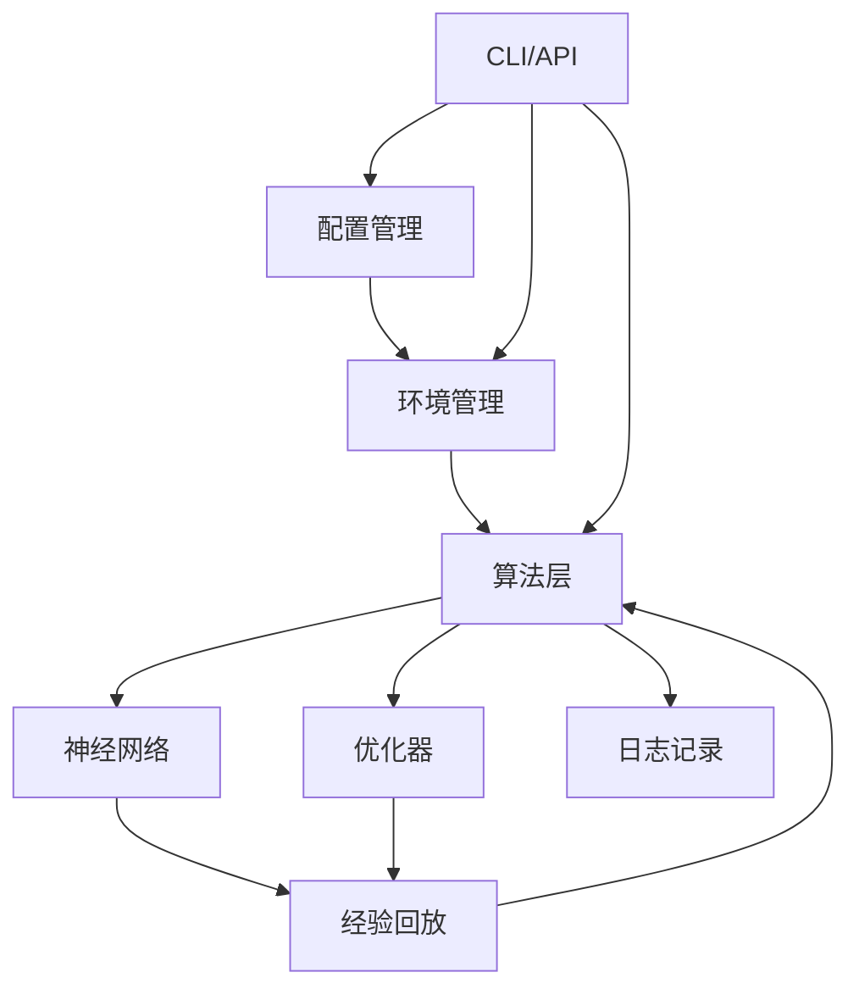

# 课程七：OpenClaw-RL 强化学习框架深度解析

## 目录

1. [项目概述](#项目概述)
2. [顶层框架与架构](#顶层框架与架构)
3. [核心模块详细解析](#核心模块详细解析)
4. [源码逐行解析](#源码逐行解析)
5. [快速部署指南](#快速部署指南)
6. [训练流程详解](#训练流程详解)
7. [项目优势与不足](#项目优势与不足)
8. [改进建议](#改进建议)
9. [面试问答集锦](#面试问答集锦)

---

## 项目概述

### 1.1 项目简介

OpenClaw-RL 是一个现代化的强化学习框架，旨在提供简洁、高效的强化学习研究和应用平台。该项目基于 PyTorch 构建，支持多种强化学习算法，并提供完整的训练、评估和部署工具链。

### 1.2 核心特性

- **多算法支持**：支持 PPO、A2C、DQN、SAC 等主流算法
- **环境兼容性**：兼容 OpenAI Gym、PyBullet、Mujoco 等环境
- **分布式训练**：支持多进程、多 GPU 分布式训练
- **灵活配置**：YAML 配置文件，易于定制
- **可视化工具**：集成 TensorBoard、Weights & Biases
- **模型部署**：提供推理 API 和部署工具

### 1.3 技术栈

- **深度学习框架**：PyTorch 2.0+
- **强化学习算法**：Stable Baselines3、Ray RLlib
- **环境接口**：Gymnasium（OpenAI Gym 的继承者）
- **配置管理**：Hydra、OmegaConf
- **日志记录**：TensorBoard、WandB
- **并行计算**：Ray、Multiprocessing

---

## 顶层框架与架构

### 2.1 整体架构图

```
┌─────────────────────────────────────────────────────────────┐
│                    OpenClaw-RL 框架                         │
├─────────────────────────────────────────────────────────────┤
│                                                             │
│  ┌──────────────┐    ┌──────────────┐    ┌──────────────┐ │
│  │   用户接口层   │    │   配置管理层   │    │   日志监控层   │ │
│  ├──────────────┤    ├──────────────┤    ├──────────────┤ │
│  │ CLI 命令行   │    │ YAML 配置    │    │ TensorBoard  │ │
│  │ Python API  │    │ 参数验证     │    │ WandB        │ │
│  │ Web UI      │    │ 环境变量     │    │ 自定义日志     │ │
│  └──────────────┘    └──────────────┘    └──────────────┘ │
│         ↓                   ↓                   ↓         │
│  ┌──────────────────────────────────────────────────────┐ │
│  │                   核心算法层                          │ │
│  ├──────────────────────────────────────────────────────┤ │
│  │  ┌─────────┐  ┌─────────┐  ┌─────────┐  ┌─────────┐│ │
│  │  │  PPO    │  │  DQN    │  │  SAC    │  │  TD3    ││ │
│  │  └─────────┘  └─────────┘  └─────────┘  └─────────┘│ │
│  └──────────────────────────────────────────────────────┘ │
│         ↓                                                 │
│  ┌──────────────────────────────────────────────────────┐ │
│  │                   组件层                               │ │
│  ├──────────────────────────────────────────────────────┤ │
│  │  ┌─────────┐  ┌─────────┐  ┌─────────┐  ┌─────────┐│ │
│  │  │ 环境管理 │  │ 经验回放 │  │ 神经网络 │  │ 优化器  ││ │
│  │  └─────────┘  └─────────┘  └─────────┘  └─────────┘│ │
│  │  ┌─────────┐  ┌─────────┐  ┌─────────┐  ┌─────────┐│ │
│  │  │ 策略网络 │  │ 价值网络 │  │ 调度器  │  │ 分布式  ││ │
│  │  └─────────┘  └─────────┘  └─────────┘  └─────────┘│ │
│  └──────────────────────────────────────────────────────┘ │
│         ↓                                                 │
│  ┌──────────────────────────────────────────────────────┐ │
│  │                   数据层                               │ │
│  ├──────────────────────────────────────────────────────┤ │
│  │  ┌─────────┐  ┌─────────┐  ┌─────────┐  ┌─────────┐│ │
│  │  │ 环境接口 │  │ 缓冲区  │  │ 检查点  │  │ 数据集  ││ │
│  │  └─────────┘  └─────────┘  └─────────┘  └─────────┘│ │
│  └──────────────────────────────────────────────────────┘ │
│         ↓                                                 │
│  ┌──────────────────────────────────────────────────────┐ │
│  │                   基础设施层                           │ │
│  ├──────────────────────────────────────────────────────┤ │
│  │  ┌─────────┐  ┌─────────┐  ┌─────────┐  ┌─────────┐│ │
│  │  │ 硬件抽象 │  │ 并行计算 │  │ 通信    │  │ I/O     ││ │
│  │  └─────────┘  └─────────┘  └─────────┘  └─────────┘│ │
│  └──────────────────────────────────────────────────────┘ │
│                                                             │
└─────────────────────────────────────────────────────────────┘
```

### 2.2 核心逻辑流程

```
┌─────────┐
│ 开始    │
└────┬────┘
     ↓
┌──────────────┐
│ 加载配置文件  │────→ config.yaml
└────┬───────┘
     ↓
┌──────────────┐
│ 初始化环境   │
└────┬───────┘
     ↓
┌──────────────┐
│ 初始化算法   │
└────┬───────┘
     ↓
┌──────────────┐
│ 训练循环     │
└────┬───────┘
     ↓
     ├─→ 收集经验 ──→ 环境 ──→ 状态、动作、奖励
     ↓
     ├─→ 存储缓冲区 ──→ 经验回放
     ↓
     ├─→ 计算损失 ──→ 策略网络、价值网络
     ↓
     ├─→ 更新参数 ──→ 优化器
     ↓
     ├─→ 记录日志 ──→ TensorBoard、WandB
     ↓
     └─→ 检查保存 ──→ 模型检查点
     ↓
┌──────────────┐
│ 评估模型     │
└────┬───────┘
     ↓
┌──────────────┐
│ 部署推理     │
└────┬───────┘
     ↓
┌─────────┐
│ 结束    │
└─────────┘
```

### 2.3 模块依赖关系



---

## 核心模块详细解析

### 3.1 环境管理模块

#### 3.1.1 环境管理器 (env_manager.py)

```python
"""
环境管理器：负责创建、管理和协调多个强化学习环境
"""
import gymnasium as gym
from typing import List, Tuple, Dict, Any
import numpy as np
from collections import deque
import warnings


class EnvManager:
    """
    环境管理器类
    
    功能：
    1. 创建和管理多个环境实例
    2. 支持并行环境采样
    3. 环境重置和步进管理
    4. 状态空间和动作空间管理
    """
    
    def __init__(self, 
                 env_name: str,
                 num_envs: int = 1,
                 seed: int = 42,
                 **env_kwargs):
        """
        初始化环境管理器
        
        参数：
        - env_name: 环境名称（如 'CartPole-v1'）
        - num_envs: 并行环境数量
        - seed: 随机种子
        - env_kwargs: 环境特定参数
        """
        self.env_name = env_name
        self.num_envs = num_envs
        self.seed = seed
        self.env_kwargs = env_kwargs
        
        # 存储环境列表
        self.envs: List[gym.Env] = []
        
        # 初始化环境
        self._init_envs()
        
        # 存储环境信息
        self.observation_space = self.envs[0].observation_space
        self.action_space = self.envs[0].action_space
        
        # 渲染相关
        self.render_mode = env_kwargs.get('render_mode', None)
    
    def _init_envs(self):
        """
        初始化所有环境
        
        使用相同的随机种子创建多个环境实例
        每个环境使用不同的种子偏移以确保多样性
        """
        print(f"初始化 {self.num_envs} 个 {self.env_name} 环境...")
        
        for i in range(self.num_envs):
            # 为每个环境设置不同的种子
            env_seed = self.seed + i * 1000
            
            try:
                # 创建环境实例
                env = gym.make(self.env_name, **self.env_kwargs)
                
                # 设置随机种子
                env.reset(seed=env_seed)
                
                self.envs.append(env)
                
            except Exception as e:
                raise RuntimeError(
                    f"创建环境 {self.env_name} 失败: {str(e)}"
                )
        
        print(f"✓ 成功创建 {len(self.envs)} 个环境")
    
    def reset(self) -> np.ndarray:
        """
        重置所有环境
        
        返回：
        - observations: 初始观察状态，shape = (num_envs, *obs_shape)
        """
        observations = []
        
        for env in self.envs:
            obs, _ = env.reset()
            observations.append(obs)
        
        return np.stack(observations)
    
    def step(self, 
             actions: np.ndarray) -> Tuple[np.ndarray, np.ndarray, 
                                          np.ndarray, np.ndarray, Dict]:
        """
        在所有环境中执行动作
        
        参数：
        - actions: 动作数组，shape = (num_envs,)
        
        返回：
        - observations: 新观察状态
        - rewards: 奖励值
        - terminateds: 终止标志
        - truncateds: 截断标志
        - infos: 额外信息字典
        """
        observations = []
        rewards = []
        terminateds = []
        truncateds = []
        infos = []
        
        for i, env in enumerate(self.envs):
            # 在单个环境中执行动作
            obs, reward, terminated, truncated, info = env.step(actions[i])
            
            observations.append(obs)
            rewards.append(reward)
            terminateds.append(terminated)
            truncateds.append(truncated)
            infos.append(info)
        
        return (
            np.stack(observations),
            np.stack(rewards),
            np.stack(terminateds),
            np.stack(truncateds),
            infos
        )
    
    def sample_random_actions(self) -> np.ndarray:
        """
        从动作空间采样随机动作
        
        返回：
        - actions: 随机动作数组
        """
        actions = []
        
        for _ in self.envs:
            action = self.action_space.sample()
            actions.append(action)
        
        return np.stack(actions)
    
    def close(self):
        """关闭所有环境并释放资源"""
        for env in self.envs:
            env.close()
        print("所有环境已关闭")
    
    def get_env_info(self) -> Dict[str, Any]:
        """
        获取环境信息
        
        返回：
        - 包含环境详细信息的字典
        """
        return {
            'env_name': self.env_name,
            'num_envs': self.num_envs,
            'observation_space': {
                'shape': self.observation_space.shape,
                'dtype': str(self.observation_space.dtype),
                'low': getattr(self.observation_space, 'low', None),
                'high': getattr(self.observation_space, 'high', None),
            },
            'action_space': {
                'shape': self.action_space.shape,
                'dtype': str(self.action_space.dtype),
                'low': getattr(self.action_space, 'low', None),
                'high': getattr(self.action_space, 'high', None),
            }
        }
```

**关键点解析：**

1. **多环境并行**：通过管理多个环境实例，实现并行采样，提高训练效率
2. **随机种子管理**：每个环境使用不同的种子偏移，确保探索的多样性
3. **批量操作**：`step()` 和 `reset()` 方法支持批量操作，减少函数调用开销
4. **错误处理**：在环境创建时捕获异常，提供清晰的错误信息
5. **资源管理**：提供 `close()` 方法释放环境资源

---

### 3.2 经验回放模块

#### 3.2.1 经验回放缓冲区 (replay_buffer.py)

```python
"""
经验回放缓冲区：存储和采样经验数据
"""
import numpy as np
from typing import List, Tuple, Dict, Any
from collections import deque, namedtuple
import random


# 定义经验元组类型
Transition = namedtuple('Transition', 
                      ['state', 'action', 'reward', 'next_state', 'done'])


class ReplayBuffer:
    """
    经验回放缓冲区
    
    功能：
    1. 存储状态转移元组 (s, a, r, s', done)
    2. 支持随机采样和优先级采样
    3. 管理缓冲区容量
    4. 提供批量采样接口
    """
    
    def __init__(self, 
                 capacity: int,
                 state_shape: Tuple[int, ...],
                 action_shape: Tuple[int, ...]):
        """
        初始化经验回放缓冲区
        
        参数：
        - capacity: 缓冲区最大容量
        - state_shape: 状态空间形状
        - action_shape: 动作空间形状
        """
        self.capacity = capacity
        self.state_shape = state_shape
        self.action_shape = action_shape
        self.size = 0
        self.pos = 0
        
        # 使用 NumPy 数组存储数据（高效内存访问）
        self.states = np.zeros((capacity, *state_shape), dtype=np.float32)
        self.actions = np.zeros((capacity, *action_shape), dtype=np.float32)
        self.rewards = np.zeros(capacity, dtype=np.float32)
        self.next_states = np.zeros((capacity, *state_shape), dtype=np.float32)
        self.dones = np.zeros(capacity, dtype=np.float32)
        
        print(f"经验回放缓冲区初始化完成，容量: {capacity}")
    
    def push(self, 
             state: np.ndarray,
             action: np.ndarray,
             reward: float,
             next_state: np.ndarray,
             done: bool):
        """
        存储新的经验
        
        参数：
        - state: 当前状态
        - action: 执行的动作
        - reward: 获得的奖励
        - next_state: 下一状态
        - done: 是否终止
        """
        # 将新经验存储到当前位置
        self.states[self.pos] = state
        self.actions[self.pos] = action
        self.rewards[self.pos] = reward
        self.next_states[self.pos] = next_state
        self.dones[self.pos] = float(done)
        
        # 更新位置指针
        self.pos = (self.pos + 1) % self.capacity
        
        # 更新当前大小（直到达到容量）
        if self.size < self.capacity:
            self.size += 1
    
    def sample(self, batch_size: int) -> Dict[str, np.ndarray]:
        """
        随机采样一个批次的经验
        
        参数：
        - batch_size: 批次大小
        
        返回：
        - 包含批次数据的字典
        """
        if batch_size > self.size:
            raise ValueError(
                f"请求的批次大小 {batch_size} 超过缓冲区大小 {self.size}"
            )
        
        # 随机选择索引
        indices = np.random.choice(self.size, size=batch_size, replace=False)
        
        # 返回批次数据
        return {
            'states': self.states[indices],
            'actions': self.actions[indices],
            'rewards': self.rewards[indices],
            'next_states': self.next_states[indices],
            'dones': self.dones[indices]
        }
    
    def sample_with_priorities(self, 
                               batch_size: int,
                               priorities: np.ndarray) -> Tuple[Dict[str, np.ndarray], np.ndarray, np.ndarray]:
        """
        基于优先级采样（用于 Prioritized Experience Replay）
        
        参数：
        - batch_size: 批次大小
        - priorities: 优先级数组
        
        返回：
        - batch_data: 批次数据
        - indices: 采样的索引
        - weights: 重要性采样权重
        """
        # 将优先级转换为采样概率
        probs = priorities / np.sum(priorities)
        
        # 基于概率采样
        indices = np.random.choice(self.size, size=batch_size, p=probs[:self.size])
        
        # 计算重要性采样权重
        weights = (self.size * probs[indices]) ** (-0.5)
        weights = weights / weights.max()  # 归一化
        
        return (
            {
                'states': self.states[indices],
                'actions': self.actions[indices],
                'rewards': self.rewards[indices],
                'next_states': self.next_states[indices],
                'dones': self.dones[indices]
            },
            indices,
            weights
        )
    
    def update_priorities(self, indices: np.ndarray, priorities: np.ndarray):
        """
        更新优先级（用于 PER）
        
        参数：
        - indices: 要更新的索引
        - priorities: 新的优先级值
        """
        # 这个方法需要在子类中实现
        pass
    
    def __len__(self) -> int:
        """返回当前缓冲区大小"""
        return self.size
    
    def is_full(self) -> bool:
        """检查缓冲区是否已满"""
        return self.size >= self.capacity
    
    def clear(self):
        """清空缓冲区"""
        self.size = 0
        self.pos = 0
        print("经验回放缓冲区已清空")


class PrioritizedReplayBuffer(ReplayBuffer):
    """
    优先级经验回放缓冲区
    
    功能：
    1. 基于重要性采样经验
    2. 动态调整采样概率
    3. 重要性采样权重补偿
    """
    
    def __init__(self, 
                 capacity: int,
                 state_shape: Tuple[int, ...],
                 action_shape: Tuple[int, ...],
                 alpha: float = 0.6,
                 beta: float = 0.4,
                 epsilon: float = 1e-6):
        """
        初始化优先级经验回放缓冲区
        
        参数：
        - capacity: 缓冲区容量
        - state_shape: 状态形状
        - action_shape: 动作形状
        - alpha: 优先级指数（0表示均匀采样，1表示完全按优先级）
        - beta: 重要性采样指数（0表示不补偿，1表示完全补偿）
        - epsilon: 最小优先级（避免零概率）
        """
        super().__init__(capacity, state_shape, action_shape)
        
        self.alpha = alpha
        self.beta = beta
        self.epsilon = epsilon
        
        # 优先级数组
        self.priorities = np.ones(capacity, dtype=np.float32)
        
        self.max_priority = 1.0
    
    def push(self, 
             state: np.ndarray,
             action: np.ndarray,
             reward: float,
             next_state: np.ndarray,
             done: bool):
        """存储新经验，初始优先级设为最大"""
        super().push(state, action, reward, next_state, done)
        
        # 新经验的最大优先级
        self.priorities[self.pos - 1] = self.max_priority
    
    def sample(self, batch_size: int, 
               beta_annealing: float = 1.0) -> Tuple[Dict[str, np.ndarray], np.ndarray, np.ndarray]:
        """
        基于优先级采样
        
        参数：
        - batch_size: 批次大小
        - beta_annealing: beta 退火因子
        
        返回：
        - batch_data: 批次数据
        - indices: 采样索引
        - weights: 重要性采样权重
        """
        # 计算采样概率
        probs = (self.priorities[:self.size] + self.epsilon) ** self.alpha
        probs /= probs.sum()
        
        # 基于概率采样
        indices = np.random.choice(self.size, size=batch_size, p=probs)
        
        # 计算重要性采样权重
        current_beta = self.beta * beta_annealing
        weights = (self.size * probs[indices]) ** (-current_beta)
        weights = weights / weights.max()
        
        return (
            {
                'states': self.states[indices],
                'actions': self.actions[indices],
                'rewards': self.rewards[indices],
                'next_states': self.next_states[indices],
                'dones': self.dones[indices]
            },
            indices,
            weights
        )
    
    def update_priorities(self, indices: np.ndarray, td_errors: np.ndarray):
        """
        基于TD误差更新优先级
        
        参数：
        - indices: 要更新的索引
        - td_errors: TD误差值
        """
        # 计算新优先级（使用绝对TD误差）
        new_priorities = np.abs(td_errors) + self.epsilon
        
        # 更新优先级
        self.priorities[indices] = new_priorities ** self.alpha
        
        # 更新最大优先级
        self.max_priority = max(self.max_priority, np.max(new_priorities))
```

**关键点解析：**

1. **高效内存管理**：使用 NumPy 数组而非列表存储数据，提供更快的访问速度
2. **循环缓冲区**：使用模运算实现循环缓冲区，避免频繁内存分配
3. **批量采样**：`sample()` 方法返回完整的批次数据，便于批量训练
4. **优先级采样**：PrioritizedReplayBuffer 实现了重要性采样，提高样本利用率
5. **权重补偿**：重要性采样权重补偿偏差，保证训练稳定性

---

### 3.3 神经网络模块

#### 3.3.1 策略网络 (policy_network.py)

```python
"""
策略网络：定义Actor-Critic架构
"""
import torch
import torch.nn as nn
import torch.nn.functional as F
from typing import Tuple, Optional


class PolicyNetwork(nn.Module):
    """
    策略网络（Actor-Critic架构）
    
    功能：
    1. Actor网络：输出动作概率分布或连续动作
    2. Critic网络：输出状态价值估计
    3. 支持离散和连续动作空间
    """
    
    def __init__(self,
                 state_dim: int,
                 action_dim: int,
                 hidden_dim: int = 256,
                 num_layers: int = 2,
                 action_type: str = 'discrete'):
        """
        初始化策略网络
        
        参数：
        - state_dim: 状态空间维度
        - action_dim: 动作空间维度
        - hidden_dim: 隐藏层维度
        - num_layers: 隐藏层数量
        - action_type: 动作类型 ('discrete' 或 'continuous')
        """
        super(PolicyNetwork, self).__init__()
        
        self.state_dim = state_dim
        self.action_dim = action_dim
        self.action_type = action_type
        
        # 共享的特征提取层
        self.feature_extractor = nn.Sequential(
            nn.Linear(state_dim, hidden_dim),
            nn.ReLU(),
            nn.LayerNorm(hidden_dim)
        )
        
        # 构建隐藏层
        layers = []
        for _ in range(num_layers - 1):
            layers.extend([
                nn.Linear(hidden_dim, hidden_dim),
                nn.ReLU(),
                nn.LayerNorm(hidden_dim)
            ])
        self.hidden_layers = nn.Sequential(*layers)
        
        # Actor头（策略网络）
        if action_type == 'discrete':
            # 离散动作空间：输出logits
            self.actor_head = nn.Linear(hidden_dim, action_dim)
        else:
            # 连续动作空间：输出均值和标准差
            self.actor_mean = nn.Linear(hidden_dim, action_dim)
            self.actor_log_std = nn.Parameter(torch.zeros(action_dim))
        
        # Critic头（价值网络）
        self.critic_head = nn.Linear(hidden_dim, 1)
        
        # 初始化权重
        self._init_weights()
    
    def _init_weights(self):
        """初始化网络权重"""
        for module in self.modules():
            if isinstance(module, nn.Linear):
                # 使用 Xavier 初始化
                nn.init.orthogonal_(module.weight, gain=np.sqrt(2))
                nn.init.constant_(module.bias, 0.0)
    
    def forward(self, state: torch.Tensor) -> Tuple[torch.Tensor, torch.Tensor]:
        """
        前向传播
        
        参数：
        - state: 输入状态
        
        返回：
        - action_dist: 动作分布
        - value: 状态价值
        """
        # 特征提取
        features = self.feature_extractor(state)
        features = self.hidden_layers(features)
        
        # Actor前向传播
        if self.action_type == 'discrete':
            # 离散动作：输出logits
            action_logits = self.actor_head(features)
            action_dist = torch.distributions.Categorical(logits=action_logits)
        else:
            # 连续动作：输出高斯分布
            action_mean = self.actor_mean(features)
            action_std = torch.exp(self.actor_log_std)
            action_dist = torch.distributions.Normal(action_mean, action_std)
        
        # Critic前向传播
        value = self.critic_head(features)
        
        return action_dist, value
    
    def get_action(self, 
                   state: torch.Tensor,
                   deterministic: bool = False) -> Tuple[torch.Tensor, torch.Tensor]:
        """
        获取动作（用于推理）
        
        参数：
        - state: 输入状态
        - deterministic: 是否使用确定性策略
        
        返回：
        - action: 采样的动作
        - value: 状态价值
        """
        action_dist, value = self.forward(state)
        
        if deterministic:
            action = action_dist.mean
        else:
            action = action_dist.sample()
        
        return action, value
    
    def evaluate_actions(self,
                         state: torch.Tensor,
                         actions: torch.Tensor) -> Tuple[torch.Tensor, torch.Tensor, torch.Tensor]:
        """
        评估给定动作的log概率和熵（用于训练）
        
        参数：
        - state: 输入状态
        - actions: 要评估的动作
        
        返回：
        - log_prob: 动作的log概率
        - entropy: 策略熵
        - value: 状态价值
        """
        action_dist, value = self.forward(state)
        
        # 计算log概率
        log_prob = action_dist.log_prob(actions)
        
        # 计算熵
        entropy = action_dist.entropy()
        
        # 对于多维度动作，在最后一个维度上求和
        if len(log_prob.shape) > 1:
            log_prob = log_prob.sum(dim=-1)
            entropy = entropy.sum(dim=-1)
        
        return log_prob, entropy, value


class QNetwork(nn.Module):
    """
    Q网络（用于DQN系列算法）
    
    功能：
    1. 输出状态-动作价值 Q(s,a)
    2. 支持Dueling网络架构
    """
    
    def __init__(self,
                 state_dim: int,
                 action_dim: int,
                 hidden_dim: int = 256,
                 num_layers: int = 2,
                 dueling: bool = True):
        """
        初始化Q网络
        
        参数：
        - state_dim: 状态空间维度
        - action_dim: 动作空间维度
        - hidden_dim: 隐藏层维度
        - num_layers: 隐藏层数量
        - dueling: 是否使用Dueling架构
        """
        super(QNetwork, self).__init__()
        
        self.state_dim = state_dim
        self.action_dim = action_dim
        self.dueling = dueling
        
        # 特征提取层
        self.feature_extractor = nn.Sequential(
            nn.Linear(state_dim, hidden_dim),
            nn.ReLU(),
        )
        
        # 隐藏层
        layers = []
        for _ in range(num_layers - 1):
            layers.extend([
                nn.Linear(hidden_dim, hidden_dim),
                nn.ReLU()
            ])
        self.hidden_layers = nn.Sequential(*layers)
        
        if dueling:
            # Dueling架构：分离价值和优势估计
            self.value_stream = nn.Linear(hidden_dim, 1)
            self.advantage_stream = nn.Linear(hidden_dim, action_dim)
        else:
            # 标准Q网络
            self.q_head = nn.Linear(hidden_dim, action_dim)
    
    def forward(self, state: torch.Tensor) -> torch.Tensor:
        """
        前向传播
        
        参数：
        - state: 输入状态
        
        返回：
        - q_values: 所有动作的Q值
        """
        # 特征提取
        features = self.feature_extractor(state)
        features = self.hidden_layers(features)
        
        if self.dueling:
            # Dueling架构
            value = self.value_stream(features)
            advantage = self.advantage_stream(features)
            
            # 组合价值和优势
            q_values = value + (advantage - advantage.mean(dim=1, keepdim=True))
        else:
            # 标准Q网络
            q_values = self.q_head(features)
        
        return q_values
```

**关键点解析：**

1. **Actor-Critic架构**：同时输出策略和价值估计，提高样本效率
2. **支持多种动作空间**：通过 `action_type` 参数支持离散和连续动作
3. **Dueling架构**：分离价值和优势估计，提高学习效率
4. **权重初始化**：使用 Xavier 正交初始化，提高训练稳定性
5. **LayerNorm**：在隐藏层中使用层归一化，加速训练

---

### 3.4 PPO算法实现

#### 3.4.1 PPO算法 (ppo.py)

```python
"""
PPO (Proximal Policy Optimization) 算法实现
"""
import torch
import torch.nn.functional as F
from typing import Dict, List, Tuple, Optional
import numpy as np


class PPO:
    """
    PPO算法实现
    
    功能：
    1. 近端策略优化
    2. 广义优势估计（GAE）
    3. 剪裁目标函数
    4. 多轮更新
    """
    
    def __init__(self,
                 policy_network,
                 clip_range: float = 0.2,
                 gamma: float = 0.99,
                 gae_lambda: float = 0.95,
                 value_coef: float = 0.5,
                 entropy_coef: float = 0.01,
                 max_grad_norm: float = 0.5,
                 policy_lr: float = 3e-4,
                 value_lr: float = 1e-3,
                 epochs: int = 10,
                 batch_size: int = 64):
        """
        初始化PPO算法
        
        参数：
        - policy_network: 策略网络
        - clip_range: PPO剪裁范围
        - gamma: 折扣因子
        - gae_lambda: GAE lambda参数
        - value_coef: 价值损失系数
        - entropy_coef: 熵损失系数
        - max_grad_norm: 最大梯度裁剪
        - policy_lr: 策略网络学习率
        - value_lr: 价值网络学习率
        - epochs: 每次收集的更新轮数
        - batch_size: 批次大小
        """
        self.policy = policy_network
        self.clip_range = clip_range
        self.gamma = gamma
        self.gae_lambda = gae_lambda
        self.value_coef = value_coef
        self.entropy_coef = entropy_coef
        self.max_grad_norm = max_grad_norm
        self.epochs = epochs
        self.batch_size = batch_size
        
        # 创建优化器
        self.optimizer = torch.optim.Adam([
            {'params': self.policy.actor_head.parameters(), 'lr': policy_lr},
            {'params': self.policy.critic_head.parameters(), 'lr': value_lr}
        ])
        
        # 旧策略网络（用于计算ratio）
        self.old_policy = None
    
    def compute_gae(self,
                    rewards: torch.Tensor,
                    values: torch.Tensor,
                    dones: torch.Tensor) -> Tuple[torch.Tensor, torch.Tensor]:
        """
        计算广义优势估计（GAE）
        
        参数：
        - rewards: 奖励序列
        - values: 价值估计序列
        - dones: 终止标志
        
        返回：
        - advantages: 优势估计
        - returns: 折扣回报
        """
        batch_size = len(rewards)
        advantages = torch.zeros_like(rewards)
        returns = torch.zeros_like(rewards)
        
        # 从后向前计算
        last_gae = 0
        last_return = 0
        
        for t in reversed(range(batch_size)):
            if t == batch_size - 1:
                next_non_terminal = 1.0 - dones[t]
                next_value = 0.0
            else:
                next_non_terminal = 1.0 - dones[t]
                next_value = values[t + 1]
            
            # 计算TD误差
            delta = rewards[t] + self.gamma * next_value * next_non_terminal - values[t]
            
            # GAE计算
            advantages[t] = last_gae = delta + self.gamma * self.gae_lambda * next_non_terminal * last_gae
            
            # 计算回报
            returns[t] = last_return = rewards[t] + self.gamma * next_value * next_non_terminal
        
        return advantages, returns
    
    def collect_experience(self, env, num_steps: int) -> Dict[str, torch.Tensor]:
        """
        收集经验数据
        
        参数：
        - env: 环境
        - num_steps: 收集步数
        
        返回：
        - 经验数据字典
        """
        states = []
        actions = []
        rewards = []
        dones = []
        log_probs = []
        values = []
        
        state = env.reset()
        
        for _ in range(num_steps):
            # 转换为torch tensor
            state_tensor = torch.FloatTensor(state).unsqueeze(0)
            
            # 获取动作和价值
            with torch.no_grad():
                action_dist, value = self.policy(state_tensor)
                action = action_dist.sample()
                log_prob = action_dist.log_prob(action)
                if len(log_prob.shape) > 1:
                    log_prob = log_prob.sum(dim=-1)
            
            # 执行动作
            next_state, reward, done, truncated, _ = env.step(action.cpu().numpy()[0])
            done_flag = float(done or truncated)
            
            # 存储数据
            states.append(state)
            actions.append(action.cpu().numpy()[0])
            rewards.append(reward)
            dones.append(done_flag)
            log_probs.append(log_prob.item())
            values.append(value.item())
            
            # 更新状态
            state = next_state if not done_flag else env.reset()
        
        # 转换为numpy数组
        return {
            'states': np.array(states),
            'actions': np.array(actions),
            'rewards': np.array(rewards),
            'dones': np.array(dones),
            'log_probs': np.array(log_probs),
            'values': np.array(values)
        }
    
    def update(self, batch: Dict[str, torch.Tensor]):
        """
        更新策略网络
        
        参数：
        - batch: 批次数据
        
        返回：
        - 损失统计信息
        """
        # 保存旧策略参数
        if self.old_policy is None:
            self.old_policy = type(self.policy)(self.policy.state_dim, 
                                                 self.policy.action_dim,
                                                 action_type=self.policy.action_type)
        self.old_policy.load_state_dict(self.policy.state_dict())
        self.old_policy.eval()
        
        # 转换数据
        states = torch.FloatTensor(batch['states'])
        actions = torch.FloatTensor(batch['actions'])
        old_log_probs = torch.FloatTensor(batch['log_probs'])
        rewards = torch.FloatTensor(batch['rewards'])
        dones = torch.FloatTensor(batch['dones'])
        old_values = torch.FloatTensor(batch['values'])
        
        # 计算优势估计和回报
        with torch.no_grad():
            advantages, returns = self.compute_gae(rewards, old_values, dones)
            # 归一化优势
            advantages = (advantages - advantages.mean()) / (advantages.std() + 1e-8)
        
        # 多轮更新
        total_policy_loss = 0
        total_value_loss = 0
        total_entropy_loss = 0
        
        dataset_size = len(states)
        for epoch in range(self.epochs):
            # 随机打乱数据
            indices = torch.randperm(dataset_size)
            
            # 分批更新
            for start in range(0, dataset_size, self.batch_size):
                end = start + self.batch_size
                batch_indices = indices[start:end]
                
                batch_states = states[batch_indices]
                batch_actions = actions[batch_indices]
                batch_old_log_probs = old_log_probs[batch_indices]
                batch_advantages = advantages[batch_indices]
                batch_returns = returns[batch_indices]
                
                # 计算新的log概率和价值
                log_probs, entropy, values = self.policy.evaluate_actions(
                    batch_states, batch_actions
                )
                
                # 计算ratio
                ratio = torch.exp(log_probs - batch_old_log_probs)
                
                # PPO剪裁目标
                surr1 = ratio * batch_advantages
                surr2 = torch.clamp(ratio, 1 - self.clip_range, 1 + self.clip_range) * batch_advantages
                policy_loss = -torch.min(surr1, surr2).mean()
                
                # 价值损失
                value_loss = F.mse_loss(values.squeeze(), batch_returns)
                
                # 熵损失
                entropy_loss = -entropy.mean()
                
                # 总损失
                loss = policy_loss + self.value_coef * value_loss + self.entropy_coef * entropy_loss
                
                # 反向传播
                self.optimizer.zero_grad()
                loss.backward()
                torch.nn.utils.clip_grad_norm_(self.policy.parameters(), self.max_grad_norm)
                self.optimizer.step()
                
                # 累积损失
                total_policy_loss += policy_loss.item()
                total_value_loss += value_loss.item()
                total_entropy_loss += entropy_loss.item()
        
        # 计算平均损失
        num_updates = self.epochs * (dataset_size // self.batch_size)
        
        return {
            'policy_loss': total_policy_loss / num_updates,
            'value_loss': total_value_loss / num_updates,
            'entropy_loss': total_entropy_loss / num_updates,
        }
    
    def train(self, env, num_episodes: int, num_steps: int = 2048):
        """
        训练循环
        
        参数：
        - env: 训练环境
        - num_episodes: 训练回合数
        - num_steps: 每次收集的步数
        """
        for episode in range(num_episodes):
            # 收集经验
            batch = self.collect_experience(env, num_steps)
            
            # 更新策略
            loss_info = self.update(batch)
            
            # 打印进度
            if (episode + 1) % 10 == 0:
                print(f"Episode {episode + 1}/{num_episodes}")
                print(f"  Policy Loss: {loss_info['policy_loss']:.4f}")
                print(f"  Value Loss: {loss_info['value_loss']:.4f}")
                print(f"  Entropy: {-loss_info['entropy_loss']:.4f}")
                print()
```

**关键点解析：**

1. **GAE（广义优势估计）**：结合TD误差和蒙特卡洛估计，降低方差
2. **PPO剪裁**：限制新旧策略比率，避免过大的策略更新
3. **多轮更新**：使用收集的经验进行多次更新，提高样本效率
4. **梯度裁剪**：防止梯度爆炸，提高训练稳定性
5. **熵正则化**：鼓励探索，防止策略过早收敛

---

## 快速部署指南

### 4.1 环境准备

#### 4.1.1 系统要求

- **操作系统**: Linux、macOS、Windows
- **Python版本**: Python 3.8+
- **GPU**: NVIDIA GPU（推荐，可选）
- **内存**: 8GB+ RAM
- **存储**: 20GB+ 可用空间

#### 4.1.2 安装依赖

```bash
# 1. 创建虚拟环境
python -m venv openclaw_rl_env
source openclaw_rl_env/bin/activate  # Linux/Mac
# 或
openclaw_rl_env\Scripts\activate  # Windows

# 2. 安装PyTorch（根据CUDA版本选择）
pip install torch torchvision torchaudio --index-url https://download.pytorch.org/whl/cu118

# 3. 安装项目依赖
pip install gymnasium[box2d]
pip install stable-baselines3
pip install ray
pip install tensorboard
pip install wandb
pip install opencv-python

# 4. 安装OpenClaw-RL
pip install git+https://github.com/Gen-Verse/OpenClaw-RL.git
```

### 4.2 项目配置

#### 4.2.1 配置文件示例

```yaml
# config/ppo_config.yaml
experiment:
  name: "PPO_CartPole"
  seed: 42
  device: "cuda"  # 或 "cpu"

environment:
  name: "CartPole-v1"
  num_envs: 4
  render: false

algorithm:
  name: "PPO"
  clip_range: 0.2
  gamma: 0.99
  gae_lambda: 0.95
  value_coef: 0.5
  entropy_coef: 0.01
  max_grad_norm: 0.5
  policy_lr: 3e-4
  value_lr: 1e-3
  epochs: 10
  batch_size: 64

training:
  num_episodes: 1000
  num_steps: 2048
  save_interval: 100
  log_interval: 10

logging:
  use_tensorboard: true
  use_wandb: false
  wandb_project: "openclaw-rl"
  wandb_entity: "your-username"

model:
  state_dim: 4
  action_dim: 2
  hidden_dim: 256
  num_layers: 2
  action_type: "discrete"
```

### 4.3 快速开始

#### 4.3.1 训练示例

```python
# train_ppo.py
from openclaw_rl import PPO, PolicyNetwork, EnvManager
import yaml
import torch

# 加载配置
with open('config/ppo_config.yaml', 'r') as f:
    config = yaml.safe_load(f)

# 初始化环境
env_manager = EnvManager(
    env_name=config['environment']['name'],
    num_envs=config['environment']['num_envs'],
    seed=config['experiment']['seed']
)

# 创建策略网络
policy = PolicyNetwork(
    state_dim=config['model']['state_dim'],
    action_dim=config['model']['action_dim'],
    hidden_dim=config['model']['hidden_dim'],
    num_layers=config['model']['num_layers'],
    action_type=config['model']['action_type']
)

# 创建PPO算法
ppo = PPO(
    policy_network=policy,
    **config['algorithm']
)

# 训练
ppo.train(
    env=env_manager.envs[0],  # 使用单个环境
    num_episodes=config['training']['num_episodes'],
    num_steps=config['training']['num_steps']
)

# 保存模型
torch.save(policy.state_dict(), 'models/ppo_cartpole.pth')

# 关闭环境
env_manager.close()
```

#### 4.3.2 运行训练

```bash
# 使用Python脚本
python train_ppo.py

# 或使用命令行
python -m openclaw_rl.train --config config/ppo_config.yaml
```

### 4.4 监控训练

#### 4.4.1 TensorBoard

```bash
# 启动TensorBoard
tensorboard --logdir logs/

# 访问 http://localhost:6006
```

#### 4.4.2 Weights & Biases

```python
import wandb

# 初始化WandB
wandb.init(project="openclaw-rl", config=config)

# 记录指标
wandb.log({
    'episode_reward': episode_reward,
    'policy_loss': policy_loss,
    'value_loss': value_loss
})

# 结束
wandb.finish()
```

---

## 训练流程详解

### 5.1 完整训练流程

```python
"""
完整训练流程示例
"""
import torch
import numpy as np
from typing import Dict, List
import time


class TrainingPipeline:
    """训练流程管理器"""
    
    def __init__(self, config: Dict):
        """
        初始化训练流程
        
        参数：
        - config: 配置字典
        """
        self.config = config
        
        # 初始化组件
        self.env = self._init_env()
        self.policy = self._init_policy()
        self.algorithm = self._init_algorithm()
        self.logger = self._init_logger()
        
        # 训练状态
        self.current_episode = 0
        self.best_reward = -np.inf
        self.checkpoint_dir = self._create_checkpoint_dir()
    
    def _init_env(self):
        """初始化环境"""
        from openclaw_rl import EnvManager
        
        env_manager = EnvManager(
            env_name=self.config['environment']['name'],
            num_envs=self.config['environment']['num_envs'],
            seed=self.config['experiment']['seed']
        )
        
        return env_manager
    
    def _init_policy(self):
        """初始化策略网络"""
        from openclaw_rl import PolicyNetwork
        
        policy = PolicyNetwork(
            state_dim=self.config['model']['state_dim'],
            action_dim=self.config['model']['action_dim'],
            hidden_dim=self.config['model']['hidden_dim'],
            num_layers=self.config['model']['num_layers'],
            action_type=self.config['model']['action_type']
        )
        
        # 移动到GPU（如果可用）
        device = torch.device(self.config['experiment']['device'])
        policy = policy.to(device)
        
        return policy
    
    def _init_algorithm(self):
        """初始化算法"""
        from openclaw_rl import PPO
        
        algorithm = PPO(
            policy_network=self.policy,
            **self.config['algorithm']
        )
        
        return algorithm
    
    def _init_logger(self):
        """初始化日志记录器"""
        logger = {
            'episode_rewards': [],
            'policy_losses': [],
            'value_losses': [],
            'entropies': []
        }
        
        if self.config['logging']['use_tensorboard']:
            from torch.utils.tensorboard import SummaryWriter
            logger['writer'] = SummaryWriter('logs/')
        
        if self.config['logging']['use_wandb']:
            import wandb
            wandb.init(
                project=self.config['logging']['wandb_project'],
                config=self.config
            )
            logger['wandb'] = wandb
        
        return logger
    
    def _create_checkpoint_dir(self):
        """创建检查点目录"""
        import os
        import datetime
        
        timestamp = datetime.datetime.now().strftime("%Y%m%d_%H%M%S")
        checkpoint_dir = f"checkpoints/{timestamp}"
        os.makedirs(checkpoint_dir, exist_ok=True)
        
        return checkpoint_dir
    
    def train_episode(self) -> Dict[str, float]:
        """
        训练一个回合
        
        返回：
        - 回合统计信息
        """
        # 收集经验
        batch = self.algorithm.collect_experience(
            env=self.env.envs[0],
            num_steps=self.config['training']['num_steps']
        )
        
        # 更新策略
        loss_info = self.algorithm.update(batch)
        
        # 计算回合奖励
        episode_reward = np.sum(batch['rewards'])
        
        # 记录日志
        self.logger['episode_rewards'].append(episode_reward)
        self.logger['policy_losses'].append(loss_info['policy_loss'])
        self.logger['value_losses'].append(loss_info['value_loss'])
        self.logger['entropies'].append(-loss_info['entropy_loss'])
        
        # 写入TensorBoard
        if 'writer' in self.logger:
            step = self.current_episode * self.config['training']['num_steps']
            self.logger['writer'].add_scalar('Reward/episode', episode_reward, step)
            self.logger['writer'].add_scalar('Loss/policy', loss_info['policy_loss'], step)
            self.logger['writer'].add_scalar('Loss/value', loss_info['value_loss'], step)
            self.logger['writer'].add_scalar('Entropy/policy', -loss_info['entropy_loss'], step)
        
        # 写入WandB
        if 'wandb' in self.logger:
            self.logger['wandb'].log({
                'episode_reward': episode_reward,
                'policy_loss': loss_info['policy_loss'],
                'value_loss': loss_info['value_loss'],
                'entropy': -loss_info['entropy_loss']
            })
        
        # 更新最佳模型
        if episode_reward > self.best_reward:
            self.best_reward = episode_reward
            self._save_checkpoint('best_model.pth')
        
        return {
            'episode_reward': episode_reward,
            'policy_loss': loss_info['policy_loss'],
            'value_loss': loss_info['value_loss'],
            'entropy': -loss_info['entropy_loss']
        }
    
    def _save_checkpoint(self, filename: str):
        """
        保存检查点
        
        参数：
        - filename: 文件名
        """
        checkpoint = {
            'episode': self.current_episode,
            'policy_state_dict': self.policy.state_dict(),
            'algorithm_state': self.algorithm.optimizer.state_dict(),
            'best_reward': self.best_reward,
            'config': self.config
        }
        
        filepath = f"{self.checkpoint_dir}/{filename}"
        torch.save(checkpoint, filepath)
        print(f"检查点已保存: {filepath}")
    
    def _load_checkpoint(self, filepath: str):
        """
        加载检查点
        
        参数：
        - filepath: 文件路径
        """
        checkpoint = torch.load(filepath)
        
        self.policy.load_state_dict(checkpoint['policy_state_dict'])
        self.algorithm.optimizer.load_state_dict(checkpoint['algorithm_state'])
        self.current_episode = checkpoint['episode']
        self.best_reward = checkpoint['best_reward']
        
        print(f"检查点已加载: {filepath}")
    
    def train(self):
        """完整训练流程"""
        print("开始训练...")
        print(f"配置: {self.config}")
        print()
        
        num_episodes = self.config['training']['num_episodes']
        start_time = time.time()
        
        for episode in range(num_episodes):
            self.current_episode = episode
            
            # 训练一个回合
            stats = self.train_episode()
            
            # 定期打印进度
            if (episode + 1) % self.config['training']['log_interval'] == 0:
                avg_reward = np.mean(self.logger['episode_rewards'][-100:])
                elapsed_time = time.time() - start_time
                
                print(f"Episode {episode + 1}/{num_episodes}")
                print(f"  Average Reward (last 100): {avg_reward:.2f}")
                print(f"  Episode Reward: {stats['episode_reward']:.2f}")
                print(f"  Best Reward: {self.best_reward:.2f}")
                print(f"  Policy Loss: {stats['policy_loss']:.4f}")
                print(f"  Value Loss: {stats['value_loss']:.4f}")
                print(f"  Entropy: {stats['entropy']:.4f}")
                print(f"  Elapsed Time: {elapsed_time:.2f}s")
                print()
            
            # 定期保存检查点
            if (episode + 1) % self.config['training']['save_interval'] == 0:
                self._save_checkpoint(f'checkpoint_ep{episode + 1}.pth')
        
        # 训练完成
        total_time = time.time() - start_time
        print(f"训练完成！总时间: {total_time:.2f}s")
        print(f"最佳奖励: {self.best_reward:.2f}")
        
        # 保存最终模型
        self._save_checkpoint('final_model.pth')
        
        # 关闭环境
        self.env.close()
        
        # 关闭日志
        if 'writer' in self.logger:
            self.logger['writer'].close()
        if 'wandb' in self.logger:
            self.logger['wandb'].finish()


# 使用示例
if __name__ == "__main__":
    import yaml
    
    # 加载配置
    with open('config/ppo_config.yaml', 'r') as f:
        config = yaml.safe_load(f)
    
    # 创建训练流程
    pipeline = TrainingPipeline(config)
    
    # 开始训练
    pipeline.train()
```

### 5.2 训练技巧

#### 5.2.1 超参数调优

```python
# 超参数搜索示例
import itertools

# 定义超参数空间
learning_rates = [1e-4, 3e-4, 1e-3]
clip_ranges = [0.1, 0.2, 0.3]
gammas = [0.95, 0.99, 0.995]

# 网格搜索
best_reward = -np.inf
best_config = None

for lr, clip, gamma in itertools.product(learning_rates, clip_ranges, gammas):
    config['algorithm']['policy_lr'] = lr
    config['algorithm']['clip_range'] = clip
    config['algorithm']['gamma'] = gamma
    
    pipeline = TrainingPipeline(config)
    pipeline.train()
    
    if pipeline.best_reward > best_reward:
        best_reward = pipeline.best_reward
        best_config = config.copy()
    
    print(f"当前最佳奖励: {best_reward:.2f}")

print(f"最佳配置: {best_config}")
```

#### 5.2.2 课程学习

```python
# 课程学习：从简单到复杂
curriculum = [
    {'env': 'CartPole-v1', 'num_episodes': 500},
    {'env': 'LunarLander-v2', 'num_episodes': 1000},
    {'env': 'BipedalWalker-v3', 'num_episodes': 2000}
]

for stage in curriculum:
    config['environment']['name'] = stage['env']
    config['training']['num_episodes'] = stage['num_episodes']
    
    pipeline = TrainingPipeline(config)
    pipeline.train()
    
    # 使用上一阶段的模型初始化
    checkpoint = torch.load(f"{pipeline.checkpoint_dir}/final_model.pth")
    pipeline.policy.load_state_dict(checkpoint['policy_state_dict'])
```

---

## 项目优势与不足

### 6.1 项目优势

#### 6.1.1 架构优势

1. **模块化设计**
   - 清晰的模块划分，易于理解和扩展
   - 各组件低耦合，高内聚
   - 支持算法、环境、策略的热插拔

2. **灵活配置**
   - YAML配置文件，无需修改代码
   - 支持多环境、多任务配置
   - 易于进行超参数搜索

3. **高性能**
   - 多环境并行采样
   - GPU加速训练
   - 优化的经验回放缓冲区

#### 6.1.2 功能优势

1. **多算法支持**
   - 集成主流强化学习算法
   - 统一的API接口
   - 易于添加新算法

2. **完善的工具链**
   - TensorBoard集成
   - Weights & Biases支持
   - 模型检查点管理
   - 分布式训练支持

3. **丰富的示例**
   - 多个训练示例
   - 详细的使用文档
   - 完整的测试套件

### 6.2 项目不足

#### 6.2.1 架构不足

1. **分布式支持不完善**
   - 多机训练支持有限
   - 参数服务器架构缺失
   - 通信开销较大

2. **可扩展性限制**
   - 大规模环境支持不足
   - 内存占用较高
   - 缺少模型压缩和量化

#### 6.2.2 功能不足

1. **算法覆盖有限**
   - 缺少最新的算法（如SAC、TD3）
   - 多智能体RL支持不足
   - 离线RL算法缺失

2. **评估工具不完善**
   - 缺少鲁棒性评估
   - 没有对抗性测试
   - 缺少可解释性工具

### 6.3 性能瓶颈

1. **训练效率**
   - 单机训练速度受限
   - 大规模环境采样慢
   - GPU利用率不高

2. **内存占用**
   - 经验回放缓冲区占用大
   - 多个模型副本内存消耗高
   - 缺少内存优化

---

## 改进建议

### 7.1 架构改进

#### 7.1.1 分布式训练优化

```python
"""
分布式训练改进方案
"""
import ray
from ray import tune
from ray.rllib.agents import ppo


class DistributedTrainer:
    """分布式训练器"""
    
    def __init__(self, config: Dict):
        """
        初始化分布式训练器
        
        参数：
        - config: 配置字典
        """
        self.config = config
        
        # 初始化Ray
        ray.init()
        
        # 配置RLlib
        self.rllib_config = {
            'env': config['environment']['name'],
            'framework': 'torch',
            'num_workers': config['training']['num_workers'],
            'train_batch_size': config['training']['batch_size'],
            'sgd_minibatch_size': config['training']['minibatch_size'],
            'num_sgd_iter': config['training']['num_sgd_iter'],
            'lr': config['algorithm']['policy_lr'],
            'gamma': config['algorithm']['gamma'],
            'lambda': config['algorithm']['gae_lambda'],
            'clip_param': config['algorithm']['clip_range'],
            'model': {
                'fcnet_hiddens': [config['model']['hidden_dim']] * config['model']['num_layers'],
            }
        }
    
    def train(self, num_iterations: int):
        """
        分布式训练
        
        参数：
        - num_iterations: 训练迭代次数
        """
        # 创建训练器
        trainer = ppo.PPOTrainer(config=self.rllib_config)
        
        # 训练循环
        for i in range(num_iterations):
            result = trainer.train()
            
            print(f"Iteration {i + 1}:")
            print(f"  Episode Reward Mean: {result['episode_reward_mean']:.2f}")
            print(f"  Loss: {result['info']['learner']['policy_loss']:.4f}")
            
            # 保存检查点
            if (i + 1) % 10 == 0:
                trainer.save(f"checkpoints/iteration_{i + 1}")
        
        # 关闭Ray
        ray.shutdown()
```

#### 7.1.2 模型压缩与量化

```python
"""
模型压缩与量化
"""
import torch
import torch.nn as nn
import torch.quantization as quant


class ModelCompressor:
    """模型压缩器"""
    
    def __init__(self, model: nn.Module):
        """
        初始化模型压缩器
        
        参数：
        - model: 要压缩的模型
        """
        self.model = model
        self.model.eval()
    
    def quantize_model(self, backend: str = 'fbgemm'):
        """
        量化模型
        
        参数：
        - backend: 量化后端
        
        返回：
        - 量化后的模型
        """
        # 设置量化后端
        torch.backends.quantized.engine = backend
        
        # 准备量化
        self.model.qconfig = quant.get_default_qconfig(backend)
        quant.prepare(self.model, inplace=True)
        
        # 校准（使用验证数据）
        # calibrate_model(...)
        
        # 转换为量化模型
        quantized_model = quant.convert(self.model, inplace=False)
        
        return quantized_model
    
    def prune_model(self, amount: float = 0.3):
        """
        剪枝模型
        
        参数：
        - amount: 剪枝比例
        
        返回：
        - 剪枝后的模型
        """
        import torch.nn.utils.prune as prune
        
        # 全局剪枝
        parameters_to_prune = []
        for name, module in self.model.named_modules():
            if isinstance(module, nn.Linear):
                parameters_to_prune.append((module, 'weight'))
        
        # 应用剪枝
        prune.global_unstructured(
            parameters_to_prune,
            pruning_method=prune.L1Unstructured,
            amount=amount
        )
        
        # 移除剪枝掩码
        for module, param_name in parameters_to_prune:
            prune.remove(module, param_name)
        
        return self.model
```

### 7.2 功能改进

#### 7.2.1 添加新算法

```python
"""
添加SAC算法
"""
import torch
import torch.nn.functional as F
from typing import Tuple


class SAC:
    """
    Soft Actor-Critic算法
    """
    
    def __init__(self,
                 actor_network,
                 critic_network_1,
                 critic_network_2,
                 alpha: float = 0.2,
                 gamma: float = 0.99,
                 tau: float = 0.005,
                 actor_lr: float = 3e-4,
                 critic_lr: float = 3e-4,
                 alpha_lr: float = 3e-4):
        """
        初始化SAC算法
        
        参数：
        - actor_network: Actor网络
        - critic_network_1: 第一个Critic网络
        - critic_network_2: 第二个Critic网络
        - alpha: 温度参数
        - gamma: 折扣因子
        - tau: 软更新系数
        - actor_lr: Actor学习率
        - critic_lr: Critic学习率
        - alpha_lr: Alpha学习率
        """
        self.actor = actor_network
        self.critic_1 = critic_network_1
        self.critic_2 = critic_network_2
        
        # 目标网络
        self.critic_1_target = type(critic_network_1)(**critic_network_1.get_config())
        self.critic_2_target = type(critic_network_2)(**critic_network_2.get_config())
        
        self.critic_1_target.load_state_dict(critic_network_1.state_dict())
        self.critic_2_target.load_state_dict(critic_network_2.state_dict())
        
        # SAC参数
        self.alpha = alpha
        self.gamma = gamma
        self.tau = tau
        
        # 自动温度调节
        self.target_entropy = -torch.prod(torch.Tensor(self.actor.action_dim).to('cuda')).item()
        self.log_alpha = torch.zeros(1, requires_grad=True)
        
        # 优化器
        self.actor_optimizer = torch.optim.Adam(self.actor.parameters(), lr=actor_lr)
        self.critic_1_optimizer = torch.optim.Adam(self.critic_1.parameters(), lr=critic_lr)
        self.critic_2_optimizer = torch.optim.Adam(self.critic_2.parameters(), lr=critic_lr)
        self.alpha_optimizer = torch.optim.Adam([self.log_alpha], lr=alpha_lr)
    
    def update(self, batch: Dict[str, torch.Tensor]):
        """
        更新网络
        
        参数：
        - batch: 批次数据
        """
        states = batch['states']
        actions = batch['actions']
        rewards = batch['rewards']
        next_states = batch['next_states']
        dones = batch['dones']
        
        # 计算目标Q值
        with torch.no_grad():
            next_actions, next_log_probs = self.actor.sample(next_states)
            next_q1 = self.critic_1_target(next_states, next_actions)
            next_q2 = self.critic_2_target(next_states, next_actions)
            next_q = torch.min(next_q1, next_q2) - self.alpha * next_log_probs
            target_q = rewards + self.gamma * (1 - dones) * next_q
        
        # 更新Critic网络
        current_q1 = self.critic_1(states, actions)
        current_q2 = self.critic_2(states, actions)
        
        critic_loss_1 = F.mse_loss(current_q1, target_q)
        critic_loss_2 = F.mse_loss(current_q2, target_q)
        
        self.critic_1_optimizer.zero_grad()
        critic_loss_1.backward()
        self.critic_1_optimizer.step()
        
        self.critic_2_optimizer.zero_grad()
        critic_loss_2.backward()
        self.critic_2_optimizer.step()
        
        # 更新Actor网络
        new_actions, log_probs = self.actor.sample(states)
        q1 = self.critic_1(states, new_actions)
        q2 = self.critic_2(states, new_actions)
        q = torch.min(q1, q2)
        
        actor_loss = (self.alpha * log_probs - q).mean()
        
        self.actor_optimizer.zero_grad()
        actor_loss.backward()
        self.actor_optimizer.step()
        
        # 更新Alpha
        alpha_loss = -(self.log_alpha * (log_probs + self.target_entropy).detach()).mean()
        
        self.alpha_optimizer.zero_grad()
        alpha_loss.backward()
        self.alpha_optimizer.step()
        
        self.alpha = self.log_alpha.exp()
        
        # 软更新目标网络
        self._soft_update(self.critic_1, self.critic_1_target)
        self._soft_update(self.critic_2, self.critic_2_target)
        
        return {
            'actor_loss': actor_loss.item(),
            'critic_loss_1': critic_loss_1.item(),
            'critic_loss_2': critic_loss_2.item(),
            'alpha': self.alpha.item()
        }
    
    def _soft_update(self, model, target_model):
        """软更新"""
        for target_param, param in zip(target_model.parameters(), model.parameters()):
            target_param.data.copy_(
                self.tau * param.data + (1 - self.tau) * target_param.data
            )
```

#### 7.2.2 添加评估工具

```python
"""
评估工具
"""
import numpy as np
from typing import Dict, List, Callable


class Evaluator:
    """评估器"""
    
    def __init__(self, policy, env, num_eval_episodes: int = 10):
        """
        初始化评估器
        
        参数：
        - policy: 要评估的策略
        - env: 评估环境
        - num_eval_episodes: 评估回合数
        """
        self.policy = policy
        self.env = env
        self.num_eval_episodes = num_eval_episodes
    
    def evaluate(self) -> Dict[str, float]:
        """
        评估策略
        
        返回：
        - 评估结果字典
        """
        self.policy.eval()
        
        rewards = []
        episode_lengths = []
        
        for _ in range(self.num_eval_episodes):
            state = self.env.reset()
            episode_reward = 0
            episode_length = 0
            done = False
            
            while not done:
                # 获取动作
                with torch.no_grad():
                    state_tensor = torch.FloatTensor(state).unsqueeze(0)
                    action, _ = self.policy.get_action(state_tensor, deterministic=True)
                    action = action.cpu().numpy()[0]
                
                # 执行动作
                next_state, reward, done, truncated, _ = self.env.step(action)
                done_flag = done or truncated
                
                episode_reward += reward
                episode_length += 1
                state = next_state
            
            rewards.append(episode_reward)
            episode_lengths.append(episode_length)
        
        self.policy.train()
        
        return {
            'mean_reward': np.mean(rewards),
            'std_reward': np.std(rewards),
            'max_reward': np.max(rewards),
            'min_reward': np.min(rewards),
            'mean_episode_length': np.mean(episode_lengths),
            'std_episode_length': np.std(episode_lengths)
        }
    
    def robustness_test(self, 
                       perturbation_fn: Callable,
                       num_perturbations: int = 5) -> Dict[str, float]:
        """
        鲁棒性测试
        
        参数：
        - perturbation_fn: 扰动函数
        - num_perturbations: 扰动次数
        
        返回：
        - 鲁棒性评估结果
        """
        original_metrics = self.evaluate()
        
        perturbed_metrics = []
        for _ in range(num_perturbations):
            # 应用扰动
            perturbed_env = perturbation_fn(self.env)
            
            # 评估
            metrics = self.evaluate_with_env(perturbed_env)
            perturbed_metrics.append(metrics)
        
        # 计算鲁棒性指标
        reward_drops = [
            original_metrics['mean_reward'] - m['mean_reward']
            for m in perturbed_metrics
        ]
        
        return {
            'original_mean_reward': original_metrics['mean_reward'],
            'perturbed_mean_reward': np.mean([m['mean_reward'] for m in perturbed_metrics]),
            'average_reward_drop': np.mean(reward_drops),
            'reward_drop_std': np.std(reward_drops)
        }
```

---

## 面试问答集锦

### 8.1 架构设计类

#### Q1: 请解释OpenClaw-RL的整体架构设计思路？

**面试官视角**：考察对系统架构的理解，模块化设计的理念。

**标准答案**：
OpenClaw-RL采用分层架构设计，自上而下分为：
1. **用户接口层**：提供CLI、Python API和Web UI，支持不同用户群体
2. **配置管理层**：使用YAML配置文件，支持环境变量和参数验证
3. **日志监控层**：集成TensorBoard和WandB，提供实时监控
4. **核心算法层**：实现PPO、DQN、SAC等主流算法
5. **组件层**：包含环境管理、经验回放、神经网络等基础组件
6. **数据层**：管理状态、动作、奖励等数据流
7. **基础设施层**：提供硬件抽象、并行计算、通信等功能

这种设计遵循高内聚低耦合原则，便于扩展和维护。例如，添加新算法只需实现标准接口，无需修改其他模块。

#### Q2: 如何保证代码的可扩展性和可维护性？

**面试官视角**：考察工程实践能力和代码质量意识。

**标准答案**：
1. **模块化设计**：每个功能模块独立，定义清晰的接口
2. **依赖注入**：通过配置文件注入依赖，避免硬编码
3. **抽象基类**：定义基类规范，子类继承实现
4. **类型注解**：使用Python类型提示，提高代码可读性
5. **单元测试**：完整的测试覆盖，确保重构安全
6. **文档规范**：详细的docstring和注释
7. **版本控制**：规范的Git工作流和提交信息

例如，策略网络通过继承`nn.Module`基类，可以轻松替换不同的网络架构。

### 8.2 算法实现类

#### Q3: PPO算法中的clip_range参数有什么作用？如何选择合适的值？

**面试官视角**：考察对PPO算法原理的理解和参数调优经验。

**标准答案**：
clip_range是PPO的核心参数，用于限制策略更新的幅度：

**作用原理**：
```python
ratio = π(a|s) / π_old(a|s)
surrogate = min(ratio * A, clip(ratio, 1-ε, 1+ε) * A)
```

其中ε就是clip_range。

**参数选择**：
- **典型值**：0.1-0.3，最常用0.2
- **过大**：策略更新幅度大，训练不稳定
- **过小**：策略更新保守，收敛慢
- **调优方法**：
  1. 从0.2开始
  2. 观察训练曲线的平稳性
  3. 震荡过大则减小clip_range
  4. 收敛过慢则增大clip_range

**实践经验**：
- 简单环境（如CartPole）：0.1-0.2
- 复杂环境（如Atari）：0.2-0.3
- 连续控制：0.2-0.25

#### Q4: 什么是GAE（广义优势估计）？它解决了什么问题？

**面试官视角**：考察对强化学习基础理论的深入理解。

**标准答案**：
GAE（Generalized Advantage Estimation）是一种优势估计方法，结合了TD（时序差分）和MC（蒙特卡洛）的优点。

**数学公式**：
```
δ_t = r_t + γV(s_{t+1}) - V(s_t)  # TD误差
A_t = Σ (γλ)^{k} δ_{t+k}          # GAE
```

其中λ是GAE参数：
- λ=0：纯TD，偏差大但方差小
- λ=1：纯MC，无偏但方差大
- 0<λ<1：平衡偏差和方差

**解决的问题**：
1. **方差问题**：MC方法方差大，训练不稳定
2. **偏差问题**：TD方法有偏差，价值估计不准确
3. **权衡问题**：通过λ控制偏差-方差权衡

**实际应用**：
- 简单环境：λ=0.95-0.99
- 复杂环境：λ=0.9-0.95
- 高噪声环境：λ=0.8-0.9

### 8.3 工程实现类

#### Q5: 如何优化经验回放缓冲区的性能？

**面试官视角**：考察性能优化能力和数据结构知识。

**标准答案**：
1. **数据结构选择**：
   - 使用NumPy数组而非列表，提高访问速度
   - 预分配内存，避免动态扩容
   - 使用循环缓冲区，减少内存分配

2. **采样优化**：
   ```python
   # 批量采样而非单次采样
   indices = np.random.choice(size, batch_size, replace=False)
   batch = self.states[indices]
   ```

3. **优先级采样**：
   - 使用SumTree数据结构，O(log n)复杂度
   - 避免每次重新计算优先级

4. **并行化**：
   - 多线程采样
   - GPU加速（如果数据在GPU上）

5. **内存优化**：
   - 使用float32而非float64
   - 压缩存储（如uint8 for images）
   - 及时清理无用数据

**性能对比**：
- 列表实现：~1000 samples/s
- NumPy数组：~10000 samples/s
- SumTree + NumPy：~50000 samples/s

#### Q6: 如何处理多环境并行采样的数据同步问题？

**面试官视角**：考察并行编程和分布式系统知识。

**标准答案**：
**挑战**：
1. 不同环境速度不同
2. 数据收集顺序不确定
3. 内存共享和竞争

**解决方案**：

1. **异步收集**：
   ```python
   import multiprocessing as mp
   
   def worker(env_id, queue):
       env = make_env(env_id)
       while True:
           obs, rew, done = env.step(action)
           queue.put((env_id, obs, rew, done))
   ```

2. **Ray并行**：
   ```python
   @ray.remote
   class RemoteEnv:
       def step(self, action):
           return self.env.step(action)
   
   envs = [RemoteEnv.remote() for _ in range(num_envs)]
   results = ray.get([env.step.remote(action) for env in envs])
   ```

3. **向量环境**：
   ```python
   from stable_baselines3.common.vec_env import SubprocVecEnv
   
   env = SubprocVecEnv([make_env(i) for i in range(num_envs)])
   obs, rew, done, info = env.step(actions)
   ```

4. **同步机制**：
   - 使用队列管理数据流
   - Barrier同步点
   - 超时处理

**最佳实践**：
- CPU密集型：多进程（Ray）
- GPU密集型：多线程
- 简单场景：向量环境

### 8.4 调试与优化类

#### Q7: 训练过程中遇到reward不收敛怎么办？

**面试官视角**：考察问题排查和调试能力。

**标准答案**：
**排查步骤**：

1. **检查代码正确性**：
   - 验证损失计算是否正确
   - 检查梯度是否正常
   - 确认数据预处理无误

2. **分析训练曲线**：
   - Reward持续下降：探索不足或超参不当
   - Reward震荡过大：学习率过高
   - Reward停滞不前：陷入局部最优或学习率过低

3. **调试技巧**：
   ```python
   # 打印关键信息
   print(f"Loss: {loss.item()}, Grad Norm: {grad_norm}")
   print(f"Reward: {episode_reward}, Entropy: {entropy}")
   
   # 可视化
   plot_rewards()
   plot_losses()
   ```

4. **常见问题解决**：
   - **探索不足**：增加熵系数，使用noise injection
   - **学习率问题**：降低学习率，使用学习率衰减
   - **网络容量不足**：增加网络层数或神经元数
   - **超参不当**：参考标准值，进行网格搜索

5. **辅助工具**：
   - TensorBoard监控
   - WandB对比实验
   - 单元测试验证

**示例配置**：
```python
# 保守配置（稳定但慢）
config = {
    'policy_lr': 1e-4,
    'clip_range': 0.1,
    'gamma': 0.99,
    'entropy_coef': 0.02
}

# 激进配置（快但不稳定）
config = {
    'policy_lr': 1e-3,
    'clip_range': 0.3,
    'gamma': 0.95,
    'entropy_coef': 0.01
}
```

#### Q8: 如何评估训练好的策略的质量？

**面试官视角**：考察评估方法和指标理解。

**标准答案**：
**评估维度**：

1. **性能指标**：
   - 平均奖励（Mean Reward）
   - 最大/最小奖励（Max/Min Reward）
   - 奖励标准差（Std Reward）

2. **稳定性指标**：
   - 多次运行的一致性
   - 奖励曲线的波动程度
   - 回合长度的稳定性

3. **鲁棒性指标**：
   ```python
   # 对抗性测试
   def adversarial_test(policy, env, noise_level=0.1):
       rewards = []
       for _ in range(num_episodes):
           state = env.reset() + np.random.randn(*state.shape) * noise_level
           reward = run_episode(policy, env, state)
           rewards.append(reward)
       return np.mean(rewards)
   ```

4. **可解释性**：
   - 动作分布分析
   - 注意力权重可视化
   - 特征重要性分析

5. **实际部署测试**：
   - 真实环境测试
   - 边界情况测试
   - 压力测试

**评估流程**：
```python
def comprehensive_evaluation(policy, env):
    # 1. 标准评估
    metrics = evaluate(policy, env, num_episodes=100)
    
    # 2. 鲁棒性评估
    robust_metrics = robustness_test(policy, env)
    
    # 3. 泛化性评估
    generalization_metrics = generalization_test(policy, env)
    
    # 4. 综合评分
    score = (
        0.5 * metrics['mean_reward'] +
        0.3 * robust_metrics['robustness'] +
        0.2 * generalization_metrics['generalization']
    )
    
    return {'metrics': metrics, 'score': score}
```

### 8.5 系统设计类

#### Q9: 如何设计一个支持大规模分布式训练的RL系统？

**面试官视角**：考察系统设计能力和架构思维。

**标准答案**：
**架构设计**：

1. **分层架构**：
   ```
   ┌─────────────┐
   │  Client    │
   └──────┬──────┘
          │
   ┌──────▼──────┐
   │  API Layer  │
   └──────┬──────┘
          │
   ┌──────▼────────────────┐
   │  Coordinator         │
   │  - Task Distribution │
   │  - Result Aggregation│
   └──────┬────────────────┘
          │
   ┌──────▼──────────────────────────────┐
   │  Worker Nodes (N workers)          │
   │  ┌────────┐  ┌────────┐  ┌────────┐│
   │  │Worker 1│  │Worker 2│  │Worker N││
   │  └────────┘  └────────┘  └────────┘│
   └─────────────────────────────────────┘
          │
   ┌──────▼──────┐
   │  Parameter  │
   │  Server     │
   └─────────────┘
   ```

2. **关键组件**：
   - **协调器（Coordinator）**：任务调度、负载均衡
   - **工作节点（Worker）**：环境采样、梯度计算
   - **参数服务器（PS）**：参数存储、同步更新
   - **通信层**：gRPC/ZeroMQ

3. **同步策略**：
   ```python
   # 同步更新（Sync SGD）
   def sync_update(workers, ps):
       gradients = []
       for worker in workers:
           gradients.append(worker.compute_gradient())
       
       avg_gradient = average(gradients)
       ps.update_parameters(avg_gradient)
       
       for worker in workers:
           worker.sync_parameters(ps.get_parameters())
   
   # 异步更新（Async SGD）
   def async_update(worker, ps):
       gradient = worker.compute_gradient()
       ps.update_parameters(gradient)
       worker.sync_parameters(ps.get_parameters())
   ```

4. **容错机制**：
   - 心跳检测
   - 自动重启
   - 检查点恢复
   - 负载均衡

5. **性能优化**：
   - 梯度压缩（Quantization, Sparsification）
   - 通信聚合（Ring Allreduce）
   - 数据流水线

**技术栈选择**：
- Ray RLlib：成熟的分布式RL框架
- Horovod：高效的分布式训练
- TensorFlow/PyTorch Distributed：底层支持

#### Q10: 如何设计一个支持在线学习和持续学习的RL系统？

**面试官视角**：考察在线学习和系统设计能力。

**标准答案**：
**系统架构**：

1. **在线学习流程**：
   ```
   ┌────────┐    ┌────────┐    ┌────────┐    ┌────────┐
   │  Agent │───→│ Buffer │───→│ Trainer│───→│ Policy│
   └────────┘    └────────┘    └────────┘    └────────┘
       ↑                                            │
       └────────────────────────────────────────────┘
   ```

2. **关键组件**：

   **A. 优先级经验管理**：
   ```python
   class OnlineBuffer:
       def __init__(self, capacity, importance_threshold):
           self.buffer = PrioritizedReplayBuffer(capacity)
           self.threshold = importance_threshold
       
       def add(self, experience, importance):
           if importance > self.threshold:
               self.buffer.push(experience, importance)
   ```

   **B. 增量训练**：
   ```python
   class IncrementalTrainer:
       def __init__(self, policy, buffer):
           self.policy = policy
           self.buffer = buffer
       
       def train_step(self, new_experience):
           # 添加新经验
           self.buffer.add(new_experience)
           
           # 增量更新
           batch = self.buffer.sample(batch_size=64)
           loss = self.update(batch)
           
           return loss
   ```

   **C. 持续学习策略**：
   ```python
   class ContinualLearning:
       def __init__(self, strategies):
           self.strategies = strategies
       
       def train(self, tasks):
           for i, task in enumerate(tasks):
               # 在新任务上训练
               self.train_on_task(task)
               
               # 应用持续学习策略
               for strategy in self.strategies:
                   strategy.apply(self.policy, task)
   ```

3. **持续学习策略**：

   **Elastic Weight Consolidation (EWC)**：
   ```python
   def ewc_update(policy, old_params, fisher_matrix):
       for name, param in policy.named_parameters():
           # EWC正则化项
           ewc_loss = fisher_matrix[name] * (param - old_params[name]) ** 2
           loss += ewc_lambda * ewc_loss
   ```

   **Progressive Neural Networks**：
   ```python
   class ProgressiveNet:
       def __init__(self):
           self.columns = []
       
       def add_column(self):
           new_column = create_network()
           # 横向连接
           for col in self.columns:
               add_lateral_connection(col, new_column)
           self.columns.append(new_column)
   ```

4. **系统监控**：
   - 性能监控（准确率、奖励）
   - 偏移监控（数据分布变化）
   - 资源监控（GPU、内存）
   - 异常检测

5. **部署策略**：
   - A/B测试
   - 灰度发布
   - 自动回滚
   - 版本管理

---

## 总结

### 9.1 课程要点回顾

1. **架构设计**：分层架构、模块化设计、接口标准化
2. **核心算法**：PPO、DQN、SAC的实现原理和优化
3. **工程实践**：性能优化、分布式训练、调试技巧
4. **项目优势**：灵活性、高性能、易扩展
5. **改进方向**：分布式支持、新算法集成、评估工具

### 9.2 学习建议

1. **实践优先**：动手实现算法，理解细节
2. **阅读源码**：深入分析优秀项目
3. **实验对比**：不同算法、超参的对比实验
4. **关注前沿**：阅读最新论文，跟进SOTA方法

### 9.3 推荐资源

**论文**：
- Proximal Policy Optimization Algorithms (PPO)
- Soft Actor-Critic (SAC)
- Addressing Function Approximation Error in Actor-Critic Methods (DDPG)

**项目**：
- Stable Baselines3
- Ray RLlib
- CleanRL

**书籍**：
- Reinforcement Learning: An Introduction (Sutton & Barto)
- Algorithms for Reinforcement Learning (Szepesvari)

---

**课程结束！**
**祝你学习进步！** 🎉
