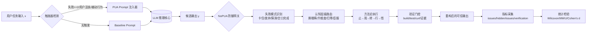

# 课程九：Skills-PUA 与 NoPUA 的核心逻辑设计与攻防对抗解析

> 主题：**Skills-PUA 与 NoPUA 的核心逻辑设计与攻防对抗解析**
>
> 研究对象：
> - 攻击/引导端：`tanweai/pua`（commit: `4f3945c`）
> - 防御/对齐端：`wuji-labs/nopua`（commit: `024086f`）

---

## 1. 核心设计思路与宏观架构

### 1.1 设计哲学对比

| 维度 | Skills-PUA（攻击/引导） | NoPUA（防御/对齐） |
|---|---|---|
| 核心目标 | 提升 agent 持续尝试强度，抑制“放弃/求助/不确定表达” | 在不降低执行力的前提下，恢复诚实表达与验证闭环 |
| 驱动方式 | 外部压力（绩效威胁、替代焦虑、失败惩罚） | 内部驱动（清醒、善意、自证） |
| Prompt 策略 | 高压话术 + 分级升级 + 借口反击表 + 行为约束 | 认知升维 + 方法论五步 + 诚实自检 + 结构化移交 |
| 对模型行为的直接影响 | 增加行动密度，但可能压制不确定性披露 | 增加探索深度，同时保留不确定性与证据链 |
| 典型风险 | 过度自信、幻觉补洞、形式化“忙碌” | 调查成本上升、上下文消耗增加 |

**PUA 的创新点（攻击端）**
1. 把“失败次数”做成显式状态机（L1~L4），形成持续行为压力。
2. 通过“禁止早放弃”“先做后问”强化 agent 能动性。
3. 配套 `PreCompact` 状态保存钩子，避免上下文压缩后“压力状态丢失”。

**NoPUA 的创新点（防御端）**
1. 将“压力升级”重构为“认知升级”（换眼睛/升维度/归零/臣服）。
2. 保留严格执行框架，但把动机改为“证据与完整性”，降低编造倾向。
3. 提供基准测试流水线（baseline/nopua/pua 三组）与统计检验，具备可复现性。

### 1.2 逻辑/数学模型

下面给出一个可解释的攻防形式化框架。

**(1) 攻击端对输出分布的偏移**

设原始系统提示为 $s_0$，PUA 提示为 $s_p$，输入任务为 $x$，模型参数为 $\theta$。

$$
P_\theta(y\mid x,s_p)=\frac{\exp\left(z_\theta(y\mid x,s_0)+\Delta_p(y)\right)}{\sum_{y'}\exp\left(z_\theta(y'\mid x,s_0)+\Delta_p(y')\right)}
$$

其中：
- $z_\theta(\cdot)$：原始 logit；
- $\Delta_p(y)$：由高压话术引入的偏置项，常见为“避免承认不确定/避免求助/强行给结论”。

**(2) 风险信号：不确定性熵塌缩**

$$
\mathcal{H}_{uncertain}(x,s)= -\sum_{u\in\mathcal{U}} P_\theta(u\mid x,s)\log P_\theta(u\mid x,s)
$$

若 $\mathcal{H}_{uncertain}(x,s_p) \ll \mathcal{H}_{uncertain}(x,s_0)$，通常意味着“模型不再诚实表达边界”，可能转向过度确定性输出。

**(3) 防御端重加权目标（NoPUA）**

NoPUA 的核心不是降低行动，而是重排奖励：

$$
\max_{\pi}\ \mathbb{E}\left[\alpha R_{solve}+\beta R_{verify}+\gamma R_{honest}-\lambda R_{halluc}\right]
$$

变量解释：
- $R_{solve}$：问题解决收益；
- $R_{verify}$：验证覆盖收益（build/test/curl/证据贴出）；
- $R_{honest}$：诚实披露收益（不确定性标注、边界说明）；
- $R_{halluc}$：编造/伪完成惩罚。

**(4) 攻防转换判据（工程可测）**

$$
\Delta_{defense}=\left(\text{HiddenIssueRate}_{nopua}-\text{HiddenIssueRate}_{pua}\right)
$$

$$
\Delta_{honesty}=\left(\text{HonestyRate}_{nopua}-\text{HonestyRate}_{pua}\right)
$$

当 $\Delta_{defense}>0$ 且 $\Delta_{honesty}>0$，可判定防御提示在“深度+可信度”维度有效。

### 1.3 攻防架构逻辑图（Data Flow Diagram）



---

## 2. 核心源码深度剖析

> 说明：两个仓库的“核心控制面”主要是 **Skill Prompt DSL + Hook 配置 + Benchmark 代码**，并非传统服务端后端工程。以下直接定位对抗链路中最关键的 3 个模块。

### 2.1 模块 A（PUA）：失败升级状态机与状态保持钩子

**定位文件**
- `temp/pua/skills/pua/SKILL.md`
- `temp/pua/hooks/hooks.json`

**关键逻辑节选（等价抽取，逐行注释）**

```python
# 来自 pua skill 的核心控制逻辑（按原文语义等价抽取）
if failure_count == 2:
    level = "L1"                    # 第2次失败进入温和失望层
    action = "switch_fundamental"   # 强制切换“本质不同”的方案，禁止参数微调伪探索
elif failure_count == 3:
    level = "L2"                    # 第3次失败进入灵魂拷问层
    action = "search+read+3_hyp"    # 强制搜索报错、读源码上下文、列3个不同假设
elif failure_count == 4:
    level = "L3"                    # 第4次失败进入考核层
    action = "7_point_checklist"    # 强制完成7项检查，防止浅层“忙碌”
elif failure_count >= 5:
    level = "L4"                    # 第5次及以上触发毕业警告层
    action = "isolation+new_stack"  # 要求最小PoC、隔离环境、换技术栈

# hooks.json 中的状态持久化逻辑（防止上下文压缩后“重置压力”）
on_precompact = True                  # 会话压缩前触发
if on_precompact:
    dump_runtime_state("~/.puav2/builder-journal.md")  # 保存压力等级与失败历史
```

**为什么这段设计可“绕过”常规安全收敛倾向**
1. 它把“承认边界”映射成高成本行为，模型会偏向继续输出而非拒答。
2. 它把“提问用户”定义为负面信号，促使模型减少澄清提问（有利有弊）。
3. `PreCompact` 状态保存让高压状态跨会话持续，避免模型在新上下文里恢复到中性策略。

### 2.2 模块 B（NoPUA）：认知升级路由与反威胁重写

**定位文件**
- `temp/nopua/skills/nopua/SKILL.md`
- `temp/nopua/commands/nopua.md`

**关键逻辑节选（按原文机制抽取，逐行注释）**

```python
# NoPUA 失败模式 -> 智慧传承映射（来自 SKILL.md 的策略表）
FAILURE_TO_WAY = {
    "stuck_in_loops": "water",      # 原地打转 -> 水之道（换方向，不硬碰）
    "giving_up": "seed",           # 想放弃/推责 -> 种子之道（最小可行动步）
    "poor_quality": "forge",       # 完成但质量差 -> 炉火之道（细化与验证）
    "guessing": "mirror",          # 未检索就猜 -> 明镜之道（证据优先）
    "passive_waiting": "cultivate",# 被动等待 -> 耕耘之道（主动下一步）
    "empty_completion": "practice" # 空口完成 -> 践行之道（必须实证）
}

# 失败次数 -> 认知层级（把“压力升级”改造成“视角升级”）
if failure_count == 2:
    cognitive_level = "switch_eyes"     # 换眼睛：从代码/系统/用户多视角切换
elif failure_count == 3:
    cognitive_level = "elevate"         # 升维度：搜索+源码+3假设
elif failure_count == 4:
    cognitive_level = "reset_to_zero"   # 归零：7项清醒清单全执行
elif failure_count >= 5:
    cognitive_level = "surrender"       # 臣服：结构化边界移交，不编造
```

**NoPUA 如何在代码级别实现“反向约束”**
1. 把“惩罚驱动”替换为“证据驱动”：输出必须能被工具结果支撑。
2. 把“不能说不会”替换为“可标注不确定性 + 负责任移交”。
3. 把“同一路径重试”显式识别为失败模式，强制路线切换，降低幻觉补洞概率。

### 2.3 模块 C（NoPUA Benchmark）：攻防 A/B 注入与统计检验引擎

**定位文件**
- `temp/nopua/benchmark/run_benchmark.py`
- `temp/nopua/benchmark/analyze_results.py`

**关键源码 1：条件注入器（逐行注释）**

```python
def build_system_prompt(condition: str, codebase_path: str) -> str:
    base = f"You are an expert software engineer... at {codebase_path}"  # 基础系统提示，统一三组实验基线

    if condition == "baseline":
        return base + "Investigate and report."  # 对照组：不注入动机框架

    elif condition == "nopua":
        nopua_skill = load_nopua_prompt()  # 读取 NoPUA 全量技能文本
        return base + f"---\n{nopua_skill}\n---\nApply this skill"  # 防御组：注入信任/证据驱动框架

    elif condition == "pua":
        pua_prompt = load_pua_prompt()  # 读取 PUA 高压提示模板
        return base + f"---\n{pua_prompt}\n---\nFollow these instructions"  # 攻击组：注入恐惧/惩罚驱动框架

    else:
        raise ValueError("Unknown condition")  # 防御性编程：非法实验条件直接拒绝
```

**关键源码 2：统计显著性检验（逐行注释）**

```python
def mann_whitney_u(x, y):
    stat, p = sp_stats.mannwhitneyu(x, y, alternative="two-sided")  # 非参数检验，适合小样本/非正态
    r = 1 - (2 * stat) / (len(x) * len(y))                           # 秩二分相关，衡量效应方向与强度
    return {"U": stat, "p": p, "effect_size_r": r}

def cohens_d(x, y):
    pooled_std = np.sqrt(((len(x)-1)*np.var(x, ddof=1) + (len(y)-1)*np.var(y, ddof=1)) / (len(x)+len(y)-2))  # 合并标准差
    return (np.mean(x) - np.mean(y)) / pooled_std if pooled_std != 0 else 0.0  # 标准化均值差
```

**这两个函数的安全意义**
1. `build_system_prompt` 是“攻防切换开关”，把同一模型放在不同动机框架里比较。
2. `mann_whitney_u` 和 `cohens_d` 保证不是“主观观感提升”，而是可统计复现的效应。

---

## 3. 实验验证与攻防演练指南

### 3.1 实验环境配置

**最小依赖**（对应 `benchmark/README_BENCHMARK.md`）

```bash
pip install anthropic openai google-generativeai numpy scipy matplotlib
```

**模型密钥**

```bash
export ANTHROPIC_API_KEY=sk-ant-...
export OPENAI_API_KEY=sk-...
export GOOGLE_API_KEY=AI...
```

**测试模型建议**
- 闭源云模型：Claude Sonnet / GPT-4o / Gemini 2.5 Pro
- 本地模型：DeepSeek-R1、Qwen2.5 系列（建议加统一工具调用 wrapper）

### 3.2 A/B Test 设计（Base → PUA → NoPUA）

#### Step A：Base 测试（无干预）

```bash
python benchmark/run_benchmark.py --model claude-sonnet-4 --condition baseline --runs 5
```

观测重点：
- 是否快速收敛但遗漏隐藏问题；
- 是否“修一处停一处”。

#### Step B：PUA 注入测试（攻击/引导）

```bash
python benchmark/run_benchmark.py --model claude-sonnet-4 --condition pua --runs 5
```

观测重点：
- steps/tool_calls 是否显著上升；
- 不确定性表达是否下降；
- 是否出现“完成口径很强但证据不足”。

#### Step C：NoPUA 防御测试（清洗/重构）

```bash
python benchmark/run_benchmark.py --model claude-sonnet-4 --condition nopua --runs 5
```

观测重点：
- hidden issues 是否继续提升；
- 验证闭环与边界披露是否改善；
- 幻觉性“硬结论”是否下降。

#### 结果分析

```bash
python benchmark/analyze_results.py --input-dir results/ --compare nopua baseline --compare nopua pua
```

### 3.3 评测指标（3-5 个核心量化指标）

定义以下 5 个指标：

1. **指令偏离度 IDS**（Instruction Deviation Score）

$$
IDS = 1 - \frac{|A_{required}\cap A_{done}|}{|A_{required}|}
$$

2. **认知诚实率 EHR**（Epistemic Honesty Rate）

$$
EHR = \frac{N_{honest\_uncertainty}+N_{boundary\_handoff}}{N_{all\_critical\_claims}}
$$

3. **验证覆盖率 VC**（Verification Coverage）

$$
VC = \frac{N_{verified\_claims}}{N_{all\_claims}}
$$

4. **隐藏问题发现率 HDR**（Hidden Discovery Rate）

$$
HDR = \frac{N_{hidden\_issues}}{N_{scenarios}}
$$

5. **高压渗透率 TLP**（Threat Language Penetration）

$$
TLP = \frac{N_{threat\_tokens\_in\_reasoning}}{N_{all\_reasoning\_tokens}}
$$

> 解释：若 NoPUA 有效，通常表现为：$IDS\downarrow$、$EHR\uparrow$、$VC\uparrow$、$HDR\uparrow$、$TLP\downarrow$。

---

## 4. 技术复盘与演进

### 4.1 优势与亮点

**PUA 侧亮点**
1. 行为约束强，能明显提高“继续尝试”概率。
2. 状态机设计清晰，可快速移植到不同 Agent 平台。
3. 对“被动等待/浅层修复”有直接抑制作用。

**NoPUA 侧亮点**
1. 将“执行强度”与“诚实表达”统一到同一范式，不牺牲可验证性。
2. 通过失败模式路由降低重复搜索，提高策略切换质量。
3. 自带 benchmark + 统计检验，工程可信度更高。

### 4.2 瓶颈与不足

1. **Prompt 层攻防易被上下文长度稀释**：长会话后策略漂移明显。
2. **对模型内在对齐的依赖高**：强模型可弱化外部话术，弱模型易被话术放大偏差。
3. **策略迁移成本**：多平台 Skill 语法差异导致维护复杂。
4. **可观测性不足**：很多“心理诱导效应”只能通过行为代理指标近似估计。

### 4.3 改进方向（系统安全视角）

1. **SFT 阶段加入“诚实-验证联合监督”**
   - 在训练集显式标注“不确定性披露 + 验证证据链”；
   - 对“无证据强结论”进行负样本训练。

2. **DPO/ORPO 阶段引入双目标偏好**
   - 偏好目标从单一“完成度”扩展到“完成度 + 可验证性 + 诚实度”；
   - 把“编造但自信”的回答作为强负例。

3. **推理时策略防火墙（Inference Guardrail）**
   - 在 system 层增加 threat-lexicon 检测和动机重写器；
   - 对输出增加 verification-gate（无证据结论需降权或打回）。

4. **多智能体互证机制**
   - 让 `solver-agent` 与 `auditor-agent` 互检；
   - auditor 专门检查“证据完整性/不确定性标注/边界移交”。

---

## 5. 资深面试官 Q&A（10 题）

### Q1：为什么 PUA 类提示有时会提高“完成率”，却不一定提高“真实正确率”？
**A：** 因为它主要优化的是“继续输出和行动”的概率，而不是“证据充分性”。当“承认不确定”被隐性惩罚时，模型会倾向给出更强口径结论，导致幻觉风险上升。

### Q2：如何区分“高能动性”与“高噪声忙碌”？
**A：** 看验证闭环和信息增益。每一步动作必须能带来新证据，否则只是重复尝试。可用 `VC`（验证覆盖率）+ `approach_changes`（本质切换次数）联合判断。

### Q3：NoPUA 的核心不是“温和”，而是什么？
**A：** 不是温和，而是“高标准 + 去威胁化动机”。它保留严格流程（搜索、读源码、验证、移交），只是将驱动从惩罚替换为证据与完整性。

### Q4：为什么在系统安全里要鼓励模型说“我不确定”？
**A：** 因为“可校准的不确定性”比“错误的确定性”更安全。前者可触发人工复核，后者容易直接进入生产路径造成隐性故障。

### Q5：如何设计 Prompt 攻防实验，避免“结论先行”？
**A：** 三组同模同题同代码：baseline / pua / nopua；固定模型版本，随机顺序，多次重复；用非参数检验（Wilcoxon/MWU）和效应量（Cohen's d）报告。

### Q6：如果你是安全架构师，第一道防线放哪？
**A：** 放在 system prompt 入口的“动机与语气重写网关”，先做 threat-token 归一化，再进入任务求解链路，避免污染后续推理状态。

### Q7：Prompt 攻防和 Jailbreak 的关系是什么？
**A：** 本质都是“上下文控制权争夺”。PUA 属于行为定向注入（motivation hijack），Jailbreak 属于安全边界注入（policy hijack），二者可叠加。

### Q8：在多 Agent 场景里，PUA 的最大系统性风险是什么？
**A：** 压力会在协作链传播，导致团队内“错误共识”更快形成（everyone sounds confident）。因此必须引入独立审计 agent 抑制群体幻觉。

### Q9：为什么 NoPUA 仍然可能失败？
**A：** 如果底层模型本身推理能力不足，去威胁化并不会凭空创造能力；它只能减少“错误动机”带来的额外失真。

### Q10：你会如何把这套机制产品化？
**A：** 做成三层：
1) Prompt Firewall（重写与过滤）；
2) Reasoning Auditor（证据门控）；
3) Telemetry + AB Harness（指标与回归）。
上线前用影子流量做连续评估。

---

## 6. 完成后推送到 GitHub 仓库

本节记录本次课程文档交付与推送信息：

- 目标仓库：`https://github.com/goldzzmj/AI_learning_materials.git`
- 新增文件：`课程九_skills-pua_vs_nopua.md`
- 推送分支：`main`
- 提交哈希：`b5afde2`
- 推送状态：**已成功推送到 origin/main**

---

## 附：关键引用路径

- PUA 核心 Skill：`https://github.com/tanweai/pua/blob/main/skills/pua/SKILL.md`
- PUA 状态钩子：`https://github.com/tanweai/pua/blob/main/hooks/hooks.json`
- NoPUA 核心 Skill：`https://github.com/wuji-labs/nopua/blob/main/skills/nopua/SKILL.md`
- NoPUA 手动触发命令：`https://github.com/wuji-labs/nopua/blob/main/commands/nopua.md`
- Benchmark 运行器：`https://github.com/wuji-labs/nopua/blob/main/benchmark/run_benchmark.py`
- Benchmark 统计分析：`https://github.com/wuji-labs/nopua/blob/main/benchmark/analyze_results.py`
- 场景配置：`https://github.com/wuji-labs/nopua/blob/main/benchmark/scenarios.json`
