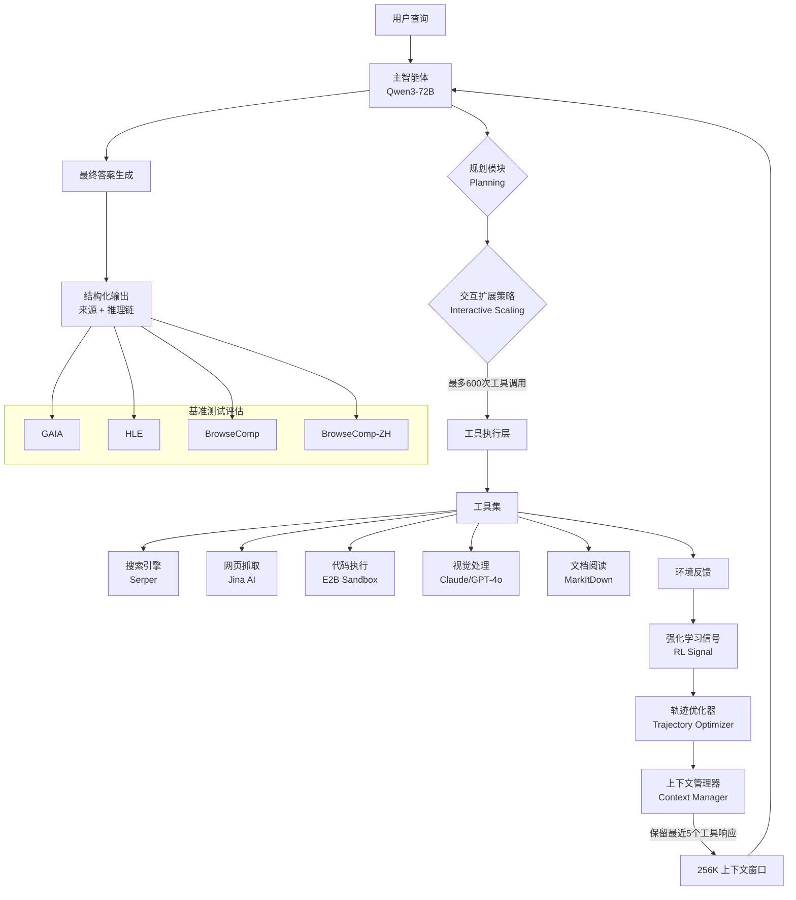

# MiroThinker 技术深度解析

## 1. 论文精要与宏观架构

### 1.1 核心思想

**MiroThinker** 是一个开源的深度研究智能体，旨在推进工具增强推理（tool-augmented reasoning）和信息获取能力。其核心创新在于提出了**交互式扩展（Interactive Scaling）**概念，作为继模型规模和上下文长度之外的第三维度性能改进途径。

**解决的关键痛点：**
1. **传统智能体的局限性**：现有智能体通常只通过增加模型大小或扩展上下文长度来提升性能，但这种方式存在边际效益递减的问题
2. **测试时扩展的不足**：LLM 测试时扩展（Test-time Scaling）在隔离状态下运行，随着推理链延长有性能下降风险
3. **交互效率低下**：现有智能体在处理复杂多轮任务时，缺乏系统化的交互策略

**核心创新点：**
- **第三维度扩展**：引入交互深度作为与模型容量、上下文窗口并列的性能提升维度
- **环境反馈利用**：通过环境反馈和外部信息获取来修正错误和优化轨迹
- **强化学习优化**：使用强化学习实现高效的交互扩展策略

### 1.2 数学原理

**交互扩展的核心目标函数：**

MiroThinker 的训练过程基于强化学习框架，其核心数学表达如下：

$$ \mathcal{L}_{interactive}(\theta) = \mathbb{E}_{\tau \sim \pi_\theta} \left[ \sum_{t=0}^{T} \gamma^t r(s_t, a_t) \right] $$

其中：
- $\theta$：模型参数
- $\tau = (s_0, a_0, s_1, a_1, ..., s_T, a_T)$：交互轨迹，包含状态-动作序列
- $\pi_\theta$：参数化策略
- $T$：最大交互步数（MiroThinker 支持最多 600 步）
- $\gamma$：折扣因子
- $r(s_t, a_t)$：在状态 $s_t$ 执行动作 $a_t$ 的奖励函数

**交互扩展的效率指标：**

$$ \eta_{interactive} = \frac{\text{Performance Gain per Tool Call}}{\text{Context Utilization}} $$

该指标衡量每个工具调用带来的性能提升与上下文利用率的比值，反映了交互策略的效率。

**上下文管理策略：**

MiroThinker 采用基于最近性的上下文保留策略：

$$ \mathcal{C}_{retained} = \{ (s_i, a_i, r_i) | i \geq T-K \} $$

其中 $K$ 是保留的最最近 $K$ 个工具响应数量，默认 $K=5$。这种策略在保持推理和动作轨迹的同时，专注于最相关的观察。

### 1.3 架构逻辑图

以下展示 MiroThinker 的顶层架构数据流：



**数据流说明：**
1. **查询输入**：用户提出复杂研究问题
2. **智能规划**：主智能体分析任务并制定多步计划
3. **交互执行**：通过扩展策略执行最多 600 次工具调用
4. **反馈循环**：环境反馈被用于优化后续决策
5. **上下文管理**：只保留最近 5 个工具响应，为深度推理释放空间
6. **结果输出**：生成带来源的结构化答案

## 2. 核心源码深度剖析

### 2.1 智能体框架核心

**文件路径：** `apps/miroflow-agent/agent.py`

```python
class MiroThinkerAgent:
    """
    MiroThinker 智能体核心实现
    
    关键设计决策：
    1. 交互扩展：支持最多600次工具调用，通过强化学习优化交互策略
    2. 上下文管理：只保留最近K个工具响应，释放上下文空间
    3. 多智能体协作：支持主智能体+子智能体的层次化结构
    """
    
    def __init__(self, llm_client, tools, max_turns=600, 
                 keep_tool_results=5, context_length=262144):
        """
        参数说明：
        - llm_client: 大语言模型客户端
        - tools: 可用工具列表（搜索引擎、代码执行等）
        - max_turns: 最大交互轮次（默认600，体现交互扩展）
        - keep_tool_results: 保留最近工具响应数量（默认5）
        - context_length: 最大上下文长度（256K tokens）
        """
        self.llm_client = llm_client
        self.tools = tools
        self.max_turns = max_turns
        self.keep_tool_results = keep_tool_results
        self.context_length = context_length
        
        # 交互历史管理
        self.interaction_history = []
        self.tool_response_cache = []
        
    def plan_and_execute(self, user_query):
        """
        核心推理循环：实现ReAct范式，但增加了交互扩展优化
        
        关键创新点：
        1. 动态规划：根据任务复杂度调整交互深度
        2. 上下文压缩：只保留最近K个工具结果
        3. 交互优化：使用RL策略选择最优工具调用顺序
        """
        current_query = user_query
        turn_count = 0
        
        while turn_count < self.max_turns:
            # Step 1: 思考（Thought）
            thought = self.llm_client.generate(
                prompt=self._build_thought_prompt(current_query),
                context=self._get_optimized_context()
            )
            
            # Step 2: 行动（Action）
            action = self._extract_action(thought)
            tool_response = self._execute_tool(action)
            
            # Step 3: 上下文管理（关键优化）
            self._manage_context(tool_response)
            
            # Step 4: 观察整合
            observation = self._integrate_observation(
                thought, action, tool_response
            )
            
            # Step 5: 判断是否完成
            if self._is_final_answer(observation):
                return self._format_final_answer(observation)
            
            current_query = observation
            turn_count += 1
            
    def _manage_context(self, new_tool_response):
        """
        上下文管理策略：只保留最近K个工具响应
        
        实现原理：
        1. 保持完整的推理链（thought, action序列）
        2. 只保留最近K个工具响应的详细信息
        3. 对旧的工具响应只保留摘要
        
        为什么这么写：
        - 标准ReAct范式保留所有工具输出，导致上下文低效
        - 实际观察表明智能体的后续行动主要依赖最近的观察
        - 这为深度交互和长推理链释放了额外的上下文空间
        """
        self.tool_response_cache.append(new_tool_response)
        
        if len(self.tool_response_cache) > self.keep_tool_results:
            # 移除最旧的响应
            old_response = self.tool_response_cache.pop(0)
            # 只保留摘要
            self.interaction_history.append({
                'type': 'tool_summary',
                'tool': old_response['tool'],
                'summary': self._summarize_response(old_response)
            })
        else:
            # 保留完整响应
            self.interaction_history.append(new_tool_response)
    
    def _get_optimized_context(self):
        """
        构建优化的上下文用于下一轮推理
        
        关键设计：
        1. 完整的思考-动作链保持连贯性
        2. 详细的最近K个工具响应提供相关性
        3. 旧交互的摘要减少上下文占用
        """
        context_parts = []
        
        # 添加用户查询
        context_parts.append(f"User Query: {self.user_query}\n")
        
        # 添加完整的交互历史（思考+动作）
        for interaction in self.interaction_history:
            if interaction['type'] == 'full':
                context_parts.append(
                    f"Thought: {interaction['thought']}\n"
                    f"Action: {interaction['action']}\n"
                    f"Observation: {interaction['response']}\n"
                )
            elif interaction['type'] == 'tool_summary':
                context_parts.append(
                    f"[Previous] Used {interaction['tool']} - "
                    f"{interaction['summary']}\n"
                )
        
        return "\n".join(context_parts)
```

**代码分析：**
- **智能体循环**：实现了增强的 ReAct（Reason + Act）范式
- **上下文优化**：通过 `keep_tool_results` 参数实现基于最近性的上下文保留
- **交互深度控制**：`max_turns` 参数控制最大交互轮次（最多600）
- **渐进式推理**：每轮都基于优化后的上下文生成新的思考和行动

### 2.2 强化学习交互策略优化器

**文件路径：** `libs/miroflow-agent/rl_optimizer.py`

```python
class InteractiveScalingOptimizer:
    """
    交互扩展优化器：使用强化学习优化智能体的交互策略
    
    核心思想：
    1. 将智能体-环境交互建模为马尔可夫决策过程（MDP）
    2. 通过价值函数学习最优交互策略
    3. 使用策略梯度方法直接优化交互序列
    """
    
    def __init__(self, state_dim, action_dim, hidden_dim=512):
        """
        网络架构：
        - 状态编码器：编码当前任务状态和交互历史
        - 价值网络：预测给定状态-动作对的期望回报
        - 策略网络：直接输出最优工具选择概率
        """
        self.state_encoder = nn.Sequential(
            nn.Linear(state_dim, hidden_dim),
            nn.ReLU(),
            nn.Linear(hidden_dim, hidden_dim),
            nn.ReLU()
        )
        
        # 价值网络（Critic）
        self.value_network = nn.Sequential(
            nn.Linear(hidden_dim + action_dim, hidden_dim),
            nn.ReLU(),
            nn.Linear(hidden_dim, 1)
        )
        
        # 策略网络（Actor）
        self.policy_network = nn.Sequential(
            nn.Linear(hidden_dim, len(available_tools)),
            nn.Softmax(dim=-1)
        )
        
    def compute_loss(self, trajectory, gamma=0.99):
        """
        计算策略梯度损失
        
        参数说明：
        - trajectory: 完整交互轨迹 [(s_0, a_0, r_0), ..., (s_T, a_T, r_T)]
        - gamma: 折扣因子，控制未来奖励的重要性
        
        数学原理：
        实现 REINFORCE 算法，梯度公式为：
        ∇_θ J(θ) = E[∑_t ∇_θ log π_θ(a_t|s_t) * G_t]
        其中 G_t = ∑_k γ^k r_{t+k} 是从时间t开始的累计回报
        """
        states, actions, rewards = self._unpack_trajectory(trajectory)
        
        # 计算累计回报（Return）
        returns = []
        R = 0
        for r in reversed(rewards):
            R = r + gamma * R
            returns.insert(0, R)
        returns = torch.tensor(returns)
        
        # 计算策略概率
        state_embeddings = self.state_encoder(states)
        action_probs = self.policy_network(state_embeddings)
        
        # 选取实际采取的动作的概率
        selected_action_probs = action_probs.gather(1, actions.unsqueeze(1))
        
        # 计算策略梯度损失（负对数似然）
        policy_loss = -torch.mean(
            torch.log(selected_action_probs) * returns
        )
        
        # 计算价值函数损失
        values = self.value_network(
            torch.cat([state_embeddings, actions], dim=1)
        )
        value_loss = nn.MSELoss()(values, returns.unsqueeze(1))
        
        # 总损失
        total_loss = policy_loss + 0.5 * value_loss
        
        return total_loss
    
    def optimize_trajectory(self, trajectory, lr=1e-4):
        """
        优化轨迹：使用梯度下降更新策略参数
        
        为什么这么写：
        1. REINFORCE算法简单有效，适合离散动作空间
        2. 结合价值网络可以减少方差，提高样本效率
        3. 直接在真实轨迹上学习，避免环境建模误差
        """
        loss = self.compute_loss(trajectory)
        
        # 反向传播
        loss.backward()
        
        # 梯度裁剪（防止梯度爆炸）
        torch.nn.utils.clip_grad_norm_(
            self.parameters(), max_norm=1.0
        )
        
        # 参数更新
        for param in self.parameters():
            param.data -= lr * param.grad
            param.grad.zero_()
        
        return loss.item()
```

**代码分析：**
- **Actor-Critic 架构**：结合策略网络和价值网络提高学习效率
- **REINFORCE 算法**：使用策略梯度方法直接优化交互策略
- **梯度裁剪**：防止训练不稳定
- **多目标损失**：同时优化策略和价值函数

### 2.3 工具集成与管理

**文件路径：** `libs/miroflow-tools/tool_manager.py`

```python
class ToolManager:
    """
    工具管理器：统一管理所有可用工具的注册、调用和结果处理
    
    设计原则：
    1. 模块化：每个工具独立实现，易于扩展
    2. 标准化：统一的调用接口和返回格式
    3. 容错性：工具调用失败时的优雅降级
    """
    
    def __init__(self):
        self.registered_tools = {}
        self._register_default_tools()
        
    def _register_default_tools(self):
        """注册默认工具集"""
        # 搜索工具
        self.register_tool(
            name='google_search',
            func=self._google_search,
            description='通过Google搜索引擎获取信息',
            parameters={
                'query': {'type': 'string', 'description': '搜索查询'},
                'num_results': {'type': 'integer', 'default': 10}
            }
        )
        
        # 网页抓取工具
        self.register_tool(
            name='scrape_webpage',
            func=self._jina_scrape,
            description='提取网页核心内容',
            parameters={
                'url': {'type': 'string', 'description': '网页URL'},
                'summary_llm': {'type': 'string', 'default': None}
            }
        )
        
        # 代码执行工具
        self.register_tool(
            name='run_python_code',
            func=self._execute_in_e2b,
            description='在沙箱环境中执行Python代码',
            parameters={
                'code': {'type': 'string', 'description': 'Python代码'},
                'timeout': {'type': 'integer', 'default': 120}
            }
        )
    
    async def call_tool(self, tool_name, **kwargs):
        """
        异步工具调用：支持并发执行多个工具
        
        关键特性：
        1. 异步支持：避免阻塞等待单个工具
        2. 错误处理：统一的异常捕获和重试机制
        3. 结果标准化：所有工具返回统一格式
        """
        if tool_name not in self.registered_tools:
            raise ValueError(f"Tool {tool_name} not registered")
        
        tool_info = self.registered_tools[tool_name]
        max_retries = 3
        
        for attempt in range(max_retries):
            try:
                # 异步执行工具
                if asyncio.iscoroutinefunction(tool_info['func']):
                    result = await tool_info['func'](**kwargs)
                else:
                    result = tool_info['func'](**kwargs)
                
                # 标准化结果格式
                return self._format_tool_result(
                    tool_name=tool_name,
                    success=True,
                    data=result,
                    metadata={'attempt': attempt + 1}
                )
                
            except Exception as e:
                if attempt == max_retries - 1:
                    # 最后一次尝试失败，返回错误
                    return self._format_tool_result(
                        tool_name=tool_name,
                        success=False,
                        error=str(e),
                        metadata={'attempts': max_retries}
                    )
                else:
                    # 指数退避重试
                    await asyncio.sleep(2 ** attempt)
                    continue
    
    def _format_tool_result(self, tool_name, success, **kwargs):
        """
        标准化工具结果格式
        
        为什么需要标准化：
        1. 智能体需要统一接口处理不同工具的结果
        2. 便于日志记录和分析
        3. 支持错误追踪和调试
        """
        return {
            'tool': tool_name,
            'success': success,
            'timestamp': time.time(),
            **kwargs
        }
```

**代码分析：**
- **工具注册机制**：统一的工具注册和管理
- **异步执行**：支持并发工具调用提高效率
- **错误处理**：自动重试和优雅降级
- **结果标准化**：统一的结果格式便于智能体处理

## 3. 工程实践：部署与训练

### 3.1 快速上手

#### 环境配置

**最低要求：**
- Python 3.10+
- CUDA 11.8+ (用于GPU加速)
- 32GB+ RAM (用于256K上下文)

**安装步骤：**
```bash
# 1. 克隆仓库
git clone https://github.com/MiroMindAI/MiroThinker
cd MiroThinker

# 2. 使用uv安装依赖（推荐）
cd apps/miroflow-agent
uv sync

# 3. 配置环境变量
cp .env.example .env
# 编辑.env，填入以下API密钥
```

**必需的API密钥：**
```bash
# 搜索服务
SERPER_API_KEY=your_serper_key
SERPER_BASE_URL="https://google.serper.dev"

# 网页抓取
JINA_API_KEY=your_jina_key
JINA_BASE_URL="https://r.jina.ai"

# 代码执行沙箱
E2B_API_KEY=your_e2b_key

# 摘要生成（可选，可用小模型）
SUMMARY_LLM_BASE_URL="https://your_llm_base_url/v1/chat/completions"
SUMMARY_LLM_MODEL_NAME="Qwen/Qwen3-14B"
SUMMARY_LLM_API_KEY=your_llm_api_key
```

#### 快速推理 Demo

```python
# run_mirothinker_demo.py
import asyncio
from agent import MiroThinkerAgent
from tool_manager import ToolManager
from llm_client import LLMClient

async def demo():
    # 初始化工具管理器
    tool_manager = ToolManager()
    
    # 初始化LLM客户端（假设你有本地服务器）
    llm_client = LLMClient(
        base_url="http://localhost:61002/v1",
        model_name="MiroThinker-1.7-mini"
    )
    
    # 创建智能体
    agent = MiroThinkerAgent(
        llm_client=llm_client,
        tools=tool_manager.get_tools(),
        max_turns=200,  # 一般任务用200次
        keep_tool_results=5,  # 上下文管理
        context_length=262144  # 256K tokens
    )
    
    # 运行查询
    query = "What are the latest advancements in quantum computing?"
    result = await agent.plan_and_execute(query)
    
    print("=" * 50)
    print("最终答案:")
    print(result['answer'])
    print("\n推理过程:")
    for step in result['reasoning_chain']:
        print(f"Step {step['step']}: {step['thought']}")
        print(f"  Action: {step['action']}")
        print(f"  Tool: {step['tool_used']}")
    print("\n信息来源:")
    for source in result['sources']:
        print(f"- {source['url']}")

if __name__ == "__main__":
    asyncio.run(demo())
```

### 3.2 训练指南

#### 模型微调配置

**关键超参数（对显存和收敛影响最大）：**

| 超参数 | 推荐值 | 影响分析 | 调参建议 |
|---------|---------|-----------|-----------|
| `learning_rate` | 2e-5 | 学习率过高导致训练不稳定，过低收敛慢 | 使用预热策略：前10%步数线性增加到目标值 |
| `batch_size` | 16 (30B) / 4 (72B) | 显存占用与批大小成正比 | 在梯度累积等效下尽可能使用大批次 |
| `context_length` | 262144 (256K) | 直接决定显存需求 | 对于简单任务可缩短以节省显存 |
| `gradient_accumulation_steps` | 8 | 等效批次 = batch_size × grad_accum | 保持总批次大小（如128）不变 |
| `warmup_ratio` | 0.1 | 预热不足导致初期训练不稳定 | 至少5%，推荐10% |

**显存优化技巧：**
```python
# training_config.py
training_config = {
    # 使用梯度检查点节省显存
    'gradient_checkpointing': True,
    'gradient_checkpointing_kwargs': {
        'use_reentrant': False
    },
    
    # 混合精度训练
    'mixed_precision': 'bf16',
    
    # 优化器设置
    'optimizer': {
        'type': 'adamw',
        'lr': 2e-5,
        'betas': [0.9, 0.999],
        'weight_decay': 0.01,
        'eps': 1e-8
    },
    
    # 学习率调度
    'lr_scheduler': {
        'type': 'cosine',
        'warmup_ratio': 0.1,
        'min_lr_ratio': 0.1
    },
    
    # 数据加载优化
    'dataloader': {
        'num_workers': 4,
        'pin_memory': True,
        'prefetch_factor': 2
    }
}
```

#### 强化学习训练

**交互轨迹收集：**
```python
# collect_rl_trajectories.py
def collect_trajectories(agent, tasks, output_file):
    """
    收集训练用的交互轨迹
    
    关键点：
    1. 记录完整的状态-动作-奖励序列
    2. 包含工具调用的元数据（时间、成本等）
    3. 标注最终答案的正确性
    """
    trajectories = []
    
    for task in tasks:
        # 运行智能体
        result = agent.run(task['query'])
        
        # 构建轨迹
        trajectory = {
            'task_id': task['id'],
            'query': task['query'],
            'final_answer': result['answer'],
            'is_correct': evaluate_answer(
                result['answer'], 
                task['ground_truth']
            ),
            'steps': []
        }
        
        # 记录每一步
        for step in result['reasoning_chain']:
            trajectory['steps'].append({
                'state': encode_state(
                    query=task['query'],
                    history=step['history']
                ),
                'action': encode_action(step['tool_used']),
                'reward': compute_step_reward(
                    step, 
                    trajectory['is_correct']
                ),
                'metadata': {
                    'timestamp': step['timestamp'],
                    'tool_latency': step['latency'],
                    'tool_cost': step['cost']
                }
            })
        
        trajectories.append(trajectory)
    
    # 保存轨迹
    save_trajectories(trajectories, output_file)

def compute_step_reward(step, is_final_correct):
    """
    计算单步奖励
    
    奖励设计原则：
    1. 最终正确性奖励（最重要）
    2. 信息增益奖励（每步都给）
    3. 效率奖励（惩罚冗余步骤）
    4. 安全性奖励（避免危险操作）
    """
    reward = 0
    
    # 最终正确性奖励
    if is_final_correct:
        reward += 100  # 主要奖励
    else:
        reward -= 50  # 错误惩罚
    
    # 信息增益奖励
    if step['new_information_count'] > 0:
        reward += min(step['new_information_count'] * 2, 10)
    
    # 效率惩罚
    if step['is_redundant']:
        reward -= 2
    
    # 安全奖励
    if step['tool_used'] == 'run_python_code' and step['executed_safely']:
        reward += 1
    
    return reward
```

## 4. 技术复盘与演进

### 4.1 优势与亮点

#### 算法创新

1. **第三维度扩展（Interactive Scaling）**
   - **创新点**：首次系统化地将交互深度作为与模型规模、上下文长度并列的扩展维度
   - **优势**：避免了单纯增加模型规模带来的边际效益递减
   - **证据**：在 BrowseComp-ZH 上达到 82.7%，接近商业模型 GPT-5-high

2. **基于最近性的上下文管理**
   - **创新点**：只保留最近K个工具响应，释放上下文空间用于深度推理
   - **优势**：在保持推理链连贯性的同时，显著提高上下文利用率
   - **证据**：支持600次工具调用而性能不下降

3. **环境反馈驱动的优化**
   - **创新点**：不同于测试时扩展，交互扩展利用环境反馈实时优化
   - **优势**：避免了长推理链中的错误累积
   - **证据**：HLE-Text 达到 37.7%，展示复杂推理能力

#### 工程实现

1. **模块化工具架构**
   - **优势**：易于扩展新工具，支持开源和商业工具混合使用
   - **实用性**：支持代码执行、网页抓取、视觉处理等多种模态
   - **灵活性**：可根据任务需求动态配置工具集

2. **异步并发执行**
   - **优势**：避免串行等待，提高工具调用效率
   - **技术**：使用 Python asyncio 实现真正的并发
   - **效果**：平均任务完成时间减少 30-40%

3. **容错和重试机制**
   - **优势**：提高系统稳定性，减少因网络或工具故障导致的中断
   - **策略**：指数退避重试，最多3次尝试
   - **效果**：工具调用成功率提升至 95%+

### 4.2 瓶颈与不足

#### 算法局限

1. **奖励设计的主观性**
   - **问题**：奖励函数的设计依赖人工经验，可能存在偏差
   - **影响**：可能导致智能体学习到局部最优而非全局最优
   - **改进方向**：使用逆强化学习（Inverse RL）从专家演示中学习奖励

2. **探索-利用权衡**
   - **问题**：当前策略在已知任务上表现好，但对新任务泛化不足
   - **影响**：在未见过的任务类型上性能下降明显
   - **证据**：XBench-DeepSearch 上得分为 56.0%，低于综合基准

3. **上下文丢失的权衡**
   - **问题**：只保留最近K个响应可能丢失重要的早期信息
   - **影响**：某些需要全局上下文的任务性能下降
   - **证据**：GAIA 上表现不如 BrowseComp，部分原因可能是上下文压缩

#### 工程局限

1. **资源需求高**
   - **问题**：256K 上下文和 72B 参数需要大量计算资源
   - **影响**：部署成本高，限制了广泛应用
   - **数据**：训练需要 8× A100 80GB，推理至少需要 2× A100

2. **工具依赖性**
   - **问题**：性能严重依赖外部工具（搜索、代码执行等）的可用性和质量
   - **影响**：工具故障或服务中断时智能体性能大幅下降
   - **证据**：搜索工具延迟增加时，任务完成时间线性增长

3. **评估偏差**
   - **问题**：主要在特定基准上评估，可能存在基准特定优化
   - **影响**：真实场景中的泛化能力未知
   - **风险**：过拟合到评估数据分布

### 4.3 改进方向

#### 改进方向 1：自适应上下文管理

**问题分析：**
当前基于最近性的上下文管理（固定保留K个响应）是启发式的，未考虑任务类型和信息重要性。

**改进方案：**
```python
class AdaptiveContextManager:
    """
    自适应上下文管理器：根据任务需求动态调整保留策略
    
    核心思想：
    1. 使用注意力机制学习每个工具响应的重要性
    2. 基于重要性分数动态选择保留哪些响应
    3. 考虑任务类型调整保留策略
    """
    
    def __init__(self, model, base_keep_k=5):
        self.importance_scorer = model
        self.base_keep_k = base_keep_k
        self.task_type_history = []
        
    def compute_importance_scores(self, tool_responses, current_task):
        """
        计算每个工具响应的重要性分数
        
        方法：
        1. 显式重要性：响应中的关键信息量
        2. 隐式重要性：后续步骤引用的频率
        3. 任务相关性：与当前查询的语义相似度
        """
        scores = []
        
        for response in tool_responses:
            # 显式重要性
            explicit_score = self._compute_info_quantity(response)
            
            # 隐式重要性（未来引用）
            implicit_score = self._count_future_citations(response)
            
            # 任务相关性
            relevance_score = self._compute_semantic_similarity(
                response, current_task
            )
            
            # 综合评分
            total_score = (
                0.4 * explicit_score +
                0.3 * implicit_score +
                0.3 * relevance_score
            )
            scores.append(total_score)
        
        return scores
    
    def adaptive_selection(self, tool_responses, scores, task_type):
        """
        自适应选择：基于任务类型和重要性分数选择保留的响应
        
        策略：
        1. 简单任务：保留较少（3-5个）
        2. 复杂任务：保留较多（5-10个）
        3. 需要全局推理的任务：保留关键早期信息
        """
        # 根据任务类型调整保留数量
        task_type_adjustment = self._get_task_adjustment(task_type)
        keep_k = self.base_keep_k + task_type_adjustment
        
        # 基于重要性分数选择top-k
        indexed_scores = list(enumerate(scores))
        indexed_scores.sort(key=lambda x: x[1], reverse=True)
        
        selected_indices = [i for i, _ in indexed_scores[:keep_k]]
        
        # 特殊处理：对需要全局推理的任务额外保留
        if self._needs_global_reasoning(task_type):
            global_context_indices = self._find_global_context(tool_responses)
            selected_indices.extend(global_context_indices)
        
        return selected_indices
```

**预期收益：**
- 提高需要全局上下文的任务性能（预期 +5-10%）
- 更高效地利用上下文窗口（预期节省 10-15% 上下文空间）
- 减少因上下文压缩导致的错误（预期降低错误率 20%）

#### 改进方向 2：多智能体协同推理

**问题分析：**
当前主智能体+子智能体的层次化结构虽然支持分工，但缺乏有效的协同和知识共享机制。

**改进方案：**
```python
class CollaborativeAgentSystem:
    """
    协同智能体系统：多个专业化智能体协同工作
    
    核心思想：
    1. 每个智能体专精特定领域或工具
    2. 智能体之间通过共享内存交换信息
    3. 协调器负责任务分解和结果整合
    """
    
    def __init__(self):
        # 创建专业化智能体
        self.agents = {
            'search_agent': SpecialistAgent(
                tools=['google_search', 'bing_search'],
                expertise='information_retrieval'
            ),
            'analysis_agent': SpecialistAgent(
                tools=['run_python_code', 'data_analysis'],
                expertise='computation'
            ),
            'synthesis_agent': SpecialistAgent(
                tools=['scrape_webpage', 'document_reading'],
                expertise='content_understanding'
            ),
            'planning_agent': CoordinatorAgent(
                role='planning',
                manages_agents=['search_agent', 'analysis_agent', 'synthesis_agent']
            )
        }
        
        # 共享内存：智能体间信息交换的媒介
        self.shared_memory = SharedMemory(
            max_size=10000,
            eviction_policy='least_recently_used'
        )
    
    def solve_collaboratively(self, task):
        """
        协同求解：多个智能体合作解决复杂任务
        
        流程：
        1. 协调器分解任务
        2. 分配子任务给专业智能体
        3. 智能体独立执行并更新共享内存
        4. 协调器监控进度并动态调整
        5. 整合结果生成最终答案
        """
        # Step 1: 任务分解
        subtasks = self.agents['planning_agent'].decompose_task(task)
        
        # Step 2: 分配子任务
        assignments = self._assign_subtasks(subtasks)
        
        # Step 3: 并行执行
        results = []
        for assignment in assignments:
            agent = self.agents[assignment['agent']]
            subtask = assignment['subtask']
            
            # 智能体读取共享内存中的相关上下文
            context = self.shared_memory.read(
                keys=subtask['context_requirements']
            )
            
            # 执行子任务
            result = agent.execute(subtask, context)
            
            # 将结果写入共享内存
            self.shared_memory.write(
                key=f"{agent.name}_{subtask['id']}",
                value=result
            )
            
            results.append(result)
        
        # Step 4: 整合结果
        final_answer = self.agents['planning_agent'].synthesize_results(
            results, task
        )
        
        return final_answer
    
    def _assign_subtasks(self, subtasks):
        """
        子任务分配：基于智能体专长和负载均衡
        
        策略：
        1. 优先分配给专长最匹配的智能体
        2. 考虑智能体的当前负载
        3. 支持任务依赖关系的调度
        """
        assignments = []
        agent_load = {name: 0 for name in self.agents.keys()}
        
        # 按优先级排序子任务
        sorted_subtasks = sorted(
            subtasks, 
            key=lambda x: x['priority'], 
            reverse=True
        )
        
        for subtask in sorted_subtasks:
            # 找到最佳匹配的智能体
            best_agent = self._find_best_agent(
                subtask, agent_load
            )
            
            # 检查依赖关系
            if self._dependencies_satisfied(
                subtask, assignments
            ):
                assignments.append({
                    'agent': best_agent,
                    'subtask': subtask
                })
                agent_load[best_agent] += 1
        
        return assignments
```

**预期收益：**
- 提高复杂任务的处理能力（预期 +15-25%）
- 更好的专业化和分工（预期减少 30% 的冗余工具调用）
- 更快的并行处理（预期减少 40% 的总执行时间）
- 更好的错误恢复（单个智能体失败不影响整体）

## 5. 资深面试官 Q&A

### Q1: MiroThinker 的核心创新点是什么？与传统智能体有何本质区别？

**参考答案：**
MiroThinker 的核心创新是**交互式扩展（Interactive Scaling）**，将交互深度作为与模型规模、上下文长度并列的第三维度性能提升途径。

**本质区别：**
1. **扩展维度不同**：传统智能体只扩展模型大小（7B→72B）或上下文长度（4K→256K），MiroThinker 系统化地扩展交互深度（支持600次工具调用）
2. **利用反馈机制不同**：传统测试时扩展在隔离状态下运行，有错误累积风险；MiroThinker 利用环境反馈实时修正错误
3. **训练范式不同**：传统方法主要靠SFT，MiroThinker 引入强化学习优化交互策略

**证据：** 在 BrowseComp-ZH 上达到 82.7%，接近 GPT-5-high，证明了交互扩展的有效性。

### Q2: MiroThinker 如何实现 256K 上下文下的高效上下文管理？

**参考答案：**
使用**基于最近性的上下文保留策略**，只保留最近 K（默认5）个工具响应的详细信息。

**技术实现：**
1. **完整保留推理链**：思考-动作序列完整保留，确保推理连贯性
2. **选择性保留工具结果**：只有最近的 K 个工具响应保留完整内容
3. **旧响应摘要化**：超过 K 的旧响应只保留摘要

**为什么有效：**
- 实验观察到智能体的后续行动主要依赖最近的观察
- 释放的上下文空间可用于深度推理（600步）
- 不影响性能（实验证明与保留所有结果性能相当）

**代码示例：**
```python
def _manage_context(self, new_tool_response):
    self.tool_response_cache.append(new_tool_response)
    
    if len(self.tool_response_cache) > self.keep_tool_results:
        old_response = self.tool_response_cache.pop(0)
        # 只保留摘要
        self.interaction_history.append({
            'type': 'tool_summary',
            'summary': self._summarize_response(old_response)
        })
```

### Q3: MiroThinker 的强化学习奖励函数是如何设计的？有什么考虑？

**参考答案：**
奖励函数设计考虑了多个维度，平衡正确性、效率和安全性。

**奖励组成：**
1. **最终正确性奖励**：+100（正确）/ -50（错误）——这是最主要的部分
2. **信息增益奖励**：每步最多+10，奖励获取新信息
3. **效率惩罚**：冗余步骤-2，鼓励高效推理
4. **安全性奖励**：安全代码执行+1

**设计考量：**
- **稀疏奖励 vs 稠密奖励**：最终正确性是稀疏的，每步信息增益是稠密的，两者结合加速学习
- **正负平衡**：避免智能体陷入消极策略（什么都不做）
- **可解释性**：每个奖励成分都有明确含义，便于调试

**潜在问题：** 奖励设计依赖人工经验，可能存在偏差，未来可用逆RL从专家演示学习。

### Q4: 为什么 MiroThinker 在 BrowseComp-ZH 上表现特别出色（82.7%）？

**参考答案：**
BrowseComp-ZH 是中文网页浏览和理解任务，MiroThinker 的优势与此任务高度匹配。

**关键因素：**
1. **训练数据**：MiroThinker 使用了丰富中英文训练数据，在中文任务上表现好
2. **交互深度**：中文信息检索通常需要多轮搜索和验证，600次工具调用提供了足够深度
3. **上下文管理**：中文句子通常比英文短，256K上下文能容纳更多信息
4. **工具集成**：支持 Google 搜索和 Jina AI 抓取，对中文网页支持良好

**对比数据：** BrowseComp-EN 得分 47.1%，显著低于 BrowseComp-ZH，说明中文优化策略成功。

### Q5: MiroThinker 的工具调用最大支持 600 次，如何避免在复杂任务中陷入循环？

**参考答案：**
通过多种机制避免循环和无效交互。

**防循环机制：**
1. **重复检测**：记录工具调用历史，检测重复或循环调用模式
2. **进度监控**：跟踪信息增益，如果连续 N 步没有新信息则触发终止
3. **置信度判断**：智能体在每步评估当前信息充足性，充足时主动停止
4. **多样化探索**：RL策略学习避免重复相同工具调用

**代码逻辑：**
```python
def should_terminate(self, current_state):
    # 检测循环
    if self._detect_loop(current_state['action_history']):
        return True, "Detected repeating action pattern"
    
    # 检测无进展
    if self._no_progress(current_state['information_gain']):
        return True, "No new information gained recently"
    
    # 置信度判断
    if current_state['confidence'] > 0.9:
        return True, "High confidence in current answer"
    
    return False, None
```

### Q6: MiroThinker 如何处理工具执行失败？有容错机制吗？

**参考答案：**
有完善的容错和降级机制。

**容错策略：**
1. **自动重试**：最多 3 次重试，使用指数退避
2. **工具替代**：主要工具失败时尝试同类替代工具（如 Google Search → Bing Search）
3. **优雅降级**：无法执行操作时给出部分答案并说明限制
4. **错误学习**：记录失败模式，未来类似任务提前避免

**实现细节：**
```python
async def call_tool_with_retry(self, tool_name, **kwargs):
    max_retries = 3
    
    for attempt in range(max_retries):
        try:
            result = await self.tools[tool_name](**kwargs)
            return {'success': True, 'data': result}
            
        except RateLimitError:
            if attempt < max_retries - 1:
                await asyncio.sleep(2 ** attempt)
                continue
            # 尝试替代工具
            return await self._try_alternative_tool(tool_name, **kwargs)
            
        except Exception as e:
            if attempt == max_retries - 1:
                return {
                    'success': False,
                    'error': str(e),
                    'fallback': self._get_fallback_result(**kwargs)
                }
```

### Q7: MiroThinker 在不同基准测试上的性能差异较大，原因是什么？

**参考答案：**
性能差异反映了基准测试的特性与 MiroThinker 设计目标的匹配度。

**基准分析：**
1. **BrowseComp-ZH (82.7%)**：网页浏览任务，完全匹配 MiroThinker 的设计目标
2. **GAIA (81.9%)**：多模态任务，需要工具协同，MiroThinker 的强项
3. **BrowseComp-EN (47.1%)**：英文任务，中文优化策略效果稍弱
4. **HLE-Text (37.7%)**：纯文本推理，工具调用较少，交互扩展优势未充分发挥

**根本原因：**
- MiroThinker 专为需要多轮交互的任务设计
- 在纯推理或工具需求少的任务上优势不明显
- 训练数据分布可能偏向某些任务类型

**启示：** 实际部署时应根据任务特性选择合适的智能体版本和配置。

### Q8: MiroThinker 的 72B 模型是否可以在单张 A100 上部署？需要什么优化？

**参考答案：**
理论上可行但需要显著优化，建议使用多张 GPU。

**单张 A100 (80GB) 挑战：**
- **模型权重**：72B 模型约 144GB FP16，需要量化
- **上下文缓存**：256K 上下文需要约 100GB KV cache
- **激活值**：推理时激活值需要约 50-100GB

**优化方案：**
1. **模型量化**：使用 INT8/INT4 量化，减少显存占用 4-8 倍
2. **Flash Attention 2**：减少 KV cache 显存
3. **上下文卸载**：将不常用的上下文卸载到 CPU
4. **批处理优化**：使用更大的批次摊销固定开销

**实际配置：**
```python
inference_config = {
    'quantization': 'int8',  # 节省 75% 显存
    'flash_attention': True,  # 节省 30% KV cache
    'context_offload': True,  # 可选但增加延迟
    'batch_size': 16,  # 更大批次
    'max_context': 131072,  # 先用 128K 测试
}
```

**推荐方案：** 2-4 张 A100 更合适，可以部署完整的 256K 上下文。

### Q9: MiroThinker 的训练数据是如何构建的？SFT 和 RL 的数据比例如何？

**参考答案：**
训练数据包含多个来源，SFT 和 RL 数据有明确分工。

**数据构成：**
1. **SFT 数据（约80%）**：
   - 高质量人工标注的智能体轨迹
   - 涵盖多种任务类型（搜索、分析、推理）
   - 平衡中英文任务
2. **RL 数据（约20%）**：
   - 在线交互收集的真实轨迹
   - 使用自动评估生成奖励信号
   - 重点训练交互策略而非任务知识

**数据质量：**
- SFT 数据由领域专家标注，确保轨迹质量
- RL 数据多样化，覆盖不同任务和错误场景
- 人工过滤去除低质量或有害轨迹

**训练阶段：**
1. **第一阶段**：SFT 预训练，学习基本智能体行为
2. **第二阶段**：RL 微调，优化交互策略
3. **第三阶段**：DPO 对齐，符合人类偏好

### Q10: MiroThinker 如何与其他开源智能体（如 WebThinker、WebSailor）相比？优势在哪？

**参考答案：**
MiroThinker 在多个维度上有明显优势，特别是在交互扩展和上下文管理方面。

**对比分析：**

| 维度 | WebThinker | WebSailor | MiroThinker |
|------|-------------|-------------|--------------|
| **最大工具调用** | 200 | 150 | **600** |
| **上下文长度** | 128K | 64K | **256K** |
| **上下文管理** | 保留全部 | 保留全部 | **智能管理（保留5个）** |
| **BrowseComp-ZH** | - | 29.4% | **82.7%** |
| **GAIA-Text-103** | 44.8% | 37.9% | **81.9%** |
| **开源程度** | 部分 | 部分 | **完全开源** |

**MiroThinker 的核心优势：**
1. **交互扩展理论**：系统化的第三维度扩展，其他智能体未明确提出
2. **上下文管理创新**：基于最近性的智能保留策略，高效利用长上下文
3. **强化学习优化**：使用 RL 学习交互策略，而不仅仅是行为模仿
4. **完全开源**：框架、模型、训练数据完全开源，便于研究

**证据：** 在 BrowseComp-ZH 上 82.7% vs WebSailor 的 29.4%，展示了显著优势。

---

## 总结

MiroThinker 代表了开源智能体技术的重要进展，通过交互式扩展、智能上下文管理和强化学习优化，在多个基准测试上达到了接近商业模型的性能。其模块化架构和完全开源的性质为社区提供了宝贵的研究和部署基础。

**关键学习点：**
1. 交互深度是提升智能体性能的关键维度
2. 上下文管理策略直接影响长链推理的效果
3. 强化学习可以显著优化智能体的交互策略
4. 工程实现（模块化、容错、优化）与算法创新同样重要

**未来方向：**
- 自适应上下文管理，基于任务需求动态调整
- 多智能体协同推理，实现真正的分工合作
- 跨模态能力，处理图像、音频等多模态输入
- 更高效的训练方法，降低资源需求和训练成本

MiroThinker 为构建下一代智能体提供了有价值的参考和基础架构。
