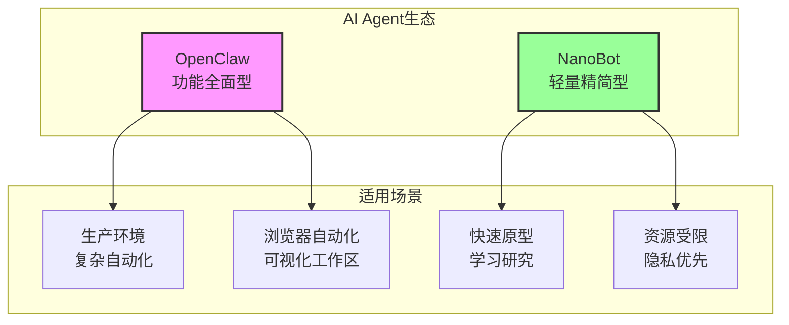
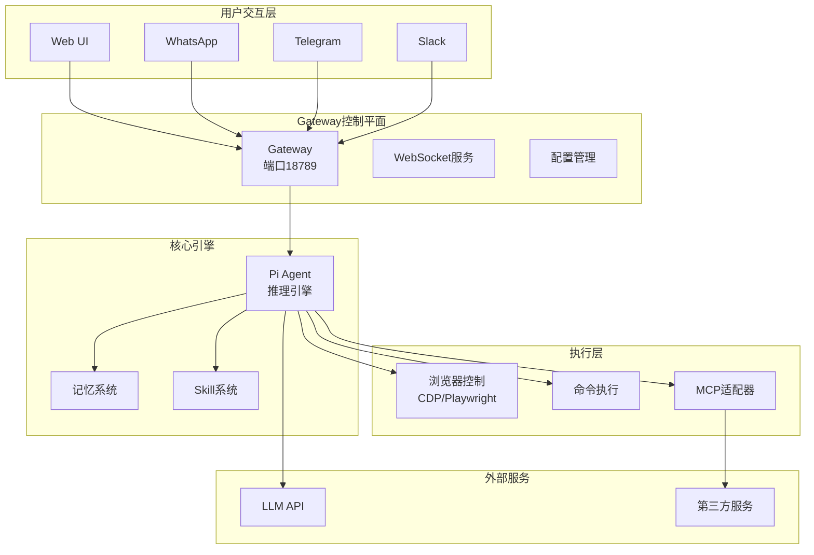
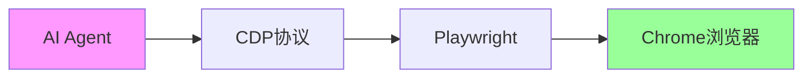
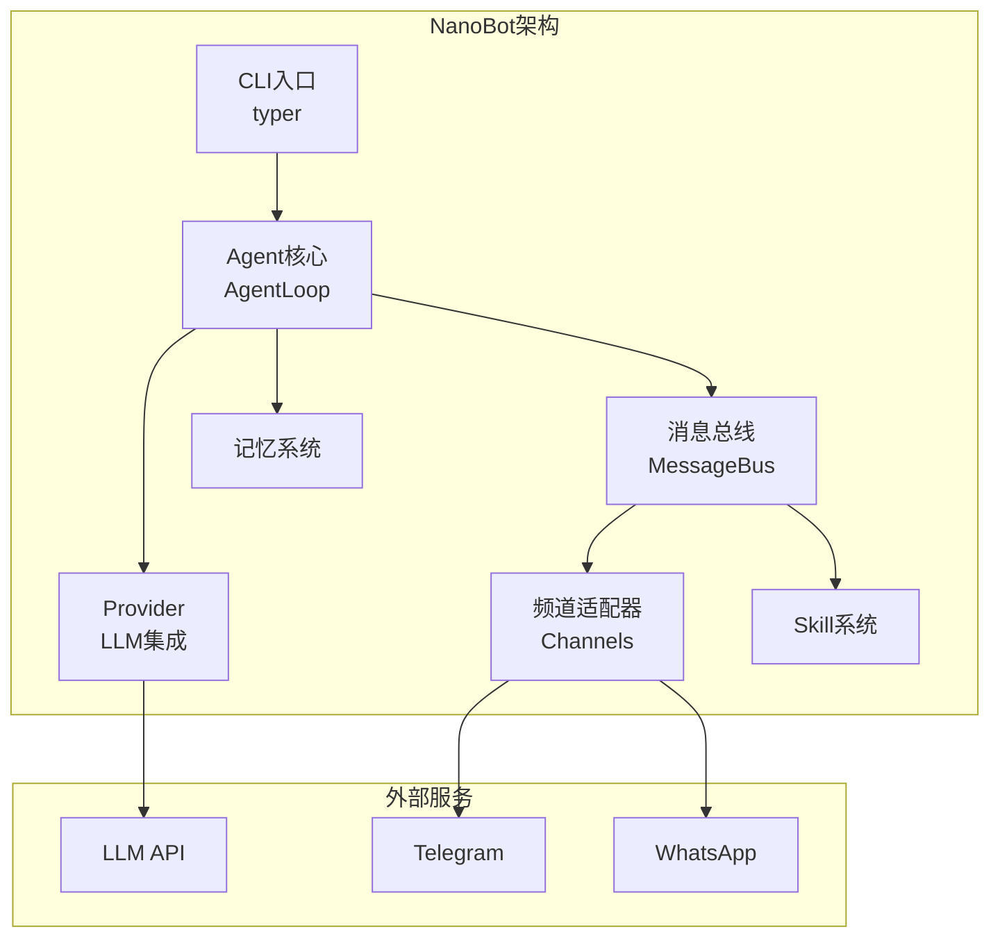

# OpenClaw & NanoBot 完整技术文档

> 🎯 **版本**: 1.0  
> 📅 **更新日期**: 2026年2月  
> 📝 **文档类型**: 综合技术文档  
> 👥 **适用读者**: 开发者、技术架构师、DevOps工程师

---

## 📋 目录

- [1. 项目概述](#1-项目概述)
  - [1.1 OpenClaw简介](#11-openclaw简介)
  - [1.2 NanoBot简介](#12-nanobot简介)
  - [1.3 两者关系](#13-两者关系)
- [2. 行业现状与价值分析](#2-行业现状与价值分析)
  - [2.1 AI Agent行业概述](#21-ai-agent行业概述)
  - [2.2 OpenClaw的市场定位](#22-openclaw的市场定位)
  - [2.3 核心价值与优势](#23-核心价值与优势)
  - [2.4 对AI发展的推动作用](#24-对ai发展的推动作用)
- [3. 技术原理详解](#3-技术原理详解)
  - [3.1 系统架构](#31-系统架构)
  - [3.2 底层原理](#32-底层原理)
  - [3.3 浏览器自动化机制](#33-浏览器自动化机制)
  - [3.4 工具调用系统](#34-工具调用系统)
  - [3.5 功能范围](#35-功能范围)
  - [3.6 优缺点分析](#36-优缺点分析)
- [4. NanoBot代码详解](#4-nanobot代码详解)
  - [4.1 项目架构图](#41-项目架构图)
  - [4.2 目录结构](#42-目录结构)
  - [4.3 核心代码逐行解析](#43-核心代码逐行解析)
  - [4.4 与OpenClaw的对比](#44-与openclaw的对比)
- [5. 部署指南](#5-部署指南)
  - [5.1 Windows部署](#51-windows部署)
  - [5.2 Linux部署](#52-linux部署)
  - [5.3 MacOS部署](#53-macos部署)
  - [5.4 Docker部署](#54-docker部署)
  - [5.5 常见问题排查](#55-常见问题排查)
- [6. 国产模型集成](#6-国产模型集成)
  - [6.1 Kimi集成](#61-kimi集成)
  - [6.2 Qwen集成](#62-qwen集成)
  - [6.3 其他国产模型](#63-其他国产模型)
  - [6.4 最佳实践](#64-最佳实践)
- [7. 常见问题解答（FAQ）](#7-常见问题解答faq)
  - [7.1 技术问题](#71-技术问题)
  - [7.2 业务场景问题](#72-业务场景问题)
- [8. 附录](#8-附录)
  - [8.1 参考链接](#81-参考链接)
  - [8.2 术语表](#82-术语表)

---

## 1. 项目概述

### 1.1 OpenClaw简介

**OpenClaw**（原名 Clawdbot / Moltbot）是由奥地利开发者 Peter Steinberger 于2025年末创建的开源AI Agent项目。该项目在短短48小时内获得超过123,000个GitHub Star，成为GitHub历史上增长最快的开源项目之一。

#### 核心定位

OpenClaw定位为**本地化、自托管的AI个人助手**，能够执行真实的自动化任务，而非仅提供对话服务。

> 💡 **"The AI that does things"** —— 真正做事的AI

#### 技术特点

| 特性 | 描述 |
|------|------|
| 🏠 **本地优先** | 数据完全本地存储，隐私可控 |
| 🔧 **自托管** | 无需依赖云服务，自主掌控 |
| 🌐 **多平台** | 支持WhatsApp、Telegram、Discord、Slack等 |
| 🚀 **任务执行** | 真正的浏览器自动化和命令执行 |
| 🔌 **技能扩展** | 通过SKILL.md规范扩展功能 |

#### 技术栈

- **语言**: TypeScript / Node.js
- **架构**: Gateway-Centric 架构
- **默认端口**: 
  - Gateway: 18789
  - Canvas Host: 18793
  - Browser Control: 18791

#### 官方资源

- 🐙 **GitHub**: https://github.com/openclaw/openclaw
- 📚 **文档**: https://docs.openclaw.ai
- 🛒 **ClawHub**: https://clawhub.ai

---

### 1.2 NanoBot简介

**NanoBot** 是由香港大学数据智能实验室(HKUDS)开发的一款超轻量级个人AI助手，灵感来源于 OpenClaw。

#### 核心特点

| 指标 | NanoBot | OpenClaw |
|------|---------|----------|
| 📏 **代码规模** | ~4,000行 | 430,000+行 |
| ⚡ **启动速度** | ~3秒 | ~30秒 |
| 💾 **内存占用** | <100MB | >1GB |
| 📜 **许可证** | MIT License | MIT License |
| 🐍 **Python版本** | >=3.11 | Node.js >=22 |

#### 技术特点

- **极简代码**: 4000行代码实现核心功能，易于理解和审计
- **快速启动**: 3秒启动时间，适合快速迭代
- **模块化设计**: 清晰的模块划分，易于扩展
- **多提供商支持**: 通过LiteLLM支持100+ LLM提供商
- **多频道集成**: 支持Telegram、WhatsApp、飞书

#### 官方资源

- 🐙 **GitHub**: https://github.com/HKUDS/nanobot
- 🐍 **PyPI**: `pip install nanobot-ai`

---

### 1.3 两者关系



#### 关系说明

| 维度 | OpenClaw | NanoBot |
|------|----------|---------|
| **关系** | 原版/参考实现 | 精简版/学习实现 |
| **目标用户** | 生产环境用户 | 学习者、原型开发者 |
| **功能侧重** | 全面功能、企业级 | 核心功能、易理解 |
| **代码哲学** | 功能完整 | 代码精简 |

---

## 2. 行业现状与价值分析

### 2.1 AI Agent行业概述

#### 2.1.1 市场规模

**全球市场数据：**

| 指标 | 2024年 | 2025年 | 2030年预测 | CAGR |
|------|--------|--------|------------|------|
| AI Agent市场规模 | $5.1B | $7.8B | $48.3B-$139B | 43-46% |
| Agentic AI市场 | - | $7.29B | $139.19B | 40.5% |
| 自主AI代理市场 | - | $4.42B | $18.25B | 32.79% |

**区域分布（2025年）：**

| 区域 | 市场份额 | 市场规模 | CAGR |
|------|----------|----------|------|
| 北美 | 37.92% | ~$2.45B | 40% |
| 欧洲 | ~30% | ~$2.31B | 42.5% |
| 亚太 | ~24% | ~$1.86B | 36.3% |

#### 2.1.2 行业应用分布

| 应用领域 | 占比 | 说明 |
|----------|------|------|
| 客户服务与虚拟助手 | 32.2% | 最大细分市场 |
| 企业自动化 | 45.7% | 按终端用户 |
| 金融服务 | - | 预计2035年提升38%盈利能力 |
| 医疗健康 | - | 预计CAGR 48.4% |

#### 2.1.3 企业采用率

- 📊 **72%** 的全球组织已采用至少一种AI自动化解决方案
- 🏢 **57%** 的大型企业已部署AI Agent
- 🏪 **38%** 的中小企业使用AI助手或工作流自动化工具
- 🔮 预计到2029年，AI Agent将自主解决**80%**的常规客户问题

---

### 2.2 OpenClaw的市场定位

#### 2.2.1 项目基本信息

| 指标 | 数值 |
|------|------|
| GitHub Stars | 150,000+ |
| 增长速度 | 48小时内123,000 Star |
| 创始人 | Peter Steinberger |
| 发布时间 | 2025年11月 |
| 命名演变 | Clawdbot → Moltbot → OpenClaw |

#### 2.2.2 竞品对比

| 对比维度 | OpenClaw | AutoGPT | CrewAI | MetaGPT |
|----------|----------|---------|--------|---------|
| 执行深度 | ⭐⭐⭐⭐⭐ | ⭐⭐⭐ | ⭐⭐⭐⭐ | ⭐⭐⭐ |
| 可靠性 | ⭐⭐⭐⭐⭐ | ⭐⭐⭐ | ⭐⭐⭐⭐ | ⭐⭐⭐⭐ |
| 易用性 | ⭐⭐⭐⭐ | ⭐⭐⭐ | ⭐⭐⭐⭐ | ⭐⭐⭐ |
| 本地部署 | ✅ | ✅ | ✅ | ✅ |
| 浏览器自动化 | ✅ | ❌ | ❌ | ❌ |

---

### 2.3 核心价值与优势

#### 2.3.1 本地化部署优势

| 优势 | 说明 |
|------|------|
| 🔒 **数据隐私** | 数据完全本地存储，不上传云端 |
| 🏠 **自主可控** | 不依赖第三方服务，避免服务中断 |
| 💰 **成本优势** | $10-25/月 vs 云AI $20-200/月 |
| ⚡ **低延迟** | 本地处理，响应更快 |

#### 2.3.2 真实执行能力

- 🌐 **浏览器控制**：基于CDP协议，毫秒级响应
- 🖥️ **命令执行**：安全的沙箱环境执行系统命令
- 📊 **任务自动化**：复杂多步骤工作流自动化
- 🔗 **第三方集成**：通过MCP协议连接100+服务

#### 2.3.3 消息平台集成

| 平台 | 支持状态 | 技术方案 |
|------|----------|----------|
| WhatsApp | ✅ | Baileys库 |
| Telegram | ✅ | Grammy库 |
| Slack | ✅ | Bolt框架 |
| Discord | ✅ | Discord.js |
| 飞书 | ✅ | 官方SDK |

---

### 2.4 对AI发展的推动作用

#### 2.4.1 推动AI Agent技术发展

1. **架构创新**：Gateway-centric架构成为行业标准
2. **协议推广**：MCP协议推动AI与外部服务标准化集成
3. **开源生态**：激发更多开源AI Agent项目
4. **实践验证**：验证了AI Agent在实际场景中的可行性

#### 2.4.2 对LLM应用落地的贡献

- 🎯 **从对话到行动**：LLM从"会说话"到"会做事"
- 🔧 **工具使用能力**：推动Function Calling技术发展
- 💼 **企业应用**：为企业提供LLM落地的完整方案
- 🌐 **多模型支持**：促进模型无关架构的发展

#### 2.4.3 未来发展方向

- 🧠 **更强的推理能力**：结合o1等推理模型
- 🌐 **更广泛集成**：支持更多第三方服务
- 📱 **移动端支持**：开发移动应用版本
- 🏢 **企业版功能**：团队协作、权限管理等

---

## 3. 技术原理详解

### 3.1 系统架构

#### 3.1.1 整体架构图



#### 3.1.2 核心组件

| 组件 | 功能 | 端口 |
|------|------|------|
| **Gateway** | 中央控制平面，协调所有组件 | 18789 |
| **Canvas Host** | 可视化工作区服务 | 18793 |
| **Browser Control** | 浏览器自动化控制 | 18791 |
| **Extension Relay** | Chrome扩展通信 | 18792 |
| **Pi Agent** | LLM推理引擎核心 | - |

---

### 3.2 底层原理

#### 3.2.1 Gateway-centric架构

**设计思想**：
- 单一控制平面管理所有组件
- 组件间通过Gateway通信，降低耦合
- 支持动态扩展和插件化

**工作流程**：
1. 用户通过消息平台发送指令
2. Gateway接收并路由到Pi Agent
3. Pi Agent调用LLM进行推理
4. 根据推理结果调用相应工具
5. 返回执行结果给用户

#### 3.2.2 Pi Agent推理引擎

**核心功能**：
- LLM抽象层，支持多提供商
- 上下文管理
- 工具选择决策
- 执行计划生成

**支持的LLM提供商**：
- OpenAI (GPT-4, GPT-4o)
- Anthropic (Claude 3.5)
- Moonshot (Kimi K2)
- 阿里云 (Qwen)
- 本地模型 (Ollama, vLLM)

---

### 3.3 浏览器自动化机制

#### 3.3.1 三层架构



| 层级 | 技术 | 作用 |
|------|------|------|
| **协议层** | Chrome DevTools Protocol | 浏览器底层控制 |
| **自动化层** | Playwright Core 1.58.1 | 跨浏览器抽象 |
| **扩展层** | Chrome Extension Relay | 与Agent通信 |

#### 3.3.2 CDP vs WebDriver对比

| 特性 | CDP | WebDriver |
|------|-----|-----------|
| 速度 | ⚡ 快15-20% | 较慢 |
| 功能丰富度 | ⭐⭐⭐⭐⭐ | ⭐⭐⭐ |
| 现代浏览器支持 | ✅ 原生 | 需要驱动 |
| 调试能力 | ⭐⭐⭐⭐⭐ | ⭐⭐⭐ |
| 学习曲线 | 较陡 | 平缓 |

#### 3.3.3 Snapshot系统

**创新点**：
- AI通过ref ID引用元素，无需CSS选择器
- 页面状态结构化表示
- 支持复杂交互操作

**示例**：
```json
{
  "elements": [
    {"ref": "E1", "type": "button", "text": "提交"},
    {"ref": "E2", "type": "input", "placeholder": "请输入"}
  ]
}
```

---

### 3.4 工具调用系统

#### 3.4.1 SKILL.md规范

**格式**：
```markdown
## 描述
技能的功能描述

## 工具
- tool_name: 工具描述

## 示例
使用示例

## 实现
TypeScript实现代码
```

#### 3.4.2 MCP协议集成

**MCP (Model Context Protocol)**：
- 标准化AI与外部服务交互
- 支持100+第三方服务
- 统一的工具发现和调用接口

**支持的服务类型**：
| 类型 | 示例 |
|------|------|
| 开发工具 | GitHub, GitLab |
| 通信工具 | Slack, Discord |
| 文件系统 | 本地文件, Google Drive |
| 数据库 | PostgreSQL, MongoDB |
| 搜索 | Google, Bing |

---

### 3.5 功能范围

#### 3.5.1 核心功能

| 功能 | 描述 | 状态 |
|------|------|------|
| 浏览器自动化 | 控制浏览器执行操作 | ✅ |
| 命令执行 | 安全沙箱执行系统命令 | ✅ |
| 文件操作 | 读写本地文件 | ✅ |
| 消息发送 | 多平台消息集成 | ✅ |
| 任务调度 | 定时任务执行 | ✅ |
| 记忆系统 | 持久化对话历史 | ✅ |

#### 3.5.2 扩展功能

| 功能 | 描述 | 状态 |
|------|------|------|
| Skill市场 | ClawHub下载第三方Skill | ✅ |
| 可视化工作区 | Canvas界面 | ✅ |
| 多Agent协作 | 多个Agent协同工作 | 🔄 |
| 工作流编排 | 复杂业务流程 | 🔄 |

---

### 3.6 优缺点分析

#### 3.6.1 优势

| 优势 | 说明 |
|------|------|
| ✅ 本地优先 | 数据完全可控，隐私保护 |
| ✅ 模型无关 | 支持100+ LLM提供商 |
| ✅ 毫秒级浏览器控制 | CDP协议，响应迅速 |
| ✅ 持久记忆 | sqlite-vec向量数据库存储 |
| ✅ 多平台集成 | 支持主流消息平台 |
| ✅ 开源免费 | MIT许可证 |

#### 3.6.2 劣势

| 劣势 | 说明 |
|------|------|
| ❌ 技术门槛高 | 需要一定的技术背景 |
| ❌ 安全风险 | 需要注意配置安全 |
| ❌ 依赖外部LLM | 需要API Key |
| ❌ 资源占用 | 内存>1GB |
| ❌ 文档不完善 | 部分功能缺乏文档 |

#### 3.6.3 适用场景

**适合**：
- 需要浏览器自动化的任务
- 数据隐私敏感的场景
- 多平台消息集成需求
- 复杂工作流自动化

**不适合**：
- 简单的问答对话
- 资源受限的环境
- 无技术背景的用户

---

## 4. NanoBot代码详解

### 4.1 项目架构图



---

### 4.2 目录结构

```
nanobot/
├── agent/                  # 核心Agent模块
│   ├── __init__.py        # 外观模式入口
│   ├── loop.py            # Agent主循环
│   ├── context.py         # 上下文构建器
│   ├── memory.py          # 记忆存储
│   ├── skills.py          # 技能加载器
│   └── types.py           # 类型定义
├── bus/                    # 消息总线
│   ├── __init__.py
│   └── message.py         # 消息路由
├── channels/               # 通信频道
│   ├── __init__.py
│   ├── telegram.py        # Telegram适配器
│   ├── whatsapp.py        # WhatsApp适配器
│   └── feishu.py          # 飞书适配器
├── config/                 # 配置系统
│   ├── __init__.py
│   ├── schema.py          # Pydantic配置模型
│   └── loader.py          # 配置加载器
├── providers/              # LLM提供商
│   ├── __init__.py
│   ├── base.py            # Provider抽象基类
│   └── litellm.py         # LiteLLM统一接口
├── skills/                 # 技能系统
│   ├── __init__.py
│   └── builtin/           # 内置技能
├── cron/                   # 定时任务
│   └── scheduler.py
├── cli.py                  # 命令行入口
└── main.py                 # 应用入口
```

---

### 4.3 核心代码逐行解析

#### 4.3.1 Agent主循环 (agent/loop.py)

```python
class AgentLoop:
    """Agent主循环，协调各组件工作"""

    def __init__(self, config: AgentConfig):
        """初始化Agent

        Args:
            config: Agent配置对象
        """
        self.config = config
        # 初始化LLM提供商，使用LiteLLM统一接口
        self.provider = LiteLLMProvider(config.model)
        # 初始化记忆系统，支持向量检索
        self.memory = MemoryStore(config.memory)
        # 加载所有可用技能
        self.skills = SkillsLoader.load(config.skills_dir)
        # 初始化消息总线，解耦各模块
        self.bus = MessageBus()

    async def run(self):
        """主循环，持续处理消息"""
        while True:
            # 从消息总线获取待处理消息
            message = await self.bus.receive()
            # 构建上下文（历史+当前消息）
            context = await self._build_context(message)
            # 调用LLM进行推理
            response = await self.provider.complete(context)
            # 解析响应，提取工具调用
            actions = self._parse_actions(response)
            # 执行工具调用
            results = await self._execute_actions(actions)
            # 发送回复
            await self._send_reply(message.channel, results)

    async def _build_context(self, message: Message) -> Context:
        """构建LLM上下文

        1. 获取相关历史记忆
        2. 添加系统提示词
        3. 添加可用技能描述
        4. 添加当前消息
        """
        # 从向量数据库检索相关记忆
        memories = await self.memory.search(message.content, top_k=5)
        # 构建上下文对象
        return Context(
            system_prompt=self._get_system_prompt(),
            memories=memories,
            skills=self.skills.describe(),
            current_message=message
        )

    def _parse_actions(self, response: str) -> List[Action]:
        """解析LLM响应，提取工具调用

        支持格式：
        - 直接回复
        - 工具调用：{"tool": "name", "args": {}}
        """
        try:
            # 尝试解析JSON格式
            data = json.loads(response)
            if "tool" in data:
                return [Action.from_dict(data)]
        except json.JSONDecodeError:
            # 非JSON格式，视为直接回复
            pass
        return [Action.reply(response)]

    async def _execute_actions(self, actions: List[Action]) -> List[Result]:
        """执行工具调用"""
        results = []
        for action in actions:
            if action.type == "tool":
                # 查找并执行对应技能
                skill = self.skills.get(action.tool)
                result = await skill.execute(action.args)
            else:
                # 直接回复
                result = Result(content=action.content)
            results.append(result)
        return results
```

#### 4.3.2 配置系统 (config/schema.py)

```python
from pydantic import BaseModel, Field
from typing import List, Optional

class ModelConfig(BaseModel):
    """模型配置"""
    provider: str = Field(..., description="提供商名称")
    model: str = Field(..., description="模型ID")
    api_key: Optional[str] = Field(None, description="API密钥")
    base_url: Optional[str] = Field(None, description="自定义API地址")
    temperature: float = Field(0.7, ge=0, le=2)
    max_tokens: int = Field(4096, gt=0)

class MemoryConfig(BaseModel):
    """记忆系统配置"""
    enabled: bool = True
    store_type: str = "sqlite"  # sqlite, redis, etc.
    path: str = "~/.nanobot/memory.db"
    max_history: int = 100

class ChannelConfig(BaseModel):
    """频道配置"""
    type: str  # telegram, whatsapp, feishu
    enabled: bool = True
    # 各频道特有配置
    token: Optional[str] = None  # Telegram bot token
    phone: Optional[str] = None  # WhatsApp phone

class AgentConfig(BaseModel):
    """Agent主配置"""
    name: str = "NanoBot"
    model: ModelConfig
    memory: MemoryConfig = MemoryConfig()
    channels: List[ChannelConfig] = []
    skills_dir: str = "~/.nanobot/skills"
    log_level: str = "INFO"
```

#### 4.3.3 LLM Provider (providers/litellm.py)

```python
from litellm import completion, acompletion

class LiteLLMProvider(BaseProvider):
    """LiteLLM统一接口，支持100+提供商"""

    def __init__(self, config: ModelConfig):
        self.config = config
        # 设置API密钥环境变量
        if config.api_key:
            os.environ[f"{config.provider.upper()}_API_KEY"] = config.api_key

    async def complete(self, context: Context) -> str:
        """异步调用LLM

        Args:
            context: 包含系统提示、历史消息、当前消息的上下文

        Returns:
            LLM生成的回复文本
        """
        # 构建消息列表
        messages = self._build_messages(context)

        # 调用LiteLLM
        response = await acompletion(
            model=f"{self.config.provider}/{self.config.model}",
            messages=messages,
            temperature=self.config.temperature,
            max_tokens=self.config.max_tokens,
            api_base=self.config.base_url
        )

        return response.choices[0].message.content

    def _build_messages(self, context: Context) -> List[Dict]:
        """构建OpenAI格式的消息列表"""
        messages = []

        # 系统提示词
        if context.system_prompt:
            messages.append({
                "role": "system",
                "content": context.system_prompt
            })

        # 历史记忆
        for mem in context.memories:
            messages.append({
                "role": "user",
                "content": mem.query
            })
            messages.append({
                "role": "assistant", 
                "content": mem.response
            })

        # 当前消息
        messages.append({
            "role": "user",
            "content": context.current_message.content
        })

        return messages
```

#### 4.3.4 消息总线 (bus/message.py)

```python
from asyncio import Queue

class MessageBus:
    """消息总线，解耦各模块通信"""

    def __init__(self):
        # 内部消息队列
        self._queue: Queue[Message] = Queue()
        # 频道适配器注册表
        self._channels: Dict[str, Channel] = {}

    def register_channel(self, channel: Channel):
        """注册频道适配器"""
        self._channels[channel.name] = channel
        # 设置消息回调
        channel.on_message = self._on_message

    async def _on_message(self, message: Message):
        """收到消息时的回调"""
        await self._queue.put(message)

    async def receive(self) -> Message:
        """接收下一条消息（阻塞）"""
        return await self._queue.get()

    async def send(self, channel: str, message: str):
        """发送消息到指定频道"""
        if channel in self._channels:
            await self._channels[channel].send(message)
```

---

### 4.4 与OpenClaw的对比

| 维度 | NanoBot | OpenClaw |
|------|---------|----------|
| **代码量** | ~4,000行 | 430,000+行 |
| **启动时间** | ~3秒 | ~30秒 |
| **内存占用** | <100MB | >1GB |
| **技术栈** | Python/Go | Node.js/TypeScript |
| **浏览器自动化** | ❌ 不支持 | ✅ 完整支持 |
| **可视化界面** | ❌ 不支持 | ✅ Canvas |
| **Skill市场** | ❌ 不支持 | ✅ ClawHub |
| **MCP协议** | ⚠️ 部分支持 | ✅ 完整支持 |
| **多Agent协作** | ❌ 不支持 | 🔄 开发中 |
| **学习曲线** | 平缓 | 较陡 |
| **适用场景** | 学习/原型 | 生产环境 |

---

## 5. 部署指南

### 5.1 Windows部署

#### 5.1.1 环境准备

**系统要求**：
- Windows 10/11 (64位)
- WSL2 (推荐) 或原生Windows
- 8GB+ RAM
- 10GB+ 磁盘空间

**步骤1: 启用WSL2**

```powershell
# 以管理员身份运行PowerShell
wsl --install

# 安装Ubuntu
wsl --install -d Ubuntu-22.04

# 设置WSL2为默认版本
wsl --set-default-version 2
```

**步骤2: 安装Docker Desktop**

```powershell
# 下载并安装Docker Desktop
# https://www.docker.com/products/docker-desktop

# 验证安装
docker --version
docker-compose --version
```

**步骤3: 配置WSL2集成**

```powershell
# Docker Desktop设置 → Resources → WSL Integration
# 启用Ubuntu集成
```

---

#### 5.1.2 OpenClaw部署

**方法一: Docker部署（推荐）**

```bash
# 在WSL2 Ubuntu中执行

# 1. 创建目录
mkdir -p ~/openclaw
cd ~/openclaw

# 2. 创建docker-compose.yml
cat > docker-compose.yml << 'EOF'
version: '3.8'

services:
  openclaw:
    image: openclaw/openclaw:latest
    container_name: openclaw
    restart: unless-stopped
    ports:
      - "18789:18789"
      - "18793:18793"
    volumes:
      - ~/.clawdbot:/root/.clawdbot
      - ~/clawd:/root/clawd
    environment:
      - NODE_ENV=production
      - ANTHROPIC_API_KEY=${ANTHROPIC_API_KEY}
    command: openclaw gateway
EOF

# 3. 创建环境变量文件
cat > .env << 'EOF'
ANTHROPIC_API_KEY=sk-ant-api03-xxx
EOF

# 4. 启动服务
docker-compose up -d

# 5. 查看日志
docker-compose logs -f
```

**方法二: 源码部署**

```bash
# 1. 安装Node.js 22+
curl -fsSL https://deb.nodesource.com/setup_22.x | sudo -E bash -
sudo apt-get install -y nodejs

# 2. 安装pnpm
npm install -g pnpm

# 3. 克隆仓库
git clone https://github.com/openclaw/openclaw.git
cd openclaw

# 4. 安装依赖
pnpm install
pnpm ui:build
pnpm build

# 5. 配置API密钥
openclaw config set anthropic.apiKey YOUR_API_KEY

# 6. 启动
openclaw start
```

---

#### 5.1.3 NanoBot部署

```bash
# 1. 安装Python 3.11+
sudo apt update
sudo apt install python3.11 python3.11-venv python3-pip

# 2. 创建虚拟环境
python3.11 -m venv ~/.nanobot-env
source ~/.nanobot-env/bin/activate

# 3. 安装NanoBot
pip install nanobot-ai

# 4. 初始化配置
nanobot init

# 5. 编辑配置
nano ~/.nanobot/config.json

# 6. 启动
nanobot agent
```

---

### 5.2 Linux部署

#### 5.2.1 Ubuntu/Debian

**系统要求**：
- Ubuntu 20.04+ / Debian 11+
- 4GB+ RAM
- 10GB+ 磁盘空间

**步骤1: 安装Docker**

```bash
# 更新包索引
sudo apt update

# 安装依赖
sudo apt install apt-transport-https ca-certificates curl gnupg lsb-release

# 添加Docker GPG密钥
curl -fsSL https://download.docker.com/linux/ubuntu/gpg | sudo gpg --dearmor -o /usr/share/keyrings/docker-archive-keyring.gpg

# 添加Docker仓库
echo "deb [arch=$(dpkg --print-architecture) signed-by=/usr/share/keyrings/docker-archive-keyring.gpg] https://download.docker.com/linux/ubuntu $(lsb_release -cs) stable" | sudo tee /etc/apt/sources.list.d/docker.list > /dev/null

# 安装Docker
sudo apt update
sudo apt install docker-ce docker-ce-cli containerd.io docker-compose-plugin

# 验证安装
sudo docker --version
```

**步骤2: 部署OpenClaw**

```bash
# 创建目录
mkdir -p ~/openclaw && cd ~/openclaw

# 创建docker-compose.yml（同上）

# 启动服务
docker compose up -d

# 配置Systemd服务（可选）
sudo tee /etc/systemd/system/openclaw.service << 'EOF'
[Unit]
Description=OpenClaw AI Agent
After=docker.service
Requires=docker.service

[Service]
Type=oneshot
RemainAfterExit=yes
WorkingDirectory=/home/yourname/openclaw
ExecStart=/usr/bin/docker compose up -d
ExecStop=/usr/bin/docker compose down

[Install]
WantedBy=multi-user.target
EOF

sudo systemctl enable openclaw
sudo systemctl start openclaw
```

---

#### 5.2.2 CentOS/RHEL

```bash
# 安装Docker
sudo yum install -y yum-utils
sudo yum-config-manager --add-repo https://download.docker.com/linux/centos/docker-ce.repo
sudo yum install docker-ce docker-ce-cli containerd.io
sudo systemctl start docker
sudo systemctl enable docker

# 其余步骤与Ubuntu相同
```

---

### 5.3 MacOS部署

#### 5.3.1 环境准备

**系统要求**：
- macOS 12+ (Monterey)
- 8GB+ RAM
- Apple Silicon 或 Intel 芯片

**步骤1: 安装Homebrew**

```bash
# 安装Homebrew
/bin/bash -c "$(curl -fsSL https://raw.githubusercontent.com/Homebrew/install/HEAD/install.sh)"

# 添加到PATH
echo 'eval "$(/opt/homebrew/bin/brew shellenv)"' >> ~/.zprofile
eval "$(/opt/homebrew/bin/brew shellenv)"
```

**步骤2: 安装Docker Desktop**

```bash
brew install --cask docker
open /Applications/Docker.app
```

**步骤3: 安装Node.js**

```bash
brew install node@20
```

---

#### 5.3.2 OpenClaw MacOS部署

```bash
# Docker部署（推荐）
mkdir -p ~/.openclaw
cd ~/.openclaw

# 创建docker-compose.yml（注意Apple Silicon使用linux/arm64）
cat > docker-compose.yml << 'EOF'
version: '3.8'

services:
  openclaw:
    image: openclaw/openclaw:latest
    platform: linux/arm64  # Apple Silicon
    container_name: openclaw
    restart: unless-stopped
    ports:
      - "18789:18789"
      - "18793:18793"
    volumes:
      - ~/.clawdbot:/root/.clawdbot
      - ~/clawd:/root/clawd
    environment:
      - NODE_ENV=production
EOF

docker-compose up -d
```

**Mac Mini M4推荐配置**：

```bash
# 对于本地模型推理，推荐Mac Mini M4 16GB+
openclaw config set localModel.enabled true
openclaw config set localModel.path /path/to/local/model
```

---

#### 5.3.3 NanoBot MacOS部署

```bash
# Python版本
brew install python@3.11
python3 -m venv ~/.nanobot-env
source ~/.nanobot-env/bin/activate
pip install nanobot-ai
nanobot init
```

---

### 5.4 Docker部署

#### 5.4.1 OpenClaw Docker Compose完整配置

```yaml
version: '3.8'

services:
  openclaw:
    image: openclaw/openclaw:latest
    container_name: openclaw
    restart: unless-stopped
    ports:
      - "18789:18789"  # Gateway WebSocket
      - "18793:18793"  # Canvas Host
    volumes:
      - ~/.clawdbot:/root/.clawdbot    # 配置和凭证
      - ~/clawd:/root/clawd            # 工作空间
    environment:
      - NODE_ENV=production
      - ANTHROPIC_API_KEY=${ANTHROPIC_API_KEY}
      - OPENAI_API_KEY=${OPENAI_API_KEY}
      - OPENAI_BASE_URL=${OPENAI_BASE_URL:-https://api.openai.com/v1}
    command: openclaw gateway
    networks:
      - openclaw-network
    healthcheck:
      test: ["CMD", "curl", "-f", "http://localhost:18789/health"]
      interval: 30s
      timeout: 10s
      retries: 3
      start_period: 40s

networks:
  openclaw-network:
    driver: bridge
```

#### 5.4.2 常用Docker命令

```bash
# 启动服务
docker-compose up -d

# 停止服务
docker-compose down

# 查看日志
docker-compose logs -f

# 重启服务
docker-compose restart

# 更新镜像
docker-compose pull && docker-compose up -d

# 进入容器
docker exec -it openclaw /bin/bash

# 备份数据
docker run --rm -v openclaw_clawdbot:/data -v $(pwd):/backup alpine tar czf /backup/clawdbot-backup.tar.gz -C /data .
```

---

### 5.5 常见问题排查

#### 5.5.1 端口被占用

```bash
# 查找占用端口的进程
lsof -i :18789

# 终止进程
kill -9 <PID>

# 或修改OpenClaw端口
openclaw config set gateway.port 18889
```

#### 5.5.2 Docker容器无法启动

```bash
# 查看详细日志
docker logs openclaw

# 检查权限
sudo chown -R $USER:$USER ~/.clawdbot ~/clawd

# 重新创建容器
docker-compose down && docker-compose up -d
```

#### 5.5.3 API密钥配置错误

```bash
# 检查配置文件
cat ~/.openclaw/.env

# 重新配置
openclaw config set anthropic.apiKey YOUR_NEW_API_KEY

# 重启服务
docker-compose restart
```

#### 5.5.4 内存不足

```bash
# 增加Node.js内存限制
export NODE_OPTIONS="--max-old-space-size=4096"

# Docker部署时修改docker-compose.yml
environment:
  - NODE_OPTIONS=--max-old-space-size=4096
```

---

## 6. 国产模型集成

### 6.1 Kimi集成

#### 6.1.1 获取API Key

1. 访问 [Moonshot AI 开放平台](https://platform.moonshot.cn/console/api-keys)
2. 注册并登录账号
3. 进入控制台 → 创建 API Key
4. 选择 `default` 默认项目
5. 复制生成的 API Key（格式：`sk-xxxxxxxx`）

#### 6.1.2 配置步骤

**环境变量配置**：

```bash
# Linux/macOS
export MOONSHOT_API_KEY="sk-your-api-key"

# Windows (CMD)
set MOONSHOT_API_KEY=sk-your-api-key

# Windows (PowerShell)
$env:MOONSHOT_API_KEY="sk-your-api-key"
```

**OpenClaw配置文件**：

```json
{
  "agents": {
    "defaults": {
      "model": {
        "primary": "moonshot/kimi-k2-0905-preview"
      }
    }
  },
  "models": {
    "mode": "merge",
    "providers": {
      "moonshot": {
        "baseUrl": "https://api.moonshot.cn/v1",
        "apiKey": "${MOONSHOT_API_KEY}",
        "api": "openai-completions",
        "models": [
          {
            "id": "kimi-k2-0905-preview",
            "name": "Kimi K2",
            "contextWindow": 256000,
            "maxTokens": 32768
          },
          {
            "id": "kimi-k2-turbo-preview",
            "name": "Kimi K2 Turbo",
            "contextWindow": 256000,
            "maxTokens": 8192
          }
        ]
      }
    }
  }
}
```

#### 6.1.3 代码示例

**Python调用示例**：

```python
from openai import OpenAI

# 初始化客户端
client = OpenAI(
    api_key="sk-your-moonshot-api-key",
    base_url="https://api.moonshot.cn/v1"
)

# 发送请求
completion = client.chat.completions.create(
    model="kimi-k2-0905-preview",
    messages=[
        {"role": "system", "content": "你是 Kimi，由 Moonshot AI 提供的人工智能助手。"},
        {"role": "user", "content": "你好，请介绍一下自己。"}
    ],
    temperature=0.6,
    max_tokens=32768
)

print(completion.choices[0].message.content)
```

**Node.js调用示例**：

```javascript
import OpenAI from 'openai';

const client = new OpenAI({
  apiKey: 'sk-your-moonshot-api-key',
  baseURL: 'https://api.moonshot.cn/v1'
});

async function chat() {
  const completion = await client.chat.completions.create({
    model: 'kimi-k2-0905-preview',
    messages: [
      { role: 'system', content: '你是 Kimi，由 Moonshot AI 提供的人工智能助手。' },
      { role: 'user', content: '你好，请介绍一下自己。' }
    ],
    temperature: 0.6,
    max_tokens: 32768
  });

  console.log(completion.choices[0].message.content);
}

chat();
```

**流式输出示例**：

```python
from openai import OpenAI

client = OpenAI(
    api_key="sk-your-moonshot-api-key",
    base_url="https://api.moonshot.cn/v1"
)

stream = client.chat.completions.create(
    model="kimi-k2-0905-preview",
    messages=[{"role": "user", "content": "你好"}],
    stream=True,
    temperature=0.6
)

for chunk in stream:
    if chunk.choices[0].delta.content is not None:
        print(chunk.choices[0].delta.content, end="")
```

#### 6.1.4 参数设置建议

| 参数 | 建议值 | 说明 |
|------|--------|------|
| `temperature` | 0.6 | K2模型推荐值，平衡创造性和准确性 |
| `max_tokens` | 32768 (K2) / 8192 (Turbo) | 根据模型选择 |
| `top_p` | 0.9 | 核采样参数 |
| `contextWindow` | 256000 | K2系列支持256K上下文 |

#### 6.1.5 可用模型列表

| 模型ID | 上下文长度 | 特点 |
|--------|-----------|------|
| `kimi-k2-0905-preview` | 256K | 标准版，功能全面 |
| `kimi-k2-turbo-preview` | 256K | 快速版，响应更快 |
| `kimi-k2-thinking` | 256K | 思考模式，适合复杂推理 |

---

### 6.2 Qwen集成

#### 6.2.1 获取API Key

1. 访问 [阿里云百炼控制台](https://bailian.console.aliyun.com/)
2. 注册阿里云账号并完成实名认证
3. 进入「API Key 管理」页面
4. 创建新的 API Key（格式：`sk-xxxxxxxx`）

**注意**：北京地域和新加坡地域的API Key不同，请根据实际需求选择。

#### 6.2.2 配置步骤

**环境变量配置**：

```bash
# Linux/macOS
export DASHSCOPE_API_KEY="sk-your-api-key"

# Windows (CMD)
set DASHSCOPE_API_KEY=sk-your-api-key

# Windows (PowerShell)
$env:DASHSCOPE_API_KEY="sk-your-api-key"
```

**OpenClaw配置文件**：

```json
{
  "agents": {
    "defaults": {
      "model": {
        "primary": "qwen/qwen-plus"
      }
    }
  },
  "models": {
    "mode": "merge",
    "providers": {
      "qwen": {
        "baseUrl": "https://dashscope.aliyuncs.com/compatible-mode/v1",
        "apiKey": "${DASHSCOPE_API_KEY}",
        "api": "openai-completions",
        "models": [
          {
            "id": "qwen-plus",
            "name": "通义千问 Plus",
            "contextWindow": 131072,
            "maxTokens": 8192
          },
          {
            "id": "qwen-max",
            "name": "通义千问 Max",
            "contextWindow": 32768,
            "maxTokens": 8192
          },
          {
            "id": "qwen-turbo",
            "name": "通义千问 Turbo",
            "contextWindow": 8192,
            "maxTokens": 4096
          }
        ]
      }
    }
  }
}
```

#### 6.2.3 代码示例

**Python调用示例（OpenAI SDK）**：

```python
import os
from openai import OpenAI

client = OpenAI(
    api_key=os.getenv("DASHSCOPE_API_KEY"),
    base_url="https://dashscope.aliyuncs.com/compatible-mode/v1"
)

completion = client.chat.completions.create(
    model="qwen-plus",
    messages=[
        {"role": "system", "content": "You are a helpful assistant."},
        {"role": "user", "content": "你是谁？"}
    ]
)

print(completion.choices[0].message.content)
```

**Python调用示例（DashScope SDK）**：

```python
import os
from dashscope import Generation
import dashscope

dashscope.api_key = os.getenv("DASHSCOPE_API_KEY")

messages = [
    {"role": "system", "content": "You are a helpful assistant."},
    {"role": "user", "content": "你好"}
]

response = Generation.call(
    model="qwen-plus",
    messages=messages,
    result_format="message"
)

print(response.output.choices[0].message.content)
```

#### 6.2.4 参数设置建议

| 参数 | 建议值 | 说明 |
|------|--------|------|
| `temperature` | 0.7-0.8 | 通义千问推荐值 |
| `max_tokens` | 1500-8192 | 根据任务复杂度选择 |
| `top_p` | 0.8-0.95 | 核采样参数 |
| `contextWindow` | 8K-128K | 根据模型选择 |

---

### 6.3 其他国产模型

#### 6.3.1 文心一言（百度千帆）

```python
import requests
import json

API_KEY = "your-baidu-api-key"
SECRET_KEY = "your-baidu-secret-key"

def get_access_token():
    url = f"https://aip.baidubce.com/oauth/2.0/token?grant_type=client_credentials&client_id={API_KEY}&client_secret={SECRET_KEY}"
    response = requests.post(url)
    return response.json().get("access_token")

def chat_with_wenxin(message):
    url = f"https://aip.baidubce.com/rpc/2.0/ai_custom/v1/wenxinworkshop/chat/completions?access_token={get_access_token()}"

    payload = json.dumps({
        "messages": [{"role": "user", "content": message}]
    })

    response = requests.post(url, data=payload)
    return response.json()

# 使用
result = chat_with_wenxin("你好，请介绍一下自己")
print(result["result"])
```

#### 6.3.2 智谱AI（ChatGLM）

```python
from zhipuai import ZhipuAI

client = ZhipuAI(api_key="your-zhipu-api-key")

response = client.chat.completions.create(
    model="glm-4",
    messages=[
        {"role": "user", "content": "你好"}
    ]
)

print(response.choices[0].message.content)
```

#### 6.3.3 讯飞星火

```python
import websocket
import json

# 讯飞星火WebSocket API
# 需要按照讯飞文档生成鉴权URL
# 详见：https://www.xfyun.cn/doc/spark/Web.html
```

---

### 6.4 最佳实践

#### 6.4.1 模型选择建议

| 场景 | 推荐模型 | 原因 |
|------|----------|------|
| 通用中文任务 | Kimi K2 / Qwen-Plus | 中文理解能力强 |
| 代码生成 | Kimi K2 | 代码能力优秀 |
| 长文档处理 | Kimi K2 (256K) | 上下文窗口大 |
| 快速响应 | Qwen-Turbo | 速度快 |
| 复杂推理 | Kimi K2 Thinking | 推理能力强 |

#### 6.4.2 成本控制策略

| 策略 | 说明 |
|------|------|
| 分层调用 | 简单任务用Turbo，复杂任务用Plus/Max |
| 缓存结果 | 重复查询使用缓存 |
| 控制输出长度 | 合理设置max_tokens |
| 批量处理 | 合并多个小请求 |

#### 6.4.3 多模型降级策略

```python
import asyncio

async def call_with_fallback(prompt, providers):
    """多模型降级调用"""
    for provider in providers:
        try:
            result = await call_llm(provider, prompt)
            return result
        except Exception as e:
            print(f"{provider} failed: {e}")
            continue
    raise Exception("All providers failed")

# 使用示例
providers = ["kimi", "qwen", "openai"]
result = await call_with_fallback("你好", providers)
```

---


## 7. 常见问题解答（FAQ）

### 7.1 技术问题

#### Q1: OpenClaw和NanoBot有什么区别？

**A:** 

| 维度 | OpenClaw | NanoBot |
|------|----------|---------|
| 代码规模 | 430,000+行 | ~4,000行 |
| 启动时间 | ~30秒 | ~3秒 |
| 内存占用 | >1GB | <100MB |
| 技术栈 | Node.js/TypeScript | Python/Go |
| 适用场景 | 生产环境 | 学习/原型 |

#### Q2: 如何解决"端口被占用"错误？

**A:**
```bash
# 查找占用端口的进程
lsof -i :18789  # Linux/macOS
netstat -ano | findstr :18789  # Windows

# 终止进程或修改端口
kill -9 <PID>  # Linux/macOS
openclaw config set gateway.port 18889
```

#### Q3: Docker容器无法启动怎么办？

**A:**
```bash
# 查看详细日志
docker logs openclaw

# 检查权限
sudo chown -R $USER:$USER ~/.clawdbot ~/clawd

# 重新创建容器
docker-compose down && docker-compose up -d
```

#### Q4: 如何配置国产模型（Kimi/Qwen）？

**A:**
1. 获取API Key（Moonshot/阿里云百炼）
2. 配置环境变量：`export MOONSHOT_API_KEY="sk-xxx"`
3. 修改OpenClaw配置文件添加provider
4. 重启服务

#### Q5: 如何优化OpenClaw的内存使用？

**A:**
```bash
# 增加Node.js内存限制
export NODE_OPTIONS="--max-old-space-size=4096"

# Docker部署时修改docker-compose.yml
environment:
  - NODE_OPTIONS=--max-old-space-size=4096
```

#### Q6: WSL2中无法访问服务怎么办？

**A:**
```powershell
# 在WSL2中获取IP
ip addr show eth0 | grep 'inet\b' | awk '{print $2}' | cut -d/ -f1

# Windows PowerShell中设置端口转发
netsh interface portproxy add v4tov4 listenport=18789 connectport=18789 connectaddress=<WSL2_IP>
```

#### Q7: 如何调试NanoBot的模型连接问题？

**A:**
```bash
# 检查配置文件
cat ~/.nanobot/config.json

# 测试API连接
curl -H "Authorization: Bearer YOUR_API_KEY" https://openrouter.ai/api/v1/models

# 检查网络
ping openrouter.ai
```

#### Q8: 如何添加自定义Skill？

**A:**
1. 创建SKILL.md文件定义技能
2. 实现对应的TypeScript/Python处理函数
3. 将Skill文件放入skills目录
4. 重启Agent加载新Skill

#### Q9: 本地模型（vLLM）无法连接怎么办？

**A:**
```bash
# 启动vLLM服务器
vllm serve meta-llama/Llama-3.1-8B-Instruct --port 8000

# 检查服务器状态
curl http://localhost:8000/v1/models

# 更新配置指向本地端口
```

#### Q10: 如何实现多模型降级策略？

**A:**
```python
# 配置多个provider，按优先级排列
providers = [
    {"name": "kimi", "priority": 1},
    {"name": "qwen", "priority": 2},
    {"name": "openai", "priority": 3}
]

# 实现故障转移逻辑
for provider in sorted(providers, key=lambda x: x["priority"]):
    try:
        return call_llm(provider)
    except Exception as e:
        continue
```

#### Q11: 如何配置持久化记忆？

**A:**
```json
{
  "memory": {
    "enabled": true,
    "store": "sqlite-vec",
    "path": "~/.openclaw/memory.db",
    "maxHistory": 100
  }
}
```

#### Q12: 如何监控OpenClaw运行状态？

**A:**
```bash
# 查看日志
docker-compose logs -f

# 健康检查
curl http://localhost:18789/health

# 使用Prometheus/Grafana监控（需配置）
```

#### Q13: 浏览器自动化失败怎么办？

**A:**
1. 检查Chrome是否安装
2. 确认CDP端口可访问
3. 检查Playwright版本兼容性
4. 查看浏览器控制台错误信息

#### Q14: 如何处理API速率限制？

**A:**
```python
import time
from functools import wraps

def rate_limit(max_calls, period):
    def decorator(func):
        calls = []
        @wraps(func)
        def wrapper(*args, **kwargs):
            now = time.time()
            calls[:] = [c for c in calls if now - c < period]
            if len(calls) >= max_calls:
                time.sleep(period - (now - calls[0]))
            calls.append(time.time())
            return func(*args, **kwargs)
        return wrapper
    return decorator
```

#### Q15: 如何备份和恢复OpenClaw数据？

**A:**
```bash
# 备份
docker run --rm -v openclaw_clawdbot:/data -v $(pwd):/backup alpine tar czf /backup/clawdbot-backup.tar.gz -C /data .

# 恢复
docker run --rm -v openclaw_clawdbot:/data -v $(pwd):/backup alpine tar xzf /backup/clawdbot-backup.tar.gz -C /data
```

---

### 7.2 业务场景问题

#### Q1: OpenClaw适合什么场景？

**A:**
- ✅ 需要浏览器自动化的任务
- ✅ 多平台消息集成（WhatsApp/Telegram/Slack）
- ✅ 本地部署、数据隐私敏感场景
- ✅ 复杂的多步骤工作流自动化
- ❌ 简单的问答对话（过于复杂）
- ❌ 资源受限的边缘设备

#### Q2: 使用OpenClaw的成本是多少？

**A:**

| 成本项 | OpenClaw | 云AI服务 |
|--------|----------|----------|
| 软件 | 免费（开源） | $20-200/月 |
| 运行环境 | $10-25/月（VPS） | 包含 |
| LLM API | 按量付费 | 按量付费 |
| 总成本 | ~$30-50/月 | ~$50-300/月 |

#### Q3: 团队如何协作使用OpenClaw？

**A:**
1. 共享配置文件和Skill仓库
2. 使用Docker Compose统一部署
3. 配置共享的LLM API账户
4. 建立Skill开发规范
5. 使用CI/CD自动化部署

#### Q4: 安全性如何保障？

**A:**
- API Key使用环境变量管理
- 配置文件权限设置为600
- 使用防火墙限制端口访问
- 定期更新依赖版本
- 启用HTTPS（生产环境）
- 审计日志记录

#### Q5: 如何选择合适的LLM模型？

**A:**
| 场景 | 推荐模型 | 原因 |
|------|----------|------|
| 通用任务 | Kimi K2 | 性价比高 |
| 代码生成 | Claude 3.5 Sonnet | 编码能力强 |
| 中文任务 | Qwen-Max | 中文优化 |
| 快速响应 | GPT-4o-mini | 速度快 |
| 复杂推理 | o1-preview | 推理能力强 |

#### Q6: 如何评估OpenClaw的ROI？

**A:**
计算指标：
- 任务自动化节省的人工时间
- 错误率降低带来的成本节省
- 响应速度提升的客户满意度
- 开发维护成本

#### Q7: 与RPA工具相比有什么优势？

**A:**
| 维度 | OpenClaw | 传统RPA |
|------|----------|---------|
| 灵活性 | 高（AI驱动） | 低（规则驱动） |
| 学习成本 | 中等 | 高 |
| 维护成本 | 低 | 高 |
| 适应性 | 强 | 弱 |
| 成本 | 低 | 高 |

#### Q8: 如何处理敏感数据？

**A:**
1. 本地部署避免数据外传
2. 数据脱敏处理
3. 访问控制和审计
4. 加密存储敏感信息
5. 定期安全评估

#### Q9: 如何扩展OpenClaw功能？

**A:**
1. 开发自定义Skill
2. 集成MCP服务
3. 连接内部API
4. 开发自定义Provider
5. 扩展消息平台适配器

#### Q10: 学习OpenClaw的最佳路径是什么？

**A:**
1. **入门**（1-2天）：部署NanoBot，理解基本概念
2. **进阶**（1周）：部署OpenClaw，配置国产模型
3. **熟练**（2-4周）：开发自定义Skill，集成业务系统
4. **精通**（1-2月）：优化性能，贡献开源社区


## 8. 附录

### 8.1 参考链接

#### OpenClaw官方资源
- GitHub: https://github.com/openclaw/openclaw
- 文档: https://docs.openclaw.ai
- ClawHub: https://clawhub.ai

#### NanoBot官方资源
- GitHub: https://github.com/HKUDS/nanobot
- PyPI: https://pypi.org/project/nanobot-ai/

#### 国产模型API文档
- Kimi (Moonshot AI): https://platform.moonshot.cn/docs
- 通义千问 (阿里云): https://help.aliyun.com/document_detail/611472.html
- 文心一言 (百度): https://cloud.baidu.com/doc/WENXINWORKSHOP/index.html
- 智谱AI: https://open.bigmodel.cn/dev/api
- 讯飞星火: https://www.xfyun.cn/doc/spark/Web.html

#### 相关技术文档
- Playwright: https://playwright.dev/python/docs/intro
- Chrome DevTools Protocol: https://chromedevtools.github.io/devtools-protocol/
- LiteLLM: https://docs.litellm.ai/docs/
- MCP协议: https://modelcontextprotocol.io/

---

### 8.2 术语表

| 术语 | 英文 | 解释 |
|------|------|------|
| AI Agent | AI代理 | 能够自主感知环境、做出决策并执行行动的AI系统 |
| LLM | Large Language Model | 大语言模型，如GPT、Claude、Kimi等 |
| RAG | Retrieval-Augmented Generation | 检索增强生成，结合知识库和生成模型 |
| CDP | Chrome DevTools Protocol | Chrome开发者工具协议，用于浏览器自动化 |
| MCP | Model Context Protocol | 模型上下文协议，标准化AI与外部服务交互 |
| Skill | 技能 | OpenClaw中定义的可执行功能单元 |
| Provider | 提供商 | LLM服务的提供方，如OpenAI、Moonshot等 |
| Gateway | 网关 | OpenClaw的核心控制平面组件 |
| Canvas | 画布 | OpenClaw的可视化工作区 |
| Snapshot | 快照 | 浏览器页面的结构化表示 |
| Embedding | 嵌入 | 将文本转换为向量表示的技术 |
| Vector DB | 向量数据库 | 存储和检索向量数据的数据库 |
| Token | 令牌 | LLM处理文本的基本单位 |
| Context Window | 上下文窗口 | LLM能处理的最大文本长度 |
| Temperature | 温度 | 控制LLM输出随机性的参数 |
| Prompt | 提示词 | 输入给LLM的指令或问题 |
| Completion | 补全 | LLM生成的输出文本 |
| Streaming | 流式 | 逐步返回生成结果的方式 |
| Function Call | 函数调用 | LLM调用外部工具的能力 |
| Tool Use | 工具使用 | AI使用外部工具完成任务 |
| Browser Automation | 浏览器自动化 | 程序控制浏览器执行操作 |
| Web Scraping | 网页抓取 | 从网页提取数据的技术 |
| Headless Browser | 无头浏览器 | 没有图形界面的浏览器 |
| Playwright | - | 微软开发的浏览器自动化库 |
| Selenium | - | 经典的浏览器自动化工具 |
| WebDriver | - | 浏览器自动化的标准协议 |
| WebSocket | - | 全双工通信协议 |
| REST API | - | 表述性状态转移接口 |
| GraphQL | - | 查询语言和运行时 |
| JSON | JavaScript Object Notation | 轻量级数据交换格式 |
| YAML | YAML Ain't Markup Language | 人类可读的数据序列化标准 |
| Docker | - | 容器化平台 |
| Docker Compose | - | 多容器应用编排工具 |
| WSL | Windows Subsystem for Linux | Windows的Linux子系统 |
| API Key | 应用编程接口密钥 | 访问API的凭证 |
| OAuth | Open Authorization | 开放授权协议 |
| JWT | JSON Web Token | 用于认证的令牌格式 |
| HTTPS | HTTP Secure | 安全的HTTP协议 |
| SSL/TLS | Secure Sockets Layer/Transport Layer Security | 安全传输层协议 |
| CI/CD | Continuous Integration/Continuous Deployment | 持续集成/持续部署 |
| DevOps | Development and Operations | 开发与运维一体化 |
| Git | - | 分布式版本控制系统 |
| GitHub | - | 代码托管平台 |
| npm | Node Package Manager | Node.js包管理器 |
| pip | pip installs packages | Python包管理器 |
| venv | Virtual Environment | Python虚拟环境 |
| Makefile | - | 构建自动化工具 |
| Cron | - | 定时任务调度器 |
| Systemd | - | Linux系统和服务管理器 |
| Nginx | - | 高性能Web服务器 |
| Prometheus | - | 监控系统和时间序列数据库 |
| Grafana | - | 数据可视化平台 |
| Log | 日志 | 系统运行记录 |
| Debug | 调试 | 查找和修复程序错误 |
| Error Handling | 错误处理 | 处理程序异常的机制 |
| Retry | 重试 | 失败后的再次尝试机制 |
| Timeout | 超时 | 操作的最大等待时间 |
| Rate Limit | 速率限制 | API调用频率限制 |
| Throttling | 节流 | 控制资源使用速率 |
| Caching | 缓存 | 临时存储数据以提高性能 |
| Load Balancing | 负载均衡 | 分配请求到多个服务器 |
| Scaling | 扩展 | 增加系统处理能力 |
| High Availability | 高可用性 | 系统持续运行的能力 |
| Fault Tolerance | 容错 | 系统应对故障的能力 |
| Backup | 备份 | 数据副本的创建 |
| Recovery | 恢复 | 从故障中恢复正常 |
| Encryption | 加密 | 数据安全保护技术 |
| Authentication | 认证 | 验证用户身份 |
| Authorization | 授权 | 授予访问权限 |
| Audit | 审计 | 操作记录和审查 |
| Compliance | 合规 | 符合法规要求 |
| SLA | Service Level Agreement | 服务级别协议 |
| ROI | Return on Investment | 投资回报率 |
| TCO | Total Cost of Ownership | 总拥有成本 |
| POC | Proof of Concept | 概念验证 |
| MVP | Minimum Viable Product | 最小可行产品 |

