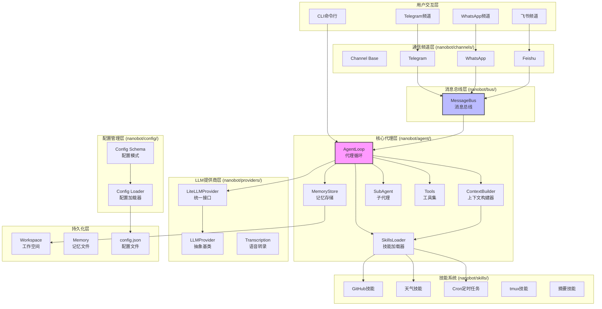
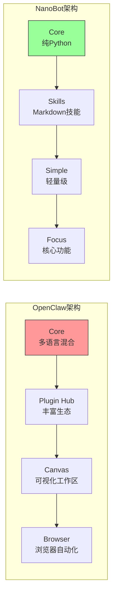

# NanoBot 项目代码深度分析报告

## 一、项目概述

**NanoBot** 是由香港大学数据智能实验室(HKUDS)开发的一款超轻量级个人AI助手，灵感来源于 OpenClaw(原Clawdbot)。

### 核心特点
- **代码规模**: 仅约4,000行Python代码（相比OpenClaw的430,000+行，精简99%）
- **启动速度**: ~3秒（OpenClaw约30秒）
- **内存占用**: <100MB（OpenClaw >1GB）
- **许可证**: MIT License
- **Python版本**: >=3.11

---

## 二、项目架构图（Mermaid格式）



---

## 三、目录结构详解

```
nanobot/
├── nanobot/                 # 主代码包
│   ├── __init__.py         # 包初始化，版本信息
│   ├── __main__.py         # 模块入口: python -m nanobot
│   │
│   ├── agent/              # 核心代理模块
│   │   ├── __init__.py     # 导出AgentLoop, ContextBuilder等
│   │   ├── loop.py         # 代理主循环 (LLM <-> 工具执行)
│   │   ├── context.py      # 上下文/提示词构建器
│   │   ├── memory.py       # 持久化记忆存储
│   │   ├── skills.py       # 技能加载器
│   │   ├── subagent.py     # 后台子代理执行
│   │   └── tools/          # 内置工具目录
│   │
│   ├── bus/                # 消息总线
│   │   └── message_bus.py  # 消息路由系统
│   │
│   ├── channels/           # 通信频道
│   │   ├── telegram.py     # Telegram Bot集成
│   │   ├── whatsapp.py     # WhatsApp集成
│   │   └── feishu.py       # 飞书集成
│   │
│   ├── cli/                # 命令行接口
│   │   ├── __init__.py
│   │   └── commands.py     # CLI命令实现 (onboard, agent, gateway等)
│   │
│   ├── config/             # 配置系统
│   │   ├── __init__.py
│   │   ├── schema.py       # Pydantic配置模型
│   │   └── loader.py       # 配置加载/保存
│   │
│   ├── cron/               # 定时任务
│   │   └── scheduler.py    # Cron任务调度器
│   │
│   ├── heartbeat/          # 心跳/主动唤醒
│   │   └── heartbeat.py    # 定时检查机制
│   │
│   ├── providers/          # LLM提供商
│   │   ├── __init__.py
│   │   ├── base.py         # LLMProvider抽象基类
│   │   ├── litellm_provider.py  # LiteLLM统一接口
│   │   └── transcription.py     # 语音转录(Groq Whisper)
│   │
│   ├── session/            # 会话管理
│   │   └── session.py      # 用户会话跟踪
│   │
│   ├── skills/             # 内置技能
│   │   ├── cron/           # 定时任务技能
│   │   ├── github/         # GitHub操作技能
│   │   ├── skill-creator/  # 技能创建器
│   │   ├── summarize/      # 内容摘要技能
│   │   ├── tmux/           # tmux控制技能
│   │   └── weather/        # 天气查询技能
│   │
│   └── utils/              # 工具函数
│       └── helpers.py      # 辅助函数
│
├── bridge/                 # TypeScript桥接层
│   └── whatsapp/           # WhatsApp Web桥接
│
├── tests/                  # 测试用例
├── workspace/              # 工作空间模板
├── case/                   # 使用案例
├── pyproject.toml          # 项目配置和依赖
├── Dockerfile              # Docker镜像配置
└── README.md               # 项目文档
```

---

## 四、核心代码逐行解析

### 4.1 入口文件 (`__main__.py`)

```python
"""
Entry point for running nanobot as a module: python -m nanobot
"""

from nanobot.cli.commands import app  # 导入CLI应用

if __name__ == "__main__":
    app()  # 启动Typer CLI应用
```

**解析**:
- 这是Python模块的标准入口点
- 当运行 `python -m nanobot` 时执行
- 将实际工作委托给 `cli.commands` 模块

---

### 4.2 Agent模块初始化 (`agent/__init__.py`)

```python
"""Agent core module."""
from nanobot.agent.loop import AgentLoop      # 代理主循环
from nanobot.agent.context import ContextBuilder  # 上下文构建器
from nanobot.agent.memory import MemoryStore   # 记忆存储
from nanobot.agent.skills import SkillsLoader  # 技能加载器

__all__ = ["AgentLoop", "ContextBuilder", "MemoryStore", "SkillsLoader"]
```

**解析**:
- 这是Agent模块的公共接口
- 采用**外观模式(Facade Pattern)**，隐藏内部实现细节
- 核心组件:
  - `AgentLoop`: 协调LLM调用和工具执行的循环
  - `ContextBuilder`: 构建发送给LLM的上下文
  - `MemoryStore`: 持久化存储对话记忆
  - `SkillsLoader`: 动态加载技能文件

---

### 4.3 LLM提供商基类 (`providers/base.py`)

```python
"""Base LLM provider interface."""
from abc import ABC, abstractmethod
from dataclasses import dataclass, field
from typing import Any

@dataclass
class ToolCallRequest:
    """A tool call request from the LLM."""
    id: str
    name: str
    arguments: dict[str, Any]

@dataclass
class LLMResponse:
    """Response from an LLM provider."""
    content: str | None
    tool_calls: list[ToolCallRequest] = field(default_factory=list)
    finish_reason: str = "stop"
    usage: dict[str, int] = field(default_factory=dict)
    
    @property
    def has_tool_calls(self) -> bool:
        """Check if response contains tool calls."""
        return len(self.tool_calls) > 0

class LLMProvider(ABC):
    """
    Abstract base class for LLM providers.
    
    Implementations should handle the specifics of each provider's API
    while maintaining a consistent interface.
    """
    
    def __init__(self, api_key: str | None = None, api_base: str | None = None):
        self.api_key = api_key
        self.api_base = api_base
    
    @abstractmethod
    async def chat(
        self,
        messages: list[dict[str, Any]],
        tools: list[dict[str, Any]] | None = None,
        model: str | None = None,
        max_tokens: int = 4096,
        temperature: float = 0.7,
    ) -> LLMResponse:
        """Send a chat completion request."""
        pass
    
    @abstractmethod
    def get_default_model(self) -> str:
        """Get the default model for this provider."""
        pass
```

**代码解析**:

| 行号 | 代码 | 说明 |
|------|------|------|
| 1 | `@dataclass` | Python装饰器，自动生成__init__等方法 |
| 2 | `ToolCallRequest` | 数据类，存储LLM请求调用的工具信息 |
| 3 | `LLMResponse` | 数据类，统一封装LLM响应 |
| 4 | `has_tool_calls` | 属性方法，检查响应是否包含工具调用 |
| 5 | `LLMProvider(ABC)` | 抽象基类，定义提供商接口 |
| 6 | `@abstractmethod` | 强制子类必须实现的方法 |
| 7 | `async def chat` | 异步方法，支持并发处理 |

**设计模式**: 
- **策略模式(Strategy Pattern)**: 不同LLM提供商实现相同接口
- **模板方法模式**: 基类定义流程，子类实现细节

---

### 4.4 配置模式 (`config/schema.py`)

```python
"""Configuration schema using Pydantic."""
from pathlib import Path
from pydantic import BaseModel, Field
from pydantic_settings import BaseSettings

class WhatsAppConfig(BaseModel):
    """WhatsApp channel configuration."""
    enabled: bool = False
    bridge_url: str = "ws://localhost:3001"
    allow_from: list[str] = Field(default_factory=list)

class TelegramConfig(BaseModel):
    """Telegram channel configuration."""
    enabled: bool = False
    token: str = ""  # Bot token from @BotFather
    allow_from: list[str] = Field(default_factory=list)
    proxy: str | None = None

class FeishuConfig(BaseModel):
    """Feishu/Lark channel configuration."""
    enabled: bool = False
    app_id: str = ""
    app_secret: str = ""
    encrypt_key: str = ""
    verification_token: str = ""
    allow_from: list[str] = Field(default_factory=list)

class ChannelsConfig(BaseModel):
    """Configuration for chat channels."""
    whatsapp: WhatsAppConfig = Field(default_factory=WhatsAppConfig)
    telegram: TelegramConfig = Field(default_factory=TelegramConfig)
    feishu: FeishuConfig = Field(default_factory=FeishuConfig)

class AgentDefaults(BaseModel):
    """Default agent configuration."""
    workspace: str = "~/.nanobot/workspace"
    model: str = "anthropic/claude-opus-4-5"
    max_tokens: int = 8192
    temperature: float = 0.7
    max_tool_iterations: int = 20

class AgentsConfig(BaseModel):
    """Agent configuration."""
    defaults: AgentDefaults = Field(default_factory=AgentDefaults)

class ProviderConfig(BaseModel):
    """LLM provider configuration."""
    api_key: str = ""
    api_base: str | None = None
```

**代码解析**:

| 组件 | 用途 |
|------|------|
| `BaseModel` | Pydantic基类，提供数据验证和序列化 |
| `Field(default_factory=list)` | 避免可变默认值的陷阱 |
| `allow_from` | 安全白名单，限制可访问的用户 |
| `proxy` | 支持代理配置，适应不同网络环境 |

**设计亮点**:
- **类型安全**: 所有配置项都有明确的类型注解
- **默认值**: 提供合理的默认配置，开箱即用
- **验证**: Pydantic自动验证配置格式
- **嵌套结构**: 支持复杂的配置层次

---

### 4.5 配置加载器 (`config/loader.py`)

```python
"""Configuration loading utilities."""
import json
from pathlib import Path
from typing import Any
from nanobot.config.schema import Config

def get_config_path() -> Path:
    """Get the default configuration file path."""
    return Path.home() / ".nanobot" / "config.json"

def get_data_dir() -> Path:
    """Get the nanobot data directory."""
    from nanobot.utils.helpers import get_data_path
    return get_data_path()

def load_config(config_path: Path | None = None) -> Config:
    """
    Load configuration from file or create default.
    
    Args:
        config_path: Optional path to config file. Uses default if not provided.
    
    Returns:
        Loaded configuration object.
    """
    path = config_path or get_config_path()
    if path.exists():
        try:
            with open(path) as f:
                data = json.load(f)
            return Config.model_validate(convert_keys(data))
        except (json.JSONDecodeError, ValueError) as e:
            print(f"Warning: Failed to load config from {path}: {e}")
            print("Using default configuration.")
    return Config()

def save_config(config: Config, config_path: Path | None = None) -> None:
    """
    Save configuration to file.
    
    Args:
        config: Configuration to save.
        config_path: Optional path to save to. Uses default if not provided.
    """
    path = config_path or get_config_path()
    path.parent.mkdir(parents=True, exist_ok=True)
    
    # Convert to camelCase format
    data = config.model_dump()
    data = convert_to_camel(data)
    
    with open(path, "w") as f:
        json.dump(data, f, indent=2)
```

**代码解析**:

| 函数 | 功能 |
|------|------|
| `get_config_path()` | 返回 `~/.nanobot/config.json` |
| `load_config()` | 从JSON加载配置，失败则使用默认 |
| `save_config()` | 保存配置到JSON文件 |
| `convert_keys()` | 在snake_case和camelCase间转换 |

---

### 4.6 CLI命令 (`cli/commands.py` - 节选)

```python
"""CLI commands for nanobot."""
import asyncio
from pathlib import Path
import typer
from rich.console import Console
from rich.table import Table
from nanobot import __version__, __logo__

app = typer.Typer(
    name="nanobot",
    help=f"{__logo__}nanobot - Personal AI Assistant",
    no_args_is_help=True,
)
console = Console()

@app.command()
def onboard():
    """Initialize nanobot configuration and workspace."""
    from nanobot.config.loader import get_config_path, save_config
    from nanobot.config.schema import Config
    from nanobot.utils.helpers import get_workspace_path
    
    config_path = get_config_path()
    if config_path.exists():
        console.print(f"[yellow]Config already exists at {config_path}[/yellow]")
        if not typer.confirm("Overwrite?"):
            raise typer.Exit()
    
    # Create default config
    config = Config()
    save_config(config)
    console.print(f"[green]✓[/green] Created config at {config_path}")
    
    # Create workspace
    workspace = get_workspace_path()
    console.print(f"[green]✓[/green] Created workspace at {workspace}")
    
    # Create default bootstrap files
    _create_workspace_templates(workspace)
    console.print(f"\n{__logo__}nanobot is ready!")

@app.command()
def gateway(
    port: int = typer.Option(18790, "--port", "-p", help="Gateway port"),
    verbose: bool = typer.Option(False, "--verbose", "-v", help="Verbose output"),
):
    """Start the nanobot gateway."""
    from nanobot.config.loader import load_config, get_data_dir
    # ... 启动网关服务
```

**代码解析**:

| 组件 | 说明 |
|------|------|
| `typer.Typer` | 现代Python CLI框架，基于类型注解 |
| `rich.console` | 提供彩色终端输出和表格 |
| `@app.command()` | 装饰器将函数注册为CLI命令 |
| `onboard` | 初始化配置和工作空间 |
| `gateway` | 启动网关服务，接收外部消息 |

---

## 五、依赖分析

### 5.1 核心依赖 (`pyproject.toml`)

```toml
dependencies = [
    "typer>=0.9.0",           # CLI框架
    "litellm>=1.0.0",         # LLM统一接口
    "pydantic>=2.0.0",        # 数据验证
    "pydantic-settings>=2.0.0",  # 配置管理
    "websockets>=12.0",       # WebSocket支持
    "websocket-client>=1.6.0", # WebSocket客户端
    "httpx>=0.25.0",          # HTTP客户端
    "loguru>=0.7.0",          # 日志记录
    "readability-lxml>=0.8.0", # 网页内容提取
    "rich>=13.0.0",           # 终端美化
    "croniter>=2.0.0",        # Cron表达式解析
    "python-telegram-bot>=21.0", # Telegram Bot
]
```

### 5.2 可选依赖

```toml
[project.optional-dependencies]
feishu = [
    "lark-oapi>=1.0.0",       # 飞书API
]
dev = [
    "pytest>=7.0.0",          # 测试框架
    "pytest-asyncio>=0.21.0", # 异步测试
    "ruff>=0.1.0",            # 代码检查
]
```

### 5.3 关键依赖作用

| 依赖 | 作用 | 替代方案 |
|------|------|----------|
| **litellm** | 统一调用100+ LLM提供商 | 直接使用各提供商SDK |
| **pydantic** | 数据验证和设置管理 | dataclasses, attrs |
| **typer** | 构建CLI界面 | Click, argparse |
| **rich** | 美化终端输出 | colorama, termcolor |
| **loguru** | 现代化日志 | logging |
| **croniter** | 解析Cron表达式 | schedule, APScheduler |

---

## 六、与OpenClaw的对比分析

### 6.1 核心差异

| 特性 | OpenClaw | NanoBot |
|------|----------|---------|
| **代码行数** | 430,000+ | ~4,000 |
| **代码精简度** | 基准 | 99%更小 |
| **启动时间** | ~30秒 | ~3秒 |
| **内存占用** | >1GB | <100MB |
| **架构** | 单体架构 | 微内核架构 |
| **多语言** | TypeScript/Go/Python | 纯Python |
| **安装方式** | Docker/VPS/Nix | pip/uv |
| **审计难度** | 高（复杂抽象） | 低（代码简洁） |
| **学习曲线** | 陡峭 | 平缓 |

### 6.2 功能对比

| 功能 | OpenClaw | NanoBot |
|------|----------|---------|
| 基础对话 | ✅ | ✅ |
| 工具调用 | ✅ | ✅ |
| 持久记忆 | ✅ (复杂) | ✅ (简单Markdown) |
| 子代理 | ✅ (原生) | ✅ (spawn工具) |
| 定时任务 | ✅ | ✅ (cron技能) |
| Web搜索 | ✅ | ✅ (Brave Search) |
| 浏览器自动化 | ✅ | ❌ |
| 画布工作区 | ✅ | ❌ |
| 多代理协调 | ✅ (原生) | ✅ (子代理) |
| Telegram | ✅ | ✅ |
| WhatsApp | ✅ | ✅ |
| 飞书 | ❌ | ✅ |
| 插件生态 | ✅ (ClawHub) | ❌ (手动技能) |

### 6.3 架构对比



### 6.4 适用场景

| 场景 | 推荐选择 |
|------|----------|
| 快速原型/学习 | NanoBot |
| 生产环境复杂自动化 | OpenClaw |
| 资源受限环境 | NanoBot |
| 需要浏览器自动化 | OpenClaw |
| 需要可视化工作区 | OpenClaw |
| 隐私优先(本地运行) | NanoBot |
| 代码审计需求 | NanoBot |
| 多代理团队协作 | 两者皆可 |

---

## 七、数据流分析

### 7.1 消息处理流程

```
用户输入
    ↓
[Channel] Telegram/WhatsApp/CLI
    ↓
[MessageBus] 消息路由
    ↓
[AgentLoop] 代理循环
    ↓
[ContextBuilder] 构建上下文
    ├─ 加载Skills
    ├─ 加载Memory
    └─ 构建System Prompt
    ↓
[LLMProvider] 调用LLM
    ↓
[Tool Execution] 执行工具(如有)
    ↓
[MemoryStore] 保存记忆
    ↓
[Response] 返回给用户
```

### 7.2 工具调用循环

```python
# 伪代码表示AgentLoop的核心逻辑
async def agent_loop(message):
    context = build_context(message)
    
    for iteration in range(max_iterations):
        # 调用LLM
        response = await llm.chat(context, available_tools)
        
        if response.has_tool_calls:
            # 执行工具
            results = await execute_tools(response.tool_calls)
            # 将结果加入上下文
            context.add_tool_results(results)
        else:
            # 直接返回内容
            return response.content
```

---

## 八、安全考虑

### 8.1 安全设计

| 层面 | 措施 |
|------|------|
| **访问控制** | `allow_from` 白名单机制 |
| **文件系统** | 限制在工作空间内操作 |
| **网络隔离** | 代理配置，可限制访问域名 |
| **API密钥** | 存储在用户目录，建议权限600 |

### 8.2 安全建议

```python
# 文件系统限制示例
SAFE_PATHS = ['/workspace', '/tmp']
RESTRICTED_PATHS = ['/etc', '/root', '/home']

def safe_read(path: str) -> str:
    if any(path.startswith(restricted) for restricted in RESTRICTED_PATHS):
        raise SecurityError(f"Access denied: {path}")
    return open(path).read()
```

---

## 九、总结

NanoBot是一个设计精良的轻量级AI代理框架，具有以下核心优势：

1. **极简代码**: 4000行代码实现核心功能，易于理解和审计
2. **快速启动**: 3秒启动时间，适合快速迭代
3. **模块化设计**: 清晰的模块划分，易于扩展
4. **多提供商支持**: 通过LiteLLM支持100+ LLM提供商
5. **多频道集成**: 支持Telegram、WhatsApp、飞书
6. **技能系统**: Markdown-based技能定义，易于创建和共享

对于希望学习AI代理架构、快速原型开发或资源受限环境的用户，NanoBot是一个极佳的选择。

---

*报告生成时间: 2026年2月*
*数据来源: GitHub HKUDS/nanobot*
