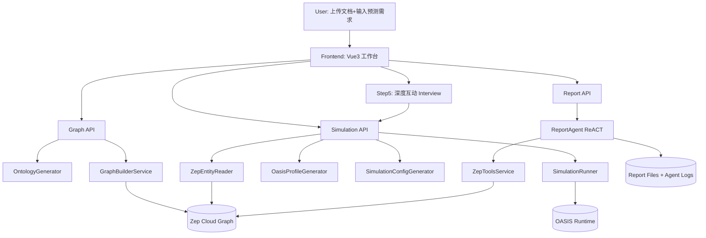
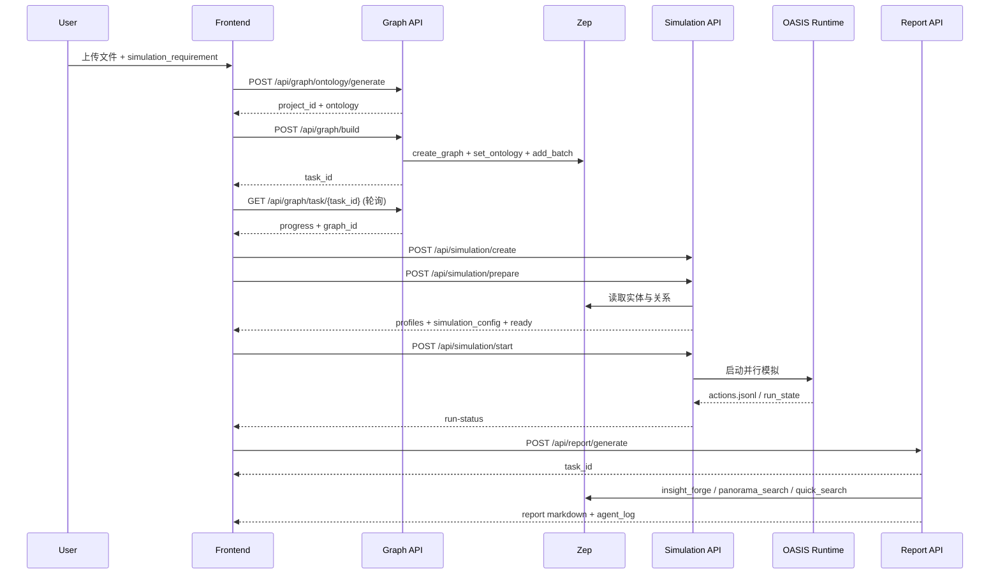

# 课程十：MiroFish 技术深度解析（架构 + 底层原理 + 工程实战）

> 项目仓库：`https://github.com/666ghj/MiroFish.git`
>
> 课程目标：在较短时间内掌握 MiroFish 的**顶层架构、核心代码链路、部署运行方式、可优化点**，并能在面试中讲清楚其技术决策。

---

## 0. 先说结论（30 秒版本）

MiroFish 是一个“**文档种子 -> 图谱 -> 群体模拟 -> 报告生成**”的多 Agent 预测系统。

它不是单点问答应用，而是完整流水线：

1. 文档上传 + 需求输入 -> 自动生成 Ontology
2. 用 Zep Cloud 构建 GraphRAG 图谱
3. 抽取实体并生成 OASIS Agent Profiles
4. 并行跑 Twitter/Reddit 风格模拟
5. ReportAgent 用 ReACT + 图谱检索生成报告并支持追问

如果你只记一个关键词：**MiroFish = 图谱约束的社会模拟 + 可追踪报告生成**。

---

## 1. 项目与论文方法的映射（源码 + 方法论）

MiroFish 仓库目前主要是工程实现，未看到独立学术论文 PDF；但其技术路线明显融合了以下公开方法。

| 方法/论文 | 在 MiroFish 中的体现 | 对应源码位置 |
|---|---|---|
| ReACT（Reason + Act） | ReportAgent 在章节生成中反复“思考-工具调用-观察-收敛” | `backend/app/services/report_agent.py` |
| GraphRAG（图增强检索） | 先构图再检索，不直接对原始长文做一次性问答 | `backend/app/api/graph.py`, `backend/app/services/graph_builder.py`, `backend/app/services/zep_tools.py` |
| Generative Agents 思想 | 从实体生成 persona，再驱动群体行为演化 | `backend/app/services/oasis_profile_generator.py`, `backend/app/services/simulation_runner.py` |
| OASIS 社交模拟框架 | Twitter/Reddit 双平台模拟与采访机制 | `backend/scripts/run_parallel_simulation.py` 及相关脚本 |

建议阅读（用于理解理论背景）：

- ReAct: `https://arxiv.org/abs/2210.03629`
- Generative Agents: `https://arxiv.org/abs/2304.03442`
- GraphRAG（Microsoft 路线）: `https://arxiv.org/abs/2404.16130`
- OASIS 开源项目: `https://github.com/camel-ai/oasis`

---

## 2. 顶层框架图



架构关键点：

- 前端是 Step 驱动器，后端是分阶段服务（Graph/Simulation/Report）
- Graph 与 Simulation 之间通过 `project_id/graph_id/simulation_id` 解耦
- 大耗时步骤全部异步任务化，前端轮询状态

---

## 3. 端到端逻辑时序图（系统如何跑起来）



---

## 4. 代码结构总览（你该先读哪些文件）

```text
MiroFish/
├─ frontend/
│  └─ src/
│     ├─ views/MainView.vue              # Step1~5 状态推进中枢
│     ├─ api/graph.js                    # 图谱阶段 API 封装
│     ├─ api/simulation.js               # 模拟阶段 API 封装
│     └─ api/report.js                   # 报告阶段 API 封装
├─ backend/
│  ├─ run.py                             # 服务启动入口 + 配置校验
│  ├─ pyproject.toml                     # Python 依赖（flask/openai/zep/oasis）
│  ├─ scripts/
│  │  ├─ run_parallel_simulation.py      # 双平台并行模拟
│  │  ├─ run_twitter_simulation.py
│  │  └─ run_reddit_simulation.py
│  └─ app/
│     ├─ __init__.py                     # Flask app factory + 蓝图注册
│     ├─ config.py                       # .env 配置加载与校验
│     ├─ api/graph.py                    # 本体生成/构图/项目管理
│     ├─ api/simulation.py               # 模拟创建/准备/启动/采访
│     ├─ api/report.py                   # 报告异步生成 + 状态查询
│     ├─ models/project.py               # 项目持久化（project.json）
│     ├─ models/task.py                  # 任务管理（内存单例）
│     └─ services/
│        ├─ graph_builder.py             # Zep 图谱构建核心
│        ├─ zep_entity_reader.py         # 实体过滤 + 关系富化
│        ├─ oasis_profile_generator.py   # 画像生成
│        ├─ simulation_config_generator.py # 参数智能生成
│        ├─ simulation_runner.py         # 运行期状态与进程管理
│        ├─ report_agent.py              # ReACT 报告生成引擎
│        └─ zep_tools.py                 # InsightForge 等检索工具
```

推荐阅读顺序：

1. `backend/app/api/graph.py`
2. `backend/app/services/graph_builder.py`
3. `backend/app/services/simulation_manager.py`
4. `backend/app/services/report_agent.py`
5. `frontend/src/views/MainView.vue`

---

## 5. 底层原理：三条核心执行链

## 5.1 Graph 链：文档 -> Ontology -> 图谱

核心动作：

1. 校验请求（文件 + 需求）
2. 文本抽取与清洗
3. LLM 生成实体/关系定义
4. Zep 创建图并动态注入 ontology
5. 文本切块批量写入，等待图谱处理完成

关键设计：

- `GraphBuilderService.build_graph_async` 异步化长任务
- `TaskManager` 实时暴露进度，前端体验更稳定
- `set_ontology` 动态创建 Pydantic 类型，避免硬编码 schema

## 5.2 Simulation 链：图谱实体 -> Agent Profiles -> 并行模拟

核心动作：

1. `ZepEntityReader` 拉全图并筛选有效实体类型
2. `OasisProfileGenerator` 生成 persona（可 LLM 增强）
3. `SimulationConfigGenerator` 自动生成时间/事件/平台参数
4. `SimulationRunner` 启动脚本并维护 run-state
5. 运行后通过 IPC 支持 interview / batch interview

关键设计：

- 强状态机：`created -> preparing -> ready -> running -> completed/failed`
- 文件化持久化：`state.json`, `simulation_config.json`, `profiles`，便于恢复
- 平台并行：Twitter/Reddit 分轨统计 + 汇总

## 5.3 Report 链：检索增强 -> ReACT 生成 -> 可追踪输出

核心动作：

1. 报告任务异步提交，返回 `task_id`
2. `ReportAgent.plan_outline` 先规划章节
3. `_generate_section_react` 逐章循环调用工具
4. 每章实时落盘（`section_xx.md`）
5. 最终组装 `full_report.md`，并保存日志

关键设计：

- ReACT + 工具调用，而非一次性长文本生成
- 双日志机制：结构化 JSONL + 控制台文本
- 工具调用解析有容错（XML 标签 / 裸 JSON 双格式）

---

## 6. 关键代码逐行解析（带注释）

## 6.1 片段 A：Flask 应用装配（入口控制面）

来源：`backend/app/__init__.py`

```python
def create_app(config_class=Config):
    app = Flask(__name__)                    # 1) 创建 Flask 应用实例
    app.config.from_object(config_class)     # 2) 统一加载配置类

    if hasattr(app, 'json') and hasattr(app.json, 'ensure_ascii'):
        app.json.ensure_ascii = False        # 3) 关闭 ASCII 转义，中文直出

    logger = setup_logger('mirofish')        # 4) 初始化系统日志

    CORS(app, resources={r"/api/*": {"origins": "*"}})  # 5) 开启 API 跨域

    from .services.simulation_runner import SimulationRunner
    SimulationRunner.register_cleanup()      # 6) 注册进程清理，避免僵尸模拟进程

    @app.before_request
    def log_request():
        logger = get_logger('mirofish.request')
        logger.debug(f"请求: {request.method} {request.path}")  # 7) 统一请求日志入口

    from .api import graph_bp, simulation_bp, report_bp
    app.register_blueprint(graph_bp, url_prefix='/api/graph')          # 8) 图谱路由
    app.register_blueprint(simulation_bp, url_prefix='/api/simulation')# 9) 模拟路由
    app.register_blueprint(report_bp, url_prefix='/api/report')        # 10) 报告路由

    return app
```

为什么重要：

- 明确了 MiroFish 的“分域 API 架构”
- 把日志、跨域、清理等非业务能力前置为平台能力

## 6.2 片段 B：图谱构建异步任务（长任务工程范式）

来源：`backend/app/services/graph_builder.py`

```python
def build_graph_async(self, text, ontology, graph_name="MiroFish Graph", chunk_size=500, chunk_overlap=50, batch_size=3):
    task_id = self.task_manager.create_task(             # 1) 先建任务
        task_type="graph_build",
        metadata={"graph_name": graph_name, "chunk_size": chunk_size, "text_length": len(text)}
    )

    thread = threading.Thread(                           # 2) 后台线程异步执行
        target=self._build_graph_worker,
        args=(task_id, text, ontology, graph_name, chunk_size, chunk_overlap, batch_size)
    )
    thread.daemon = True                                 # 3) 守护线程随主进程退出
    thread.start()

    return task_id                                       # 4) 立即返回 task_id 给前端轮询
```

进一步看 `_build_graph_worker` 的 6 步推进：

```python
graph_id = self.create_graph(graph_name)                # 步骤1：创建图
self.set_ontology(graph_id, ontology)                   # 步骤2：设置本体
chunks = TextProcessor.split_text(text, chunk_size, chunk_overlap)  # 步骤3：切块
episode_uuids = self.add_text_batches(graph_id, chunks, batch_size, callback) # 步骤4：批量写入
self._wait_for_episodes(episode_uuids, callback)        # 步骤5：等待远端处理完成
graph_info = self._get_graph_info(graph_id)             # 步骤6：拉取统计信息
```

这套模式可复用到任何“远端异步处理型”任务。

## 6.3 片段 C：实体过滤与关系富化（模拟质量关键）

来源：`backend/app/services/zep_entity_reader.py`

```python
for node in all_nodes:
    labels = node.get("labels", [])
    custom_labels = [l for l in labels if l not in ["Entity", "Node"]]  # 1) 去掉默认标签

    if not custom_labels:
        continue                                                  # 2) 只剩默认标签则跳过

    if defined_entity_types:
        matching_labels = [l for l in custom_labels if l in defined_entity_types]
        if not matching_labels:
            continue                                              # 3) 若用户指定类型，严格过滤
        entity_type = matching_labels[0]
    else:
        entity_type = custom_labels[0]

    entity = EntityNode(...)                                     # 4) 构造实体对象

    if enrich_with_edges:
        for edge in all_edges:
            if edge["source_node_uuid"] == node["uuid"]:
                ...                                              # 5) 出边信息
            elif edge["target_node_uuid"] == node["uuid"]:
                ...                                              # 6) 入边信息
```

为什么重要：

- 决定了后续 Agent 人设输入质量
- 不做过滤会引入大量“弱实体”干扰模拟

## 6.4 片段 D：ReportAgent 的 ReACT 工具调用解析容错

来源：`backend/app/services/report_agent.py`

```python
def _parse_tool_calls(self, response: str) -> List[Dict[str, Any]]:
    tool_calls = []

    xml_pattern = r'<tool_call>\s*(\{.*?\})\s*</tool_call>'      # 1) 优先解析标准 XML 包裹格式
    for match in re.finditer(xml_pattern, response, re.DOTALL):
        call_data = json.loads(match.group(1))
        tool_calls.append(call_data)

    if tool_calls:
        return tool_calls                                           # 2) 命中即返回

    stripped = response.strip()
    if stripped.startswith('{') and stripped.endswith('}'):
        call_data = json.loads(stripped)                            # 3) 兜底解析裸 JSON
        if self._is_valid_tool_call(call_data):
            tool_calls.append(call_data)
            return tool_calls

    match = re.search(r'(\{"(?:name|tool)"\s*:.*?\})\s*$', stripped, re.DOTALL)  # 4) 再兜底提取末尾 JSON
    if match:
        call_data = json.loads(match.group(1))
        if self._is_valid_tool_call(call_data):
            tool_calls.append(call_data)

    return tool_calls                                               # 5) 解析失败返回空列表
```

工程价值：

- 兼容 LLM 输出格式漂移，显著降低因格式不稳定导致的“空工具调用”问题

---

## 7. 快速部署（源码部署 + Docker 部署）

## 7.1 环境要求

- Node.js `>=18`
- Python `3.11~3.12`
- `uv`（Python 包管理）

## 7.2 环境变量

最小必填（来自 `backend/app/config.py` 校验）：

```env
LLM_API_KEY=...
LLM_BASE_URL=...            # OpenAI 兼容地址
LLM_MODEL_NAME=...          # 例如 qwen-plus / gpt-4o-mini
ZEP_API_KEY=...
```

## 7.3 源码一键启动（推荐）

```bash
# 1) 安装依赖（根+前端+后端）
npm run setup:all

# 2) 启动前后端
npm run dev
```

服务地址：

- 前端：`http://localhost:3000`
- 后端：`http://localhost:5001`

可拆分启动：

```bash
npm run backend
npm run frontend
```

## 7.4 Docker 启动

```bash
docker compose up -d
```

`docker-compose.yml` 会映射：`3000`（前端）、`5001`（后端），并挂载 `backend/uploads`。

## 7.5 最小验证路径（5 步）

1. 上传一份小型 `md/txt/pdf`
2. 观察 Step1 是否拿到 `project_id` + `graph_id`
3. Step2/3 生成 profile 与 config 并启动模拟（先用 `max_rounds=20`）
4. Step4 生成报告并查看 `agent_log.jsonl`
5. Step5 采访 1~3 个 Agent，验证 IPC 闭环

---

## 8. 关于“训练方式”：本项目该怎么理解

MiroFish 不是传统模型训练仓库（无 Trainer、无 checkpoint、无反向传播训练脚本）。

因此“训练”在本项目里更准确分三类：

1. **仿真训练（Simulation Tuning）**：调 `max_rounds`、活动时间、平台权重
2. **提示词训练（Prompt Tuning）**：优化 Ontology、Profile、Report prompt
3. **检索策略训练（Retrieval Tuning）**：优化 InsightForge/Panorama 的查询策略

如果你真的要做参数级模型训练，建议把 MiroFish 当上层编排器，外接单独微调管线（例如 LoRA/SFT），再把微调模型通过 OpenAI 兼容接口接回本项目。

---

## 9. 项目优势、不足与改进建议

## 9.1 优势

1. **闭环完整**：从文档输入到报告输出，链路完整可演示。
2. **架构清晰**：Graph / Simulation / Report 三段式职责明确。
3. **可观测性好**：任务进度、章节增量、Agent 日志都可追踪。
4. **工具化程度高**：InsightForge + Panorama + Interview 组合实用。
5. **工程实战性强**：异步任务、状态机、文件持久化、IPC 都有落地实现。

## 9.2 不足

1. **TaskManager 仅内存单例**：服务重启可能丢任务上下文。
2. **线程模型可扩展性有限**：高并发/多实例下不如队列系统稳定。
3. **持久化偏文件系统**：缺少统一 DB 事务边界与并发控制。
4. **安全面待加强**：当前 CORS 全开且未见鉴权/租户隔离。
5. **接口一致性存在隐患**：例如前端 `report.js` 的 `getReportStatus` 使用 GET，而后端 `/api/report/generate/status` 是 POST。

## 9.3 改进路线（建议优先级）

P0（先做）：

- 统一 API contract（OpenAPI + 前后端自动校验）
- 引入认证层（JWT/API Key）与项目级权限隔离

P1（再做）：

- 用 Celery/RQ + Redis 替代线程任务，任务状态落库
- 给 Project/Simulation/Report 引入关系型 DB 或 KV 索引

P2（增强）：

- 增加结果评测集（预测一致性、来源覆盖率、幻觉率）
- 增加实验复现实验脚本（固定 seed + 固定模型版本）

---

## 10. 面试官视角：核心问题与参考答案

**Q1：为什么不是“直接 RAG + LLM 写报告”，而要多阶段？**  
A1：因为目标是“可推演的社会系统”，不是静态问答。图谱和模拟阶段把信息从文本事实提升为动态交互过程，报告阶段再做可追溯总结，可信度更高。

**Q2：GraphBuilder 为什么采用 submit + poll，而不是阻塞请求？**  
A2：构图涉及远端处理和不确定耗时。submit + poll 能避免超时，提升前端可用性，也便于失败恢复和重试。

**Q3：`set_ontology` 动态建模有什么价值？**  
A3：避免对实体类型硬编码，能随不同文档主题动态适配 schema，提高通用性。

**Q4：SimulationManager 的核心职责是什么？**  
A4：统一编排“实体读取->画像生成->配置生成->状态持久化”。它是准备阶段 orchestrator，不直接承载模拟执行。

**Q5：为什么需要 `state.json` 和 `run_state.json` 双状态文件？**  
A5：`state.json` 偏生命周期状态（准备完成与否），`run_state.json` 偏运行时实时指标（轮次、动作、平台状态），职责分离便于恢复与展示。

**Q6：ReportAgent 如何降低幻觉风险？**  
A6：通过工具检索（图谱事实）约束生成过程，并记录 tool call + result；最终答案有来源链路，不是纯生成。

**Q7：`_parse_tool_calls` 为什么要做多格式容错？**  
A7：LLM 输出格式不稳定。只支持单一格式会让工具调用频繁失效，导致报告质量抖动。

**Q8：如何评价 MiroFish 的可扩展性？**  
A8：功能扩展性不错（新工具/新平台可插），但系统扩展性一般（线程 + 文件存储限制多实例并发）。

**Q9：如何做线上化改造？**  
A9：把任务层切到队列系统、状态落库、对象存储保存中间产物、加入 auth + rate limit + observability（metrics/tracing）。

**Q10：如果要做 A/B 实验验证改进是否有效，指标怎么定？**  
A10：至少三组指标：报告质量（事实覆盖率/可追溯率）、模拟稳定性（失败率/超时率）、资源效率（单位报告 token 与时间成本）。

---

## 11. 给你的“优化后提示词”（可复用模板）

下面这段可以直接作为后续“项目深度解析”任务的高质量提示词。

```text
请基于仓库源码对项目做一份“可用于技术面试和工程落地”的深度解析，输出一个 Markdown 文档，要求：

1) 先给出 30 秒结论、项目定位、适用场景；
2) 给出顶层架构图（Mermaid）和端到端时序图（Mermaid）；
3) 从源码出发解析三条主链路：数据输入链、核心执行链、结果输出链；
4) 至少选择 4 段关键代码做逐行注释，解释“为什么这样设计”；
5) 给出快速部署步骤（本地 + Docker）和最小可复现验证路径；
6) 若项目无传统训练流程，要明确说明“训练”的替代定义（参数调优/提示词调优/检索调优）；
7) 对照相关论文或方法（如 ReAct / GraphRAG / Generative Agents），说明“理念->代码实现”的映射；
8) 输出优势、不足、风险和分优先级改进路线（P0/P1/P2）；
9) 以面试官视角给出 10 个高质量问题和参考答案；
10) 文档必须包含：关键文件路径、关键接口、状态机设计、异步任务机制、可观测性机制。

约束：
- 不要只讲概念，必须引用源码文件；
- 不要泛泛而谈，必须指出至少 2 个真实工程风险；
- 结论要可执行，给出明确的下一步改造建议。
```

---

## 12. 你可以怎么用这份文档

1. 面试前 10 分钟：看第 0、2、10 节，快速建立表达框架。  
2. 做二次开发：看第 5、6、9 节，直接定位改造入口。  
3. 写技术方案：复用第 11 节提示词，快速产出同风格文档。  

---

## 13. 参考链接

- MiroFish：`https://github.com/666ghj/MiroFish.git`
- OASIS：`https://github.com/camel-ai/oasis`
- ReAct：`https://arxiv.org/abs/2210.03629`
- Generative Agents：`https://arxiv.org/abs/2304.03442`
- GraphRAG：`https://arxiv.org/abs/2404.16130`
