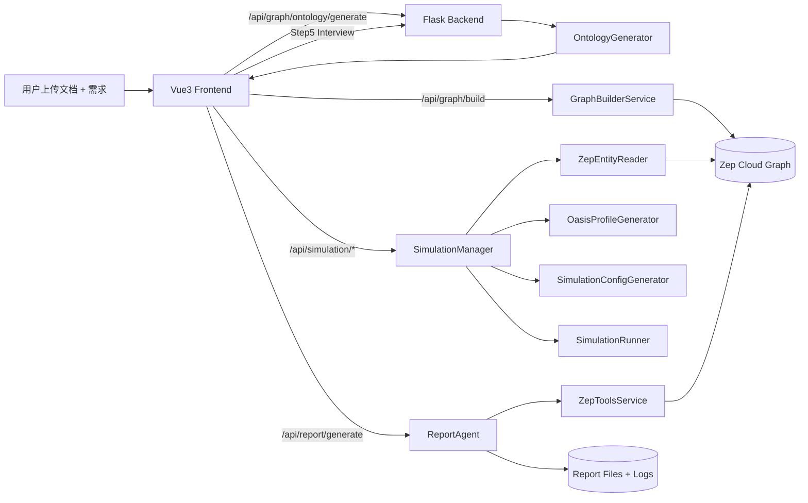
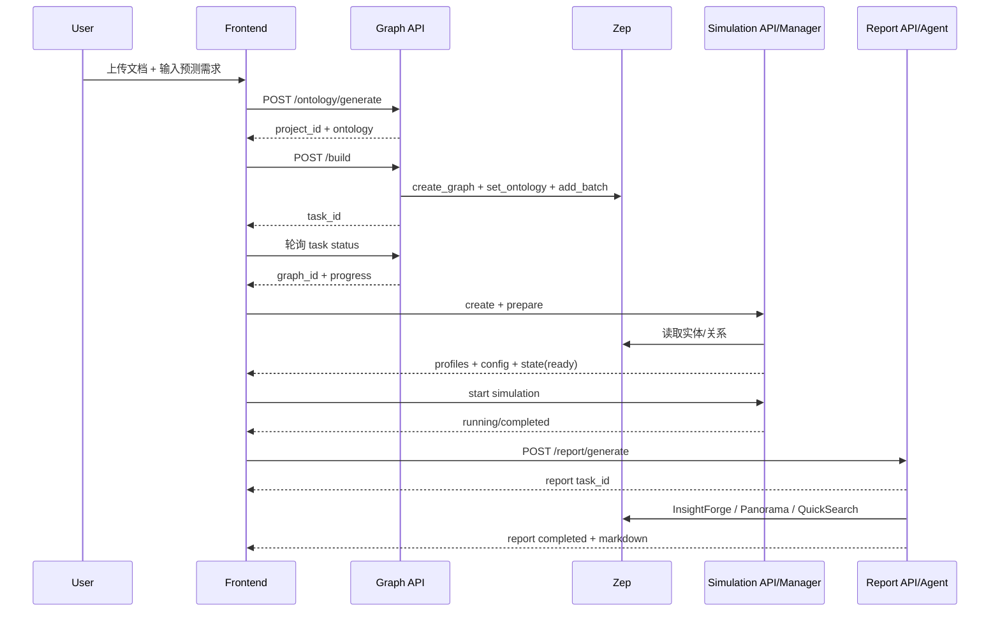

# 课程十：MiroFish 技术深度解析

> 项目地址：`https://github.com/666ghj/MiroFish.git`
>
> 课程目标：理解 MiroFish 如何把“文档种子”转成“可交互的社会模拟世界”，并最终生成可追踪来源的预测报告。

---

## 1. 项目定位与核心价值

MiroFish 是一个面向“预测与推演”的多 Agent 系统，核心不是单次问答，而是完整闭环：

1. 输入文档与预测需求（现实种子）
2. 构建结构化知识图谱（GraphRAG）
3. 基于图谱生成群体画像并驱动模拟
4. 用 ReportAgent 对模拟后世界进行检索分析并写报告
5. 支持继续采访模拟角色，实现“报告后追问”

从工程角度，它是一个典型的 **前后端分层 + 异步任务 + LLM 工具编排** 项目。

---

## 2. 顶层架构图



**一句话理解**：MiroFish 把“文档语义”先固化为图谱，再把“图谱关系”转成“社会行为模拟”，最后把“模拟状态”转成“可解释报告”。

---

## 3. 文件结构（学习者重点版）

```text
MiroFish/
├─ frontend/                        # Vue3 前端
│  └─ src/
│     ├─ views/MainView.vue        # 主工作流编排（Step1~5）
│     ├─ components/               # 各步骤页面组件
│     └─ api/                      # 对后端接口封装
├─ backend/
│  ├─ run.py                       # 后端入口
│  └─ app/
│     ├─ __init__.py               # Flask app 工厂与蓝图注册
│     ├─ api/
│     │  ├─ graph.py               # 本体生成、图谱构建、项目管理
│     │  ├─ simulation.py          # 实体读取、模拟创建/准备/运行
│     │  └─ report.py              # 报告异步生成、状态查询、导出
│     ├─ services/
│     │  ├─ graph_builder.py       # 对接 Zep 构图
│     │  ├─ simulation_manager.py  # 模拟全流程 orchestrator
│     │  ├─ simulation_config_generator.py # LLM 生成模拟参数
│     │  ├─ report_agent.py        # ReACT 报告生成核心
│     │  └─ zep_tools.py           # 检索工具层（InsightForge 等）
│     ├─ models/                   # Project/Task 状态持久化
│     └─ utils/                    # 日志、分页、LLM 客户端等
├─ docker-compose.yml
├─ Dockerfile
└─ README.md
```

---

## 4. 核心代码原理解析

## 4.1 后端入口与路由拼装：`backend/app/__init__.py`

MiroFish 使用 Flask app factory，做三件关键事：

1. 统一配置 + JSON 中文输出
2. 注册 CORS 与请求日志中间件
3. 注册三个核心蓝图：`/api/graph`、`/api/simulation`、`/api/report`

这说明系统不是“大一统单接口”，而是按业务阶段拆成三条主链路，方便前端按 Step 驱动。

## 4.2 图谱阶段（Step1）：`graph.py` + `graph_builder.py`

### A) 本体生成（Ontology）

`/api/graph/ontology/generate` 负责：

- 校验上传文件与 `simulation_requirement`
- 提取文本并预处理
- 调 `OntologyGenerator` 输出 `entity_types` 与 `edge_types`
- 保存项目状态到 `ProjectManager`

这一步本质是把“非结构化文档”转成“结构化 schema”。

### B) 异步构图（Build Graph）

`GraphBuilderService.build_graph_async` 使用后台线程做 6 段任务推进：

1. `create_graph`
2. `set_ontology`
3. `split_text`
4. `add_text_batches`
5. `_wait_for_episodes`
6. `_get_graph_info`

并通过 `TaskManager` 持续更新 progress，让前端轮询可视化构建进度。

### C) 一个非常实用的工程点

`set_ontology` 中对 Zep 保留字段做了改名保护：

- 保留名：`uuid`、`name`、`summary` 等
- 自动转成 `entity_<attr>`

这避免了动态 schema 注入时与后端数据模型冲突，属于“集成第三方图数据库时的防踩坑设计”。

## 4.3 模拟阶段（Step2/3）：`simulation.py` + `simulation_manager.py`

模拟部分采用“准备-运行”二段式：

- **prepare**：读图谱实体 -> 生成人设 -> 生成模拟配置 -> 落盘
- **run**：真正驱动 Twitter/Reddit 双平台并行模拟

`SimulationState` 用 dataclass 明确了状态机字段（`created/preparing/ready/running/...`），并持久化到 `state.json`。这意味着即便服务重启，模拟状态也可恢复。

## 4.4 配置自动化：`simulation_config_generator.py`

该模块核心价值是把复杂参数“自动化生成”，包括：

- 时间推进（`minutes_per_round`、总时长）
- Agent 活跃度与发言频率
- 事件注入、热点关键词、叙事方向
- 平台推荐权重（recency/popularity/relevance）

并采用分步生成策略（时间/事件/agent/平台），降低单次长输出失败概率。

## 4.5 报告阶段（Step4）：`report.py` + `report_agent.py` + `zep_tools.py`

报告生成采用异步任务 + ReACT 风格工具调用：

1. `/api/report/generate` 立即返回 `task_id`
2. 后台线程创建 `ReportAgent` 执行
3. 通过 `progress_callback` 把阶段进度写入任务系统
4. 用 `ReportManager` 持久化报告结果

`ReportAgent` 内部还实现了双日志：

- `agent_log.jsonl`：结构化动作日志（thought/tool/result）
- `console_log.txt`：控制台文本日志

这是“可解释 AI 代理”的关键工程实践：你不仅知道输出是什么，还知道它怎么得到输出。

---

## 5. 关键代码逐行注释分析

## 5.1 片段一：图谱构建异步任务启动

来源：`backend/app/services/graph_builder.py`

```python
def build_graph_async(
    self,
    text: str,
    ontology: Dict[str, Any],
    graph_name: str = "MiroFish Graph",
    chunk_size: int = 500,
    chunk_overlap: int = 50,
    batch_size: int = 3
) -> str:
    # 1) 先创建任务，返回 task_id 给前端轮询
    task_id = self.task_manager.create_task(
        task_type="graph_build",
        metadata={
            "graph_name": graph_name,
            "chunk_size": chunk_size,
            "text_length": len(text),
        }
    )

    # 2) 后台线程执行真正构图，避免阻塞 HTTP 请求
    thread = threading.Thread(
        target=self._build_graph_worker,
        args=(task_id, text, ontology, graph_name, chunk_size, chunk_overlap, batch_size)
    )
    thread.daemon = True
    thread.start()

    # 3) 立即返回，前端可继续操作并显示进度
    return task_id
```

**学习点**：这是标准“长任务 API”模式（submit + poll），非常适合 LLM 和图谱构建等耗时流程。

## 5.2 片段二：模拟准备状态机入口

来源：`backend/app/services/simulation_manager.py`

```python
def prepare_simulation(
    self,
    simulation_id: str,
    simulation_requirement: str,
    document_text: str,
    defined_entity_types: Optional[List[str]] = None,
    use_llm_for_profiles: bool = True,
    progress_callback: Optional[callable] = None,
    parallel_profile_count: int = 3
) -> SimulationState:
    state = self._load_simulation_state(simulation_id)
    if not state:
        raise ValueError(f"模拟不存在: {simulation_id}")

    try:
        # 1) 切到 preparing，落盘 state.json
        state.status = SimulationStatus.PREPARING
        self._save_simulation_state(state)

        # 2) 从图谱读取并过滤实体
        reader = ZepEntityReader()
        filtered = reader.filter_defined_entities(
            graph_id=state.graph_id,
            defined_entity_types=defined_entity_types,
            enrich_with_edges=True
        )

        state.entities_count = filtered.filtered_count
        state.entity_types = list(filtered.entity_types)

        # 3) 无实体直接 fail-fast，避免后续空跑
        if filtered.filtered_count == 0:
            state.status = SimulationStatus.FAILED
            state.error = "没有找到符合条件的实体，请检查图谱是否正确构建"
            self._save_simulation_state(state)
            return state
```

**学习点**：状态先写入再执行耗时逻辑，且空结果提前失败，是后台任务健壮性设计常见最佳实践。

## 5.3 片段三：报告生成异步线程与进度回调

来源：`backend/app/api/report.py`

```python
def run_generate():
    try:
        task_manager.update_task(
            task_id,
            status=TaskStatus.PROCESSING,
            progress=0,
            message="初始化Report Agent..."
        )

        # 1) 创建 Agent（绑定 graph/simulation/requirement）
        agent = ReportAgent(
            graph_id=graph_id,
            simulation_id=simulation_id,
            simulation_requirement=simulation_requirement
        )

        # 2) 回调把 Agent 内部进度同步到任务中心
        def progress_callback(stage, progress, message):
            task_manager.update_task(
                task_id,
                progress=progress,
                message=f"[{stage}] {message}"
            )

        # 3) 真正执行报告生成
        report = agent.generate_report(
            progress_callback=progress_callback,
            report_id=report_id
        )

        ReportManager.save_report(report)
```

**学习点**：API 层不直接处理复杂逻辑，而是通过 callback 与 service 协作，把“可观测性”做成统一能力。

---

## 6. 图形化理解：从文档到报告的全流程时序



---

## 7. 面试官视角：高频问题与参考回答

**Q1：为什么 MiroFish 要先做 Ontology，而不是直接把文本喂给 Agent？**  
A1：先定义实体类型和关系类型能约束图谱结构，减少后续检索歧义；对模拟阶段来说，结构化 schema 比原始文本更适合批量生成人设和交互规则。

**Q2：图谱构建为什么是异步线程 + task_id 轮询？**  
A2：构图包含分块、批处理上传、远端处理等待，耗时不确定。异步化避免 HTTP 阻塞，task 状态让前端可视化进度，也便于失败重试。

**Q3：SimulationManager 的关键工程价值是什么？**  
A3：它是 orchestrator，统一管理“读图谱->人设->配置->文件落盘->状态流转”。同时把状态持久化到 `state.json`，提升可恢复性。

**Q4：ReportAgent 与普通“直接让 LLM 写报告”相比强在哪？**  
A4：ReportAgent 具备工具检索与过程日志，能把“结论”绑定到图谱事实与关系链，降低空想式输出风险，并支持追溯每步推理动作。

**Q5：这个项目最大可改进点是什么？**  
A5：目前异步任务主要基于线程与本地状态文件，若要上生产可引入消息队列与持久化任务系统（如 Celery + Redis + DB），增强横向扩展和故障恢复能力。

---

## 8. 学习建议（从工程到研究）

1. 先跑通最小闭环：1 份小文档 + 20~40 轮模拟，观察状态机变化。  
2. 再读 `graph_builder.py` 与 `simulation_manager.py`，理解“异步任务编排 + 状态落盘”模式。  
3. 最后深入 `report_agent.py` 与 `zep_tools.py`，研究 ReACT + 检索工具如何提升报告可信度。  

当你能把“图谱阶段”和“报告阶段”的 callback/日志链路讲清楚，基本就掌握了 MiroFish 的工程核心。
