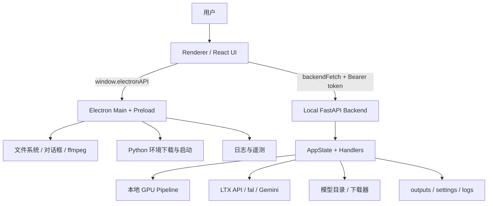
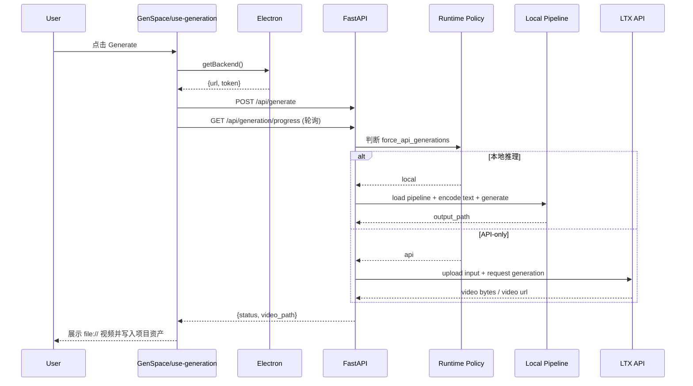

# 课程十一：LTX-Desktop 技术深度解析

> 项目仓库：`https://github.com/Lightricks/LTX-Desktop`
>
> 技术栈：`React 18 + TypeScript + Vite + Electron 41 + FastAPI + PyTorch + uv + pnpm`
>
> 适合人群：想做 AI 桌面应用、想理解 Electron 与本地 Python 服务协作模式、想学习“本地推理 + 云 API”混合架构的人。

---

## 0. 先说结论（30 秒版本）

LTX Desktop 本质上不是一个“套了 Electron 的前端 Demo”，而是一个完整的桌面 AI 产品骨架：

1. `frontend/` 负责交互与编辑体验。
2. `electron/` 负责桌面生命周期、文件系统、Python 环境与安全边界。
3. `backend/` 负责模型、推理、下载、状态机和运行策略。

最关键的设计点有三个：

- 所有生成请求都先进入本地 Python backend，而不是让前端自己决定怎么推理。
- 本地 GPU 与 API-only 两种模式被统一封装在同一套 handler 里，前端无需分叉大量逻辑。
- Electron 不只是一个壳，它还是权限边界、会话认证中心、日志汇聚点、Python 生命周期管理器。

如果你只记一个关键词：`LTX Desktop = 桌面产品化的 AI 推理编排层`。

---

## 1. 项目定位与运行模式

## 1.1 这个项目在解决什么问题

从工程角度看，LTX Desktop 解决的不是“如何训练视频模型”，而是“如何把重型视频模型稳定交付给最终用户”：

- 用户希望像普通桌面软件一样安装、启动、生成视频，而不是自己配 Python、CUDA、模型权重。
- 有些机器显存足够，可以本地跑；有些机器不满足条件，只能走 API。
- 用户不仅要生成，还要做项目管理、资产管理、Timeline 编辑与导出。

所以它的重点不是单一算法，而是产品化落地：安装、首启、模型下载、环境校验、运行时模式切换、编辑、导出、更新、日志和隐私。

## 1.2 Local 与 API 模式的核心判断

仓库在 `README.md` 与 `backend/runtime_config/runtime_policy.py` 中给出了明确策略：

- `macOS`：强制 `API-only`
- `Windows/Linux` 且没有 CUDA：强制 `API-only`
- `Windows/Linux` 有 CUDA 但 VRAM 未知：强制 `API-only`
- `Windows/Linux` 有 CUDA 且 `VRAM >= 31GB`：允许本地推理

对应代码非常直接：

```python
def decide_force_api_generations(system: str, cuda_available: bool, vram_gb: int | None) -> bool:
    if system == "Darwin":
        return True

    if system in ("Windows", "Linux"):
        if not cuda_available:
            return True
        if vram_gb is None:
            return True
        return vram_gb < 31

    return True
```

这段逻辑背后的含义是：项目对“能不能本地跑”采取保守策略，宁可降级到 API，也不让用户进入一半能跑、一半会炸的状态。

## 1.3 为什么前端永远先调本地 backend

LTX Desktop 并没有让 React 直接去调 LTX API，也没有让 Electron main process 直接承接全部推理逻辑，而是统一走本地 FastAPI：

- 前端只关心用户输入、进度展示、结果回填。
- Electron 负责本地权限、会话 token、Python 进程、文件操作。
- Python backend 负责运行时策略、模型与状态机。

这样设计后，本地推理和云端推理都能复用同一条 API 表面。

---

## 2. 顶层架构图

## 2.1 组件关系图



这个图最值得注意的地方：

- `Renderer` 会同时和 `Electron`、`Backend` 交互，但它并不直接访问系统资源。
- `Electron` 不做模型推理本身，而是做“桌面编排器”。
- `Backend` 是真正的推理与状态控制中心。

## 2.2 端到端时序图



---

## 3. 代码结构总览

```text
LTX-Desktop/
├─ frontend/                     # React renderer
│  ├─ App.tsx                    # 启动门面：首启、backend、全局 gate
│  ├─ contexts/                  # Settings / Project / Keyboard contexts
│  ├─ hooks/use-generation.ts    # 视频/图像生成主 hook
│  ├─ lib/backend.ts             # 统一后端请求入口
│  └─ views/
│     ├─ GenSpace.tsx            # 生成工作台
│     └─ VideoEditor.tsx         # 时间线编辑器
├─ electron/                     # Desktop shell
│  ├─ main.ts                    # 主进程入口
│  ├─ preload.ts                 # 安全桥
│  ├─ python-backend.ts          # 启动/守护 Python backend
│  ├─ python-setup.ts            # 首启下载 Python 环境
│  ├─ analytics.ts               # 匿名遥测
│  ├─ csp.ts                     # CSP 注入
│  └─ path-validation.ts         # 路径白名单校验
├─ backend/                      # FastAPI + ML orchestration
│  ├─ ltx2_server.py             # 运行时组合根
│  ├─ app_factory.py             # FastAPI app factory
│  ├─ architecture.md            # 后端架构设计文档
│  ├─ _routes/                   # 薄路由层
│  ├─ handlers/                  # 业务逻辑与状态迁移
│  ├─ services/                  # GPU / IO / HTTP 等 side effects
│  ├─ runtime_config/            # 运行策略与模型规格
│  ├─ state/                     # AppState / AppSettings
│  └─ tests/                     # integration-first 测试
├─ docs/
│  ├─ INSTALLER.md
│  ├─ TELEMETRY.md
│  └─ CONTRIBUTING.md
├─ electron-builder.yml          # 打包配置
└─ package.json                  # pnpm scripts 与前端依赖
```

---

## 4. 四条最重要的执行链

## 4.1 启动链：桌面 App 如何把 Python backend 拉起来

入口在 `frontend/App.tsx`：

1. `checkPythonReady()` 检查 Python embed 是否已经准备好。
2. 如果已就绪，调用 `window.electronAPI.startPythonBackend()`。
3. Electron 在 `electron/python-backend.ts` 中选择 Python 可执行文件，并 `spawn` `backend/ltx2_server.py`。
4. Python 服务启动后打印 `Server running on http://127.0.0.1:<port>`。
5. Electron 解析这条 ready message，把 backend URL 和 auth token 暴露给前端。

关键价值：

- 前端不需要知道 backend 端口，也不用关心是固定端口还是随机端口。
- Python 崩溃、重启、端口占用等问题被收敛在 Electron 侧处理。

## 4.2 边界链：Renderer 如何安全访问 backend

最小闭环是 `frontend/lib/backend.ts + electron/preload.ts + electron/ipc/app-handlers.ts`。

前端请求逻辑非常简单：

```ts
export async function backendFetch(path: string, init?: RequestInit): Promise<Response> {
  const { url, token } = await getBackendCredentials()
  const headers = new Headers(init?.headers)
  if (token) headers.set('Authorization', `Bearer ${token}`)
  return fetch(`${url}${path}`, { ...init, headers })
}
```

这意味着：

- React 组件永远通过统一入口访问 backend。
- 认证 token 由 Electron 生成并管理，而不是硬编码在前端。
- 即使 backend 跑在 `localhost`，依然有会话级鉴权，不默认信任 loopback。

`preload.ts` 中暴露的 `window.electronAPI` 也体现了安全边界：前端拿到的是“可调用能力”，不是 `fs`、`child_process` 等 Node 原语本身。

## 4.3 生成链：从按钮点击到视频落盘

生成主链在 `frontend/hooks/use-generation.ts` 与 `backend/handlers/video_generation_handler.py`。

前端做的事情：

- 组装 `prompt / model / duration / resolution / fps / audioPath / imagePath`
- 轮询 `/api/generation/progress`
- 调用 `/api/generate`
- 拿到 `video_path` 后转成 `file://` URL

后端做的事情：

- 判断是否强制走 API
- 如果本地推理：加载 pipeline、准备文本编码、执行推理、写入输出文件
- 如果 API-only：上传输入媒体、调用 LTX API、下载视频并保存到本地输出目录

关键分流点在这里：

```python
def generate(self, req: GenerateVideoRequest) -> GenerateVideoResponse:
    if should_video_generate_with_ltx_api(
        force_api_generations=self.config.force_api_generations,
        settings=self.state.app_settings,
    ):
        return self._generate_forced_api(req)

    if self._generation.is_generation_running():
        raise HTTPError(409, "Generation already in progress")
```

这段代码非常重要，因为它把“产品运行策略”和“业务入口”融合到一起：

- 环境不支持时，自动降级到 API。
- 环境支持时，也允许用户根据设置选择 API 视频生成。
- 前端完全不需要知道究竟是本地模型还是云端服务在执行。

## 4.4 资源链：Python 环境与模型是如何准备的

这个项目有两层下载体系：

### 第一层：Python 运行时

由 `electron/python-setup.ts` 负责：

- Windows/Linux 的 Python 环境可在首启时下载，避免安装包过大。
- 更新时支持 `python-next/` 预下载，下一次启动直接切换。
- 通过 `deps-hash.txt` 做版本匹配与提升（promote）。

### 第二层：模型权重

由 `backend/runtime_config/model_download_specs.py` 负责定义模型清单与大小。

默认关键模型包括：

- `checkpoint`：主模型，约 `43GB`
- `upsampler`：空间上采样器，约 `1.9GB`
- `zit`：`Z-Image-Turbo`，约 `31GB`

部分节选如下：

```python
"checkpoint": ModelFileDownloadSpec(
    relative_path=Path("ltx-2.3-22b-distilled.safetensors"),
    expected_size_bytes=43_000_000_000,
    repo_id="Lightricks/LTX-2.3",
    description="Main transformer model",
),
```

这说明它不是轻量玩具项目，而是真正面向重型模型交付的桌面系统。

---

## 5. 核心源码深度剖析

## 5.1 `frontend/lib/backend.ts`：为什么这是全前端最重要的薄封装

```ts
let cached: { url: string; token: string } | null = null

export async function getBackendCredentials(): Promise<{ url: string; token: string }> {
  if (!cached) cached = await window.electronAPI.getBackend()
  return cached
}

export async function backendFetch(path: string, init?: RequestInit): Promise<Response> {
  const { url, token } = await getBackendCredentials()
  const headers = new Headers(init?.headers)
  if (token) headers.set('Authorization', `Bearer ${token}`)
  return fetch(`${url}${path}`, { ...init, headers })
}
```

设计含义：

- `cached` 减少了前端每次都走 IPC 取 backend 地址的开销。
- token 自动注入，使“请求 backend”成为一个受控行为，而不是组件内部随意 `fetch`。
- 这为将来统一切换成重试、日志、埋点、SSE 都留下了单点扩展位置。

## 5.2 `electron/python-backend.ts`：Electron 不是壳，而是 backend 守护者

关键逻辑可以浓缩成下面几步：

```ts
authToken = crypto.randomBytes(32).toString('base64url')
adminToken = crypto.randomBytes(32).toString('base64url')

pythonProcess = spawn(pythonPath, pythonArgs, {
  cwd: backendPath,
  env: {
    ...process.env,
    LTX_AUTH_TOKEN: authToken,
    LTX_ADMIN_TOKEN: adminToken,
    LTX_APP_DATA_DIR: getAppDataDir(),
  },
})

const readyMatch = output.match(/Server running on (http:\/\/\S+)/)
if (readyMatch) {
  backendUrl = readyMatch[1]
}
```

为什么这段实现很关键：

- auth/admin token 每次会话随机生成，不是写死常量。
- Python backend 启动所需的 app data、token、log file 都由 Electron 注入。
- Electron 通过解析 ready message 建立“我知道 backend 真正可用了”的状态，而不是盲目睡眠等待。

这是一种非常适合桌面 AI App 的模式：前端专注交互，Electron 专注运行时托管。

## 5.3 `backend/app_factory.py`：本地服务也必须有明确安全边界

`app_factory.py` 做了三件大事：

1. 挂 CORS 与全局异常处理
2. 注入共享 `AppHandler`
3. 做 HTTP / WebSocket 鉴权

关键鉴权逻辑：

```python
if auth_header.startswith("Bearer ") and _token_matches(auth_header[7:]):
    return await call_next(request)
```

这说明作者并没有因为“服务只监听 `127.0.0.1`”就忽略认证，而是明确把 backend 当成一个受保护的本地服务。

这是很多桌面软件容易忽略但非常值得学习的地方。

## 5.4 `backend/ltx2_server.py`：真正的运行时组合根

这个文件的责任非常集中：

- 检测设备与 dtype
- 解析 app data 路径
- 建立 `RuntimeConfig`
- 计算 `FORCE_API_GENERATIONS`
- 构建 `AppHandler`
- 启动 Uvicorn
- 输出机器可解析的 ready message

其中最关键的不是某一行代码，而是它把“环境事实”全部收敛为 `RuntimeConfig`：

- `device`
- `default_models_dir`
- `outputs_dir`
- `settings_file`
- `ltx_api_base_url`
- `force_api_generations`
- `camera_motion_prompts`

这让后续 handler 基本只依赖配置对象，而不用各处自己再重新探测环境。

## 5.5 `backend/handlers/video_generation_handler.py`：本地/云双路径的真正落点

本地路径的关键步骤是：

1. 校验模型是否存在
2. 加载 GPU pipeline
3. 准备文本编码
4. 根据分辨率和比例计算宽高
5. 调用 `pipeline.generate(...)`
6. 生成结果写入 `outputs/`

对应片段：

```python
if not resolve_model_path(self.models_dir, self.config.model_download_specs, "checkpoint").exists():
    raise RuntimeError("Models not downloaded. Please download the AI models first using the Model Status menu.")

self._generation.update_progress("loading_model", 5, 0, total_steps)
pipeline_state = self._pipelines.load_gpu_pipeline("fast", should_warm=False)

self._generation.update_progress("encoding_text", 10, 0, total_steps)
self._text.prepare_text_encoding(enhanced_prompt, enhance_prompt=enhance)

self._generation.update_progress("inference", 15, 0, total_steps)
pipeline_state.pipeline.generate(...)
```

API 路径的关键步骤则是：

- 上传 image/audio 等输入文件
- 调用 `text-to-video` / `image-to-video` / `audio-to-video`
- 拿到视频 bytes 或下载地址
- 保存到本地 outputs

这套结构的好处是：无论底层执行端在哪里，前端都能得到统一的 `GenerateVideoResponse`。

## 5.6 `backend/state/app_settings.py`：设置模型不只是存配置，更是在表达产品策略

`AppSettings` 里最重要的字段不是 UI 偏好，而是运行行为开关：

- `ltx_api_key`
- `user_prefers_ltx_api_video_generations`
- `fal_api_key`
- `use_local_text_encoder`
- `models_dir`

最关键的策略函数是：

```python
def should_video_generate_with_ltx_api(*, force_api_generations: bool, settings: AppSettings) -> bool:
    has_ltx_api_key = bool(settings.ltx_api_key.strip())
    return force_api_generations or (
        settings.user_prefers_ltx_api_video_generations and has_ltx_api_key
    )
```

也就是说，最终是否走 API，由两类因素共同决定：

- 机器是否被系统策略强制降级
- 用户是否主动偏好 API 且已配置密钥

这个设计把“系统约束”和“用户意图”拆开了，逻辑比较清楚。

---

## 6. 工程实践观察

## 6.1 后端分层非常成熟

`backend/architecture.md` 给出的规范可以概括为：

```text
_routes -> AppHandler -> handlers -> services + state
```

它的优点是：

- route 非常薄，不堆业务逻辑
- `AppHandler` 统一装配依赖
- `handlers` 专注状态迁移与业务流程
- `services` 专门承接 GPU、HTTP、IO 等重 side effect
- `state` 用显式 union/state machine 管运行态

这比“把所有逻辑塞进 FastAPI endpoint”强太多，也更利于 integration test。

## 6.2 安全做得比很多 Electron 项目更认真

可以明确看到四层安全措施：

1. `window.ts` 开启 `contextIsolation: true`、关闭 `nodeIntegration`
2. `preload.ts` 只暴露白名单 API
3. `csp.ts` 用响应头注入 CSP
4. `path-validation.ts` 对文件路径做 allowed roots + approved paths 校验

尤其是路径验证这类细节，通常只在真正想把软件做成产品时才会认真补齐。

## 6.3 打包与更新非常工程化

根据 `docs/INSTALLER.md`：

- 安装包会包含 Electron app、backend Python 代码与预装依赖
- Windows/Linux 可在首启下载 Python 环境以缩小安装包
- 更新时支持 `python-next` 预下载
- 产物覆盖 `Windows NSIS`、`macOS DMG`、`Linux AppImage/deb`

这说明它从一开始就按“发行版软件”而不是“开发者自用工具”来设计。

## 6.4 测试风格有鲜明取向：integration-first + no mock

后端测试里有两个非常值得注意的护栏：

- `test_no_mock_usage.py`：禁止 `unittest.mock` / `MagicMock` / `patch`
- `test_pyright.py`：把 `pyright` 零告警当成测试门禁

这意味着团队更偏向：

- 用真实 FastAPI app + fake services 做集成测试
- 尽量避免 fragile 的 patch-based 单测
- 强制保持 Python 类型系统整洁

对于一个重状态、重副作用的本地 AI 服务，这是相对靠谱的选择。

## 6.5 遥测边界表达得很清楚

`docs/TELEMETRY.md` 和 `electron/analytics.ts` 说明：

- 遥测默认开启，但可关闭
- 不收集 prompt、生成内容、文件路径、个人信息
- 自研 HTTPS 上报，不依赖第三方 analytics SDK

这对 AI 桌面软件尤其重要，因为用户天然会担心本地媒体和 prompt 泄漏。

---

## 7. 技术复盘：优点、瓶颈与改进方向

## 7.1 做得好的地方

| 维度 | 亮点 | 说明 |
|---|---|---|
| 架构 | 三层边界清晰 | React、Electron、FastAPI 各司其职 |
| 产品化 | Local/API 混合模式 | 不同硬件都能进入可用路径 |
| 安全 | preload + CSP + token + path validation | 比典型 Electron 项目更完整 |
| 交付 | Python embed + first-run download + update prefetch | 兼顾安装包体积与可维护性 |
| 测试 | integration-first + pyright gate | 后端工程纪律较强 |

## 7.2 当前瓶颈

| 瓶颈 | 影响场景 | 严重程度 |
|---|---|---|
| 前端大组件偏多 | `GenSpace.tsx`、`VideoEditor.tsx` 状态复杂，改动风险高 | 高 |
| 前端测试薄弱 | UI 逻辑、编辑交互与回归验证成本高 | 高 |
| 进度同步以 polling 为主 | 生成与下载状态更新不够统一 | 中 |
| 项目持久化基于 localStorage | 项目体量大、资产多时可扩展性一般 | 中 |
| 本地模型体积巨大 | 首次体验门槛高，对硬件和磁盘要求重 | 高 |

## 7.3 我会优先做的改进

### 改进方向 1：把 `GenSpace` 和 `VideoEditor` 做 feature 拆分

建议拆成：

- 输入面板
- 生成参数面板
- Retake/IC-LoRA 子流
- 结果管理
- 项目资产同步

预期收益：降低单文件复杂度，减少回归风险，让前端更容易补测试。

### 改进方向 2：把 progress 机制统一成 SSE 或 WebSocket

当前生成主要靠 `/api/generation/progress` 轮询。可以把：

- generation
- download
- backend restart
- export

统一成一个实时事件流。

预期收益：

- 更平滑的进度展示
- 更少的轮询代码
- 更统一的状态机表达

### 改进方向 3：把项目持久化升级到文件数据库或 SQLite

现在 `ProjectContext.tsx` 使用 `localStorage` 保存 `ltx-projects`。对小项目没问题，但当 Timeline、assets、takes 变复杂时会开始吃力。

预期收益：

- 更稳定的数据恢复
- 更好的大项目支持
- 更容易做版本迁移与备份

### 改进方向 4：补前端 integration test

后端已经有很强的约束，但前端缺少同等级护栏。建议至少覆盖：

- 首启 setup 流程
- API-only gating
- 视频生成主流程
- Retake / 项目资产落库
- Editor 导出主链

---

## 8. 建议阅读顺序

如果你准备真正开始读源码，建议按下面顺序：

1. `README.md`
2. `backend/architecture.md`
3. `frontend/App.tsx`
4. `frontend/lib/backend.ts`
5. `electron/preload.ts`
6. `electron/python-backend.ts`
7. `backend/ltx2_server.py`
8. `backend/app_factory.py`
9. `frontend/hooks/use-generation.ts`
10. `backend/handlers/video_generation_handler.py`
11. `backend/state/app_settings.py`
12. `backend/runtime_config/model_download_specs.py`

这个顺序的好处是：先看系统边界，再看启动路径，最后看具体业务链路。

---

## 9. 最后一段判断

LTX Desktop 最值得学习的地方，不在某一个 AI 算法细节，而在于它把一个重模型、高依赖、跨平台、需要本地与云端共存的复杂问题，拆成了可维护的桌面工程架构。

如果你的目标是做一个真正可交付的 AI Desktop App，这个项目比很多“只展示模型效果”的仓库更有参考价值。
